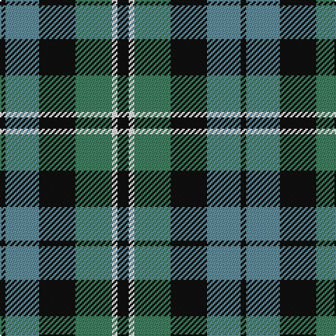

In pattern [KGKGWK](/patterns/kgkgwk/).

This was sourced from register-of-tartans.  It is a [6 stripes tartan](/stripes/stripes6/).

Original link https://www.tartanregister.gov.uk/tartanDetails.aspx?ref=2914

## Attestations

This cloth appears in 2 source records; the oldest owns this page.

- 01/01/1847 — Melville (register-of-tartans, [record](https://www.tartanregister.gov.uk/tartanDetails.aspx?ref=2914))
- pre 1847 — Melville (Clan) (tartans-authority, [record](http://www.tartansauthority.com/tartan-ferret/display/6328/))

## Thread count
K/4 B24 K26 G26 W4 K/8

## Palette
Each colour and its ΔE from the base-6 reference it is a variant of.

| Colour | Shade | Base | ΔE (OKLab) |
|---|---|---|---|
| B | <code style="background-color:#608C9C;">#608C9C</code> `#608C9C` | G <code style="background-color:#006400;">#006400</code> | 0.23 |
| G | <code style="background-color:#408060;">#408060</code> `#408060` | G <code style="background-color:#006400;">#006400</code> | 0.13 |
| K | <code style="background-color:#101010;">#101010</code> `#101010` | K <code style="background-color:#000000;">#000000</code> | 0.17 |
| W | <code style="background-color:#FCFCFC;">#FCFCFC</code> `#FCFCFC` | W <code style="background-color:#F4F4F0;">#F4F4F0</code> | 0.03 |

# Sample pattern

ID: /setts/s6/k8w4g26k26ga24k4-g408060-ga608c9c-k101010-wfcfcfc/
