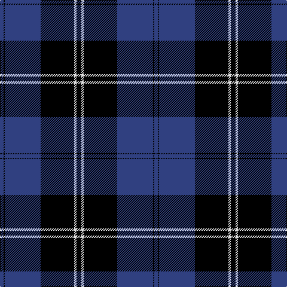

In pattern [BKBKWK](/patterns/bkbkwk/).

This was sourced from weddslist.  It is a [6 stripes tartan](/stripes/stripes6/).

Original link http://www.weddslist.com/cgi-bin/tartans/pg.pl?source=sts

## Thread count
B/6 K2 B60 K56 LN4 K/8

## Palette
Each colour and its ΔE from the base-6 reference it is a variant of.

| Colour | Shade | Base | ΔE (OKLab) |
|---|---|---|---|
| B | <code style="background-color:#304080;">#304080</code> `#304080` | B <code style="background-color:#2A418A;">#2A418A</code> | 0.02 |
| K | <code style="background-color:#000000;">#000000</code> `#000000` | K <code style="background-color:#000000;">#000000</code> | 0.00 |
| LN | <code style="background-color:#E0E0E0;">#E0E0E0</code> `#E0E0E0` | W <code style="background-color:#F7F7F7;">#F7F7F7</code> | 0.07 |

# Sample pattern

## Nearest tartans

The nearest existing variants by ΔTartan distance.

1. [Home, or Hume](/setts/s8/k56r2k4r2k16b48g4b6-b304080-g008000-k000000-rc00000/) — ΔT 1.27
1. [Angus](/setts/s9/k6r2k64b56r2b4r2b4r6-b304080-k000000-rc00000/) — ΔT 1.28
1. [Dunlop](/setts/s8/k6r2k60w2b56r2b2w6-b304080-k000000-rc00000-we0e0e0/) — ΔT 1.37
1. [Ramsay Blue Hunting](/setts/s6/k8w4k56b60k2b6-b1474b4-k101010-wc0c0c0/) — ΔT 1.46
1. [St Andrews, Earl of](/setts/s6/b52k28w5k3w2k10-b304080-k000030-we0e0e0/) — ΔT 1.49
1. [Oakleigh (Corporate)](/setts/s6/b16k4b80k80y4k16-b1474b4-k101010-ye8c000/) — ΔT 1.56
1. [MacKay](/setts/s6/b4k12b4k12b32r2-b304080-k000000-rc00000/) — ΔT 1.56
1. [Dunlop](/setts/s8/k6r2k60w2b56r2b2w6-b2c2c80-k101010-rc80000-we0e0e0/) — ΔT 1.72
1. [MacKay, Blue](/setts/s5/k30b8k30b56r4-b304080-k000000-rc00000/) — ΔT 1.72
1. [TACC](/setts/s7/b68k14b24k80b6k8w6-b666666-k000000-w82cffd/) — ΔT 1.76

## Neighbour map

Every grey dot is one of 15726 variants placed by the first two principal components of the ΔTartan feature space (44% of its variance). Red is this tartan; blue dots are its nearest — click one to open its page.

<svg viewBox="0 0 640 380" role="img" style="max-width:100%;height:auto;border:1px solid #e0e0e0;border-radius:4px;display:block" xmlns="http://www.w3.org/2000/svg"><image href="/nn/cloud.v1.png" width="640" height="380"/><a href="/setts/s8/k56r2k4r2k16b48g4b6-b304080-g008000-k000000-rc00000/"><circle cx="364.1" cy="149.9" r="4" fill="#3465a4"><title>Home, or Hume</title></circle></a><a href="/setts/s9/k6r2k64b56r2b4r2b4r6-b304080-k000000-rc00000/"><circle cx="361.0" cy="136.9" r="4" fill="#3465a4"><title>Angus</title></circle></a><a href="/setts/s8/k6r2k60w2b56r2b2w6-b304080-k000000-rc00000-we0e0e0/"><circle cx="324.5" cy="125.4" r="4" fill="#3465a4"><title>Dunlop</title></circle></a><a href="/setts/s6/k8w4k56b60k2b6-b1474b4-k101010-wc0c0c0/"><circle cx="362.5" cy="175.7" r="4" fill="#3465a4"><title>Ramsay Blue Hunting</title></circle></a><a href="/setts/s6/b52k28w5k3w2k10-b304080-k000030-we0e0e0/"><circle cx="365.2" cy="185.4" r="4" fill="#3465a4"><title>St Andrews, Earl of</title></circle></a><a href="/setts/s6/b16k4b80k80y4k16-b1474b4-k101010-ye8c000/"><circle cx="349.9" cy="197.9" r="4" fill="#3465a4"><title>Oakleigh (Corporate)</title></circle></a><a href="/setts/s6/b4k12b4k12b32r2-b304080-k000000-rc00000/"><circle cx="387.2" cy="215.2" r="4" fill="#3465a4"><title>MacKay</title></circle></a><a href="/setts/s8/k6r2k60w2b56r2b2w6-b2c2c80-k101010-rc80000-we0e0e0/"><circle cx="354.6" cy="135.5" r="4" fill="#3465a4"><title>Dunlop</title></circle></a><a href="/setts/s5/k30b8k30b56r4-b304080-k000000-rc00000/"><circle cx="323.8" cy="244.1" r="4" fill="#3465a4"><title>MacKay, Blue</title></circle></a><a href="/setts/s7/b68k14b24k80b6k8w6-b666666-k000000-w82cffd/"><circle cx="312.5" cy="198.7" r="4" fill="#3465a4"><title>TACC</title></circle></a><circle cx="360.8" cy="176.8" r="5" fill="#c00000"/></svg>

ID: /setts/s6/k8w4k56b60k2b6-b304080-k000000-we0e0e0/
