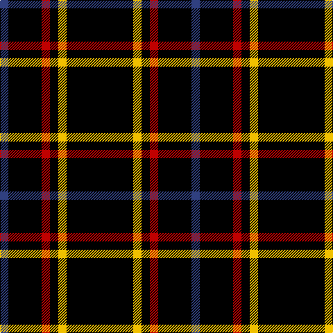

In pattern [BKRKYK](/patterns/bkrkyk/).

This was sourced from weddslist.  It is a [6 stripes tartan](/stripes/stripes6/).

Original link http://www.weddslist.com/cgi-bin/tartans/pg.pl?source=sts

## Thread count
B/12 K48 R12 K12 Y12 K/96

## Palette
Each colour and its ΔE from the base-6 reference it is a variant of.

| Colour | Shade | Base | ΔE (OKLab) |
|---|---|---|---|
| B | <code style="background-color:#304080;">#304080</code> `#304080` | B <code style="background-color:#2A418A;">#2A418A</code> | 0.02 |
| K | <code style="background-color:#000000;">#000000</code> `#000000` | K <code style="background-color:#000000;">#000000</code> | 0.00 |
| R | <code style="background-color:#C00000;">#C00000</code> `#C00000` | R <code style="background-color:#CC0000;">#CC0000</code> | 0.03 |
| Y | <code style="background-color:#F0C000;">#F0C000</code> `#F0C000` | Y <code style="background-color:#F2BF00;">#F2BF00</code> | 0.00 |

# Sample pattern

## Nearest tartans

The nearest existing variants by ΔTartan distance.

1. [Unidentified 11](/setts/s7/k24g3r3k24r2k2r2~g008000-k000000-rc00000/) — ΔT 1.37
1. [Renwick](/setts/s10/k3g2k20r2k12g2k4g2k6g2~g008000-k000000-rc00000~x2/) — ΔT 1.58
1. [New Zealand (2000)](/setts/s6/k21w2k5w9k13g2~g007800-k000000-wc8c8c8~x4/) — ΔT 1.73
1. [Hebridean 7](/setts/s14/b2k10r2g2r2k10r2k10r1k2r1k10r1k2~b304080-g008000-k000000-rc00000~x2/) — ΔT 1.89
1. [Dhillon (Personal)](/setts/s4/k35y3w3g3~g006818-k101010-wf8f8f8-yd87c00~x4/) — ΔT 1.95
1. [Gwynn](/setts/s8/k45y4k4y9k4y4k45r4~k101010-rc80000-ye8c000~x2/) — ΔT 1.95
1. [Benson (New England)](/setts/s7/k16b2k8r3y3r3k8~b1474b4-k101010-rc80000-yb8b8b8~x2/) — ΔT 2.04
1. [Lanoir](/setts/s6/k4r4k20r1k20w4~k101010-rc80000-we0e0e0~x6/) — ΔT 2.14
1. [Believe - Colette](/setts/s7/b3k31w6k8b3k12w2~b5c5c5c-k101010-wfcfcfc~x2/) — ΔT 2.18
1. [Cowe (Personal)](/setts/s7/k8b3k32ba14w3k25b3~b5c8ca8-ba1474b4-k101010-wfcfcfc~x2/) — ΔT 2.18

## Neighbour map

Every grey dot is one of 15726 variants placed by the first two principal components of the ΔTartan feature space (44% of its variance). Red is this tartan; blue dots are its nearest — click one to open its page.

<svg viewBox="0 0 640 380" role="img" style="max-width:100%;height:auto;border:1px solid #e0e0e0;border-radius:4px;display:block" xmlns="http://www.w3.org/2000/svg"><image href="/nn/cloud.v1.png" width="640" height="380"/><a href="/setts/s7/k24g3r3k24r2k2r2~g008000-k000000-rc00000/"><circle cx="547.0" cy="224.8" r="4" fill="#3465a4"><title>Unidentified 11</title></circle></a><a href="/setts/s10/k3g2k20r2k12g2k4g2k6g2~g008000-k000000-rc00000~x2/"><circle cx="506.9" cy="223.0" r="4" fill="#3465a4"><title>Renwick</title></circle></a><a href="/setts/s6/k21w2k5w9k13g2~g007800-k000000-wc8c8c8~x4/"><circle cx="413.3" cy="241.9" r="4" fill="#3465a4"><title>New Zealand (2000)</title></circle></a><a href="/setts/s14/b2k10r2g2r2k10r2k10r1k2r1k10r1k2~b304080-g008000-k000000-rc00000~x2/"><circle cx="435.4" cy="190.8" r="4" fill="#3465a4"><title>Hebridean 7</title></circle></a><a href="/setts/s4/k35y3w3g3~g006818-k101010-wf8f8f8-yd87c00~x4/"><circle cx="488.1" cy="209.7" r="4" fill="#3465a4"><title>Dhillon (Personal)</title></circle></a><a href="/setts/s8/k45y4k4y9k4y4k45r4~k101010-rc80000-ye8c000~x2/"><circle cx="515.2" cy="203.4" r="4" fill="#3465a4"><title>Gwynn</title></circle></a><a href="/setts/s7/k16b2k8r3y3r3k8~b1474b4-k101010-rc80000-yb8b8b8~x2/"><circle cx="402.0" cy="233.1" r="4" fill="#3465a4"><title>Benson (New England)</title></circle></a><a href="/setts/s6/k4r4k20r1k20w4~k101010-rc80000-we0e0e0~x6/"><circle cx="537.0" cy="217.1" r="4" fill="#3465a4"><title>Lanoir</title></circle></a><a href="/setts/s7/b3k31w6k8b3k12w2~b5c5c5c-k101010-wfcfcfc~x2/"><circle cx="473.5" cy="202.0" r="4" fill="#3465a4"><title>Believe - Colette</title></circle></a><a href="/setts/s7/k8b3k32ba14w3k25b3~b5c8ca8-ba1474b4-k101010-wfcfcfc~x2/"><circle cx="410.1" cy="216.7" r="4" fill="#3465a4"><title>Cowe (Personal)</title></circle></a><circle cx="470.2" cy="232.0" r="5" fill="#c00000"/></svg>

ID: /setts/s6/k8y1k1r1k4b1~b304080-k000000-rc00000-yf0c000~x12/
