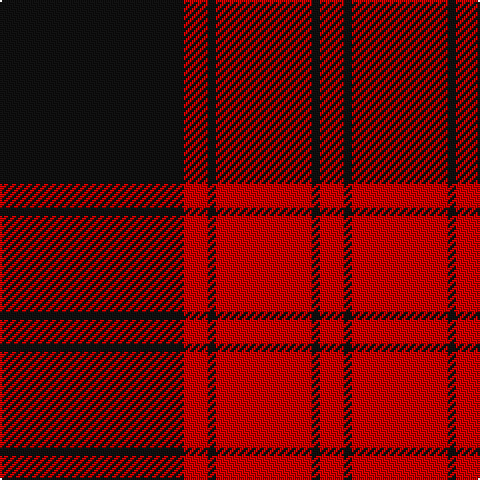

In pattern [KRKRKR](/patterns/krkrkr/).

This was sourced from tartans-authority.  It is a [6 stripes tartan](/stripes/stripes6/).

Original link http://www.tartansauthority.com/tartan-ferret/display/11082/

## Attestations

This cloth appears in 2 source records; the oldest owns this page.

- 2014 — Ewing (Clan) (tartans-authority, [record](http://www.tartansauthority.com/tartan-ferret/display/11082/))
- undated — Ewing Clan Tartan Tartan Number: 11082. Earliest known date: 2014 Following official recognition, this tartan was chosen by the new Commander of Clan Ewing, John Thor Ewing, as the Clan Ewing tartan. The tartan takes its inspiration from the plaid of John Ewing in Heiddykis of Kirkmichael (d.1609), described in his testament as 'sax ellis of reid & blak cullerit claith' The design relates to historical and traditional tartans from the areas and clans among which Clan Ewing has its roots. This tartan is woven to order by Lochcarron on behalf of Clan Ewing. All weavers must seek permission from John Thor Ewing as registrant and copyright holder. See products available Copyright © Blair Urquhart, Comrie, 2015 (house-of-tartan, [record](http://www.house-of-tartan.scotland.net/house/TartanViewjs.asp?colr=Def&tnam=11082))

## Thread count
K/92 R12 K4 R48 K4 R/12

## Palette
Each colour and its ΔE from the base-6 reference it is a variant of.

| Colour | Shade | Base | ΔE (OKLab) |
|---|---|---|---|
| K | <code style="background-color:#101010;">#101010</code> `#101010` | K <code style="background-color:#000000;">#000000</code> | 0.17 |
| R | <code style="background-color:#C80000;">#C80000</code> `#C80000` | R <code style="background-color:#C80000;">#C80000</code> | 0.00 |

# Sample pattern

## Nearest tartans

The nearest existing variants by ΔTartan distance.

1. [Ewing](/setts/s6/k92r12k4r48k4r12-k101010-rdc0000/) — ΔT 0.38
1. [Aragon (Erskine)](/setts/s6/k12r2k48r56k2r8-k101010-rc80000/) — ΔT 0.83
1. [Murray of Ochtertyre #2](/setts/s8/k60r6k4r6k4r54k60r8-k101010-rc80000/) — ΔT 1.07
1. [Cameron Black & Red (Dress)](/setts/s6/k4r24k4r24k66r4-k101010-ra00000/) — ΔT 1.19
1. [Campbell, Red](/setts/s5/r8k2r48k44r4-k000000-rc00000/) — ΔT 1.22
1. [Campbell Red (artefact)](/setts/s5/r8k2r48k44r4-k101010-rdc0000/) — ΔT 1.26
1. [The Mary Erskine](/setts/s6/k12r4k64r64k4r12-k000030-rc00000/) — ΔT 1.32
1. [Masai Shuka 15 (Artefact)](/setts/s5/r40k4r4k30w2-k101010-rc80000-we0e0e0/) — ΔT 1.36
1. [MacIver](/setts/s5/k32r4k4r24w2-k101010-rdc0000-we0e0e0/) — ΔT 1.42
1. [Bertea, A H (Personal)](/setts/s9/w4k6r20k10r6k10r30k70w2-k101010-rc80000-wfcfcfc/) — ΔT 1.47

## Neighbour map

Every grey dot is one of 15726 variants placed by the first two principal components of the ΔTartan feature space (44% of its variance). Red is this tartan; blue dots are its nearest — click one to open its page.

<svg viewBox="0 0 640 380" role="img" style="max-width:100%;height:auto;border:1px solid #e0e0e0;border-radius:4px;display:block" xmlns="http://www.w3.org/2000/svg"><image href="/nn/cloud.v1.png" width="640" height="380"/><a href="/setts/s6/k92r12k4r48k4r12-k101010-rdc0000/"><circle cx="431.5" cy="185.4" r="4" fill="#3465a4"><title>Ewing</title></circle></a><a href="/setts/s6/k12r2k48r56k2r8-k101010-rc80000/"><circle cx="417.2" cy="184.3" r="4" fill="#3465a4"><title>Aragon (Erskine)</title></circle></a><a href="/setts/s8/k60r6k4r6k4r54k60r8-k101010-rc80000/"><circle cx="438.6" cy="205.1" r="4" fill="#3465a4"><title>Murray of Ochtertyre #2</title></circle></a><a href="/setts/s6/k4r24k4r24k66r4-k101010-ra00000/"><circle cx="454.7" cy="223.0" r="4" fill="#3465a4"><title>Cameron Black &amp; Red (Dress)</title></circle></a><a href="/setts/s5/r8k2r48k44r4-k000000-rc00000/"><circle cx="410.1" cy="196.5" r="4" fill="#3465a4"><title>Campbell, Red</title></circle></a><a href="/setts/s5/r8k2r48k44r4-k101010-rdc0000/"><circle cx="422.7" cy="195.0" r="4" fill="#3465a4"><title>Campbell Red (artefact)</title></circle></a><a href="/setts/s6/k12r4k64r64k4r12-k000030-rc00000/"><circle cx="376.0" cy="206.4" r="4" fill="#3465a4"><title>The Mary Erskine</title></circle></a><a href="/setts/s5/r40k4r4k30w2-k101010-rc80000-we0e0e0/"><circle cx="387.3" cy="186.1" r="4" fill="#3465a4"><title>Masai Shuka 15 (Artefact)</title></circle></a><a href="/setts/s5/k32r4k4r24w2-k101010-rdc0000-we0e0e0/"><circle cx="361.0" cy="197.5" r="4" fill="#3465a4"><title>MacIver</title></circle></a><a href="/setts/s9/w4k6r20k10r6k10r30k70w2-k101010-rc80000-wfcfcfc/"><circle cx="418.0" cy="136.0" r="4" fill="#3465a4"><title>Bertea, A H (Personal)</title></circle></a><circle cx="440.5" cy="190.9" r="5" fill="#c00000"/></svg>

ID: /setts/s6/k92r12k4r48k4r12-k101010-rc80000/
