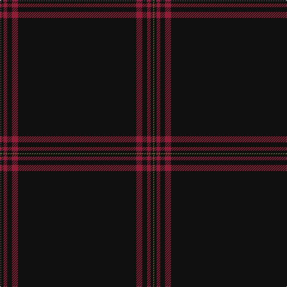

**Bands:** [GKRKRK](/stripes/gkrkrk/) · **Stripes:** [Y K R K R K](/stripes/stripes6/) Y K R K R K

This was sourced from register-of-tartans.  It is a [6 band tartan](/bands/bands6/).

Original link https://www.tartanregister.gov.uk/tartanDetails.aspx?ref=61

## Attestations

This cloth appears in 2 source records; the oldest owns this page.

- 01/09/2007 — Allt Dubh (Black Burn) (register-of-tartans, [record](https://www.tartanregister.gov.uk/tartanDetails.aspx?ref=61))
- September 2007 — Allt Dubh (Fashion) (tartans-authority, [record](http://www.tartansauthority.com/tartan-ferret/display/7296/))

## Register references

External register numbers recorded for this tartan.

- Scottish Register of Tartans: [61](https://www.tartanregister.gov.uk/tartanDetails.aspx?ref=61)
- Scottish Tartans Authority (ITI): 7296

## Thread count
G/2 K4 DR6 K8 DR10 K/198

## Palette
Each colour and its ΔE from the base-6 reference it is a variant of.

| Colour | Shade | Base | ΔE (OKLab) |
|---|---|---|---|
| DR | <code style="background-color:#901C38;">#901C38</code> `#901C38` | R <code style="background-color:#CC0000;">#CC0000</code> | 0.13 |
| G | <code style="background-color:#5C6428;">#5C6428</code> `#5C6428` | G <code style="background-color:#006100;">#006100</code> | 0.10 |
| K | <code style="background-color:#101010;">#101010</code> `#101010` | K <code style="background-color:#000000;">#000000</code> | 0.17 |

# Sample pattern

## Nearest tartans

The nearest existing variants by ΔTartan distance.

1. [SmartWool](/setts/s5/k200dy3lo3dy3lo3/) — ΔT 1.06
1. [Alich (Personal)](/setts/s4/k50r1db3dp1~x4/) — ΔT 1.43
1. [Alich (Personal)](/setts/s4/k50r1dt3dp1~x4/) — ΔT 1.48
1. [Webster, Colin Wesley (Personal)](/setts/s10/k100dp5k4dp3k2y1k2dp2k4dp5~x2/) — ΔT 1.65
1. [Galloway (Name)](/setts/s4/r2k50n2r1~x2/) — ΔT 1.68
1. [St. David's (District)](/setts/s6/dg60r2dg8r1dg5k2/) — ΔT 1.82
1. [Eternity, Dedicated 2 Weddings](/setts/s5/do88o3ly2k2lr1~x2/) — ΔT 2.43
1. [Lochaber (Hesketh)](/setts/s7/k8ly3k120ly3k40t2k4~x2/) — ΔT 2.45
1. [Selkirk Silver Band (Corporate)](/setts/s10/k75r1k4n15k2n1k3db1k2r1~x2/) — ΔT 2.66
1. [Edinburgh International Film Festival](/setts/s13/k184r1k2r2k2r1k2w1k6w1k4r10k20/) — ΔT 2.70

## Neighbour map

Every grey dot is one of 14313 variants placed by the first two principal components of the ΔTartan feature space (44% of its variance). Red is this tartan; blue dots are its nearest — click one to open its page.

<svg viewBox="0 0 640 380" role="img" style="max-width:100%;height:auto;border:1px solid #e0e0e0;border-radius:4px;display:block" xmlns="http://www.w3.org/2000/svg"><image href="/nn/cloud.v1.png" width="640" height="380"/><a href="/setts/s5/k200dy3lo3dy3lo3/"><circle cx="626.0" cy="191.6" r="4" fill="#3465a4"><title>SmartWool</title></circle></a><a href="/setts/s4/k50r1db3dp1~x4/"><circle cx="626.0" cy="213.8" r="4" fill="#3465a4"><title>Alich (Personal)</title></circle></a><a href="/setts/s4/k50r1dt3dp1~x4/"><circle cx="626.0" cy="217.5" r="4" fill="#3465a4"><title>Alich (Personal)</title></circle></a><a href="/setts/s10/k100dp5k4dp3k2y1k2dp2k4dp5~x2/"><circle cx="626.0" cy="148.6" r="4" fill="#3465a4"><title>Webster, Colin Wesley (Personal)</title></circle></a><a href="/setts/s4/r2k50n2r1~x2/"><circle cx="626.0" cy="204.7" r="4" fill="#3465a4"><title>Galloway (Name)</title></circle></a><a href="/setts/s6/dg60r2dg8r1dg5k2/"><circle cx="626.0" cy="200.6" r="4" fill="#3465a4"><title>St. David's (District)</title></circle></a><a href="/setts/s5/do88o3ly2k2lr1~x2/"><circle cx="626.0" cy="155.7" r="4" fill="#3465a4"><title>Eternity, Dedicated 2 Weddings</title></circle></a><a href="/setts/s7/k8ly3k120ly3k40t2k4~x2/"><circle cx="626.0" cy="170.1" r="4" fill="#3465a4"><title>Lochaber (Hesketh)</title></circle></a><a href="/setts/s10/k75r1k4n15k2n1k3db1k2r1~x2/"><circle cx="626.0" cy="128.5" r="4" fill="#3465a4"><title>Selkirk Silver Band (Corporate)</title></circle></a><a href="/setts/s13/k184r1k2r2k2r1k2w1k6w1k4r10k20/"><circle cx="626.0" cy="112.7" r="4" fill="#3465a4"><title>Edinburgh International Film Festival</title></circle></a><circle cx="626.0" cy="194.0" r="5" fill="#c00000"/></svg>

ID: /setts/s6/k99r5k4r3k2y1~x2/
