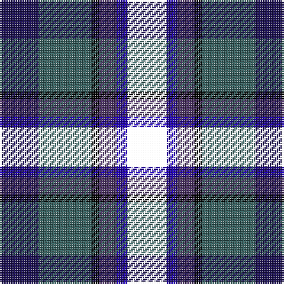

This page is one **sett** — a single exact thread-count. It belongs to the [tartan](/tartans/ki11dbi3dp5k2y15db11/)
(the same proportion at any scale), whose colour order is pattern [BGKBBK](/stripes/bgkbbk/).

Sourced from house-of-tartan.  It is a [6 stripe tartan](/stripes/stripes6/).

Original link http://www.house-of-tartan.scotland.net/house/TartanViewjs.asp?colr=Def&tnam=10739

## Thread count
DB/22 Na30 K4 N10 B6 LB/22

## Palette

Palette: <strong>Ingles Buchan</strong> <small style="color:#888">(1 of 5 colours)</small>
<table><thead><tr><th>Colour</th><th>Threads</th><th>Shade</th><th>Base</th><th>OKLCh</th></tr></thead><tbody><tr><td>DB/</td><td style="text-align:right;font-variant-numeric:tabular-nums">22</td><td><code style="background-color:#1B0F53;">#1B0F53</code> <small style="color:#888">#1B0F53</small></td><td>B <code style="background-color:#2A418A;">#2A418A</code></td><td><small style="color:#888">oklch(24.1% 0.115 281.5)</small></td></tr><tr><td>Na</td><td style="text-align:right;font-variant-numeric:tabular-nums">30</td><td><code style="background-color:#365F5E;">#365F5E</code> <small style="color:#888">#365F5E</small></td><td>G <code style="background-color:#006100;">#006100</code></td><td><small style="color:#888">oklch(45.5% 0.046 193.6)</small></td></tr><tr><td>K</td><td style="text-align:right;font-variant-numeric:tabular-nums">4</td><td><code style="background-color:#000000;">#000000</code> <small style="color:#888">#000000</small></td><td>K <code style="background-color:#000000;">#000000</code></td><td><small style="color:#888">oklch(0.0% 0.000 0.0)</small></td></tr><tr><td>N</td><td style="text-align:right;font-variant-numeric:tabular-nums">10</td><td><code style="background-color:#4A3162;">#4A3162</code> <small style="color:#888">#4A3162</small></td><td>B <code style="background-color:#2A418A;">#2A418A</code></td><td><small style="color:#888">oklch(36.6% 0.086 306.1)</small></td></tr><tr><td>B</td><td style="text-align:right;font-variant-numeric:tabular-nums">6</td><td><code style="background-color:#2001AF;">#2001AF</code> <small style="color:#888">#2001AF</small></td><td>B <code style="background-color:#2A418A;">#2A418A</code></td><td><small style="color:#888">oklch(35.2% 0.229 270.8)</small></td></tr><tr><td>/</td><td style="text-align:right;font-variant-numeric:tabular-nums">22</td><td><code style="background-color:;"></code> <small style="color:#888"></small></td><td> <code style="background-color:;"></code></td><td><small style="color:#888"></small></td></tr></tbody></table>

# Sample pattern

## Nearest tartans

The nearest existing variants by ΔTartan distance, with this tartan at the top so the swatches line up against it.

ΔTartan

Tartan

Sett

—

<a href="/ttd/edit/#slug=ki11dbi3dp5k2y15db11~x2">Saorsa Corporate Tartan Tartan Number: 10739. Earliest known date: 07/11/2012 Designed by Maggie Scott-Stewart and Lori Scott Ryan for the Fellowship of the Thistle, a select group of invited individuals who work together for the 'betterment' and freedom of Scotland. Green represents the hills and glens of Scotland; blue represents the saltire; purple for the thistle and black for the union. The name of the tartan, 'Saorsa', means 'freedom' in Gaelic. Miss Lori Scott Ryan, 25/19 Gullans Close, Edinburgh, Mid Lothian, Scotland, EH8 8JW redruairidh@hotmail.co.uk See products available Copyright © Blair Urquhart, Comrie, 2015</a> <a class="nn-out" href="/setts/s6/ki11dbi3dp5k2y15db11~x2/" title="open its dictionary page">↗</a>

0.97

<a href="/ttd/edit/#slug=t3k3db17k20g20dp8p3~x2">Gracey (2013)</a> <a class="nn-out" href="/setts/s7/t3k3db17k20g20dp8p3~x2/" title="open its dictionary page">↗</a>

1.16

<a href="/ttd/edit/#slug=r3dp8g20k20db17k3lg3~x2">Gracey (2013)</a> <a class="nn-out" href="/setts/s7/r3dp8g20k20db17k3lg3~x2/" title="open its dictionary page">↗</a>

1.23

<a href="/ttd/edit/#slug=dp11db2t4db21k16dg19ly4~x2">Ayrshire (International Tartans)</a> <a class="nn-out" href="/setts/s7/dp11db2t4db21k16dg19ly4~x2/" title="open its dictionary page">↗</a>

1.28

<a href="/ttd/edit/#slug=lb3db17do16dt2dg17lo2~x2">Ancient Atlantic (Fashion)</a> <a class="nn-out" href="/setts/s6/lb3db17do16dt2dg17lo2~x2/" title="open its dictionary page">↗</a>

1.35

<a href="/ttd/edit/#slug=k4b2dg8db8lr1~x2">Dougles Green</a> <a class="nn-out" href="/setts/s5/k4b2dg8db8lr1~x2/" title="open its dictionary page">↗</a>

1.35

<a href="/ttd/edit/#slug=k4b2dg8db8lr1">Dougles Green</a> <a class="nn-out" href="/setts/s5/k4b2dg8db8lr1/" title="open its dictionary page">↗</a>

1.36

<a href="/ttd/edit/#slug=r2k1db6k2g6m2~x4">MacEachain (Clan)</a> <a class="nn-out" href="/setts/s6/r2k1db6k2g6m2~x4/" title="open its dictionary page">↗</a>

1.43

<a href="/ttd/edit/#slug=r2k1db8k8dg8k1b2~x2">Campbell of Cawdor</a> <a class="nn-out" href="/setts/s7/r2k1db8k8dg8k1b2~x2/" title="open its dictionary page">↗</a>

1.45

<a href="/ttd/edit/#slug=r6dbi35k36db36w6">Davidson of Tulloch</a> <a class="nn-out" href="/setts/s5/r6dbi35k36db36w6/" title="open its dictionary page">↗</a>

1.47

<a href="/ttd/edit/#slug=r2db8k8lr1dg8k1~x2">Leslie Hunting</a> <a class="nn-out" href="/setts/s6/r2db8k8lr1dg8k1~x2/" title="open its dictionary page">↗</a>

## Neighbour map

Every grey dot is one of 14359 variants placed by the first two principal components of the ΔTartan feature space (44% of its variance). Red is this tartan; blue dots are its nearest — click one to open its page.

<svg viewBox="0 0 640 380" role="img" style="max-width:100%;height:auto;border:1px solid #e0e0e0;border-radius:4px;display:block" xmlns="http://www.w3.org/2000/svg"><image href="/nn/cloud.v1.png" width="640" height="380"/><a href="/setts/s7/t3k3db17k20g20dp8p3~x2/"><circle cx="84.6" cy="206.2" r="4" fill="#3465a4"><title>Gracey (2013)</title></circle></a><a href="/setts/s7/r3dp8g20k20db17k3lg3~x2/"><circle cx="111.4" cy="213.6" r="4" fill="#3465a4"><title>Gracey (2013)</title></circle></a><a href="/setts/s7/dp11db2t4db21k16dg19ly4~x2/"><circle cx="111.3" cy="203.2" r="4" fill="#3465a4"><title>Ayrshire (International Tartans)</title></circle></a><a href="/setts/s6/lb3db17do16dt2dg17lo2~x2/"><circle cx="143.4" cy="214.7" r="4" fill="#3465a4"><title>Ancient Atlantic (Fashion)</title></circle></a><a href="/setts/s5/k4b2dg8db8lr1~x2/"><circle cx="147.2" cy="246.4" r="4" fill="#3465a4"><title>Dougles Green</title></circle></a><a href="/setts/s5/k4b2dg8db8lr1/"><circle cx="147.2" cy="246.4" r="4" fill="#3465a4"><title>Dougles Green</title></circle></a><a href="/setts/s6/r2k1db6k2g6m2~x4/"><circle cx="118.6" cy="242.0" r="4" fill="#3465a4"><title>MacEachain (Clan)</title></circle></a><a href="/setts/s7/r2k1db8k8dg8k1b2~x2/"><circle cx="144.1" cy="220.4" r="4" fill="#3465a4"><title>Campbell of Cawdor</title></circle></a><a href="/setts/s5/r6dbi35k36db36w6/"><circle cx="103.7" cy="247.9" r="4" fill="#3465a4"><title>Davidson of Tulloch</title></circle></a><a href="/setts/s6/r2db8k8lr1dg8k1~x2/"><circle cx="139.3" cy="227.9" r="4" fill="#3465a4"><title>Leslie Hunting</title></circle></a><circle cx="102.5" cy="228.2" r="5" fill="#c00000"/></svg>

ID: /setts/s6/ki11dbi3dp5k2y15db11~x2/
