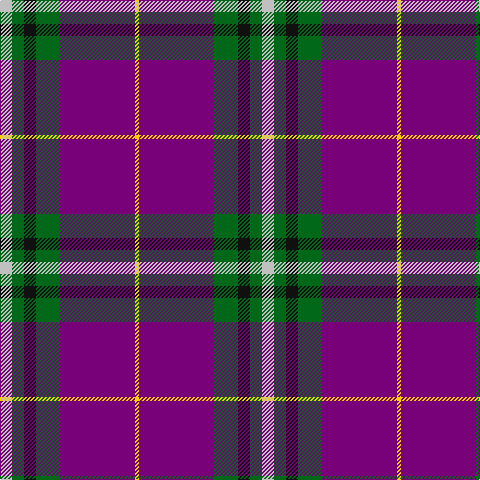

In pattern [WGKGBY](/stripes/wgkgby/).

This was sourced from tartans-authority.  It is a [6 stripe tartan](/stripes/stripes6/).

Original link http://www.tartansauthority.com/tartan-ferret/display/11270/

## Thread count
N/12 G12 K12 G24 P75 Y/4

## Palette
Each colour and the base-6 reference it is a variant of.

| Colour | Shade | Base |
|---|---|---|
| G | <code style="background-color:#006818;">#006818</code> `oklch(45.0% 0.142 145.0)` <small>#006818</small> | G <code style="background-color:#006100;">#006100</code> |
| K | <code style="background-color:#101010;">#101010</code> `oklch(17.3% 0.000 89.9)` <small>#101010</small> | K <code style="background-color:#000000;">#000000</code> |
| N | <code style="background-color:#C0C0C0;">#C0C0C0</code> `oklch(80.8% 0.000 89.9)` <small>#C0C0C0</small> | W <code style="background-color:#F7F7F7;">#F7F7F7</code> |
| P | <code style="background-color:#780078;">#780078</code> `oklch(40.2% 0.185 328.4)` <small>#780078</small> | B <code style="background-color:#2A418A;">#2A418A</code> |
| Y | <code style="background-color:#FCCC00;">#FCCC00</code> `oklch(86.2% 0.176 91.5)` <small>#FCCC00</small> | Y <code style="background-color:#F2BF00;">#F2BF00</code> |

# Sample pattern

## Nearest tartans

The nearest existing variants by ΔTartan distance.

1. [Doten (2013)](/setts/s5/r14lr6db38k3g2~x2/) — ΔT 0.99
1. [Widows Sons Scotland Dress](/setts/s6/lb12dg16k12dg24dp75lo4/) — ΔT 1.00
1. [Iberia Dress, Blue (Fashion)](/setts/s7/db60w2r10dg6w4r15ly10~x2/) — ΔT 1.02
1. [Java Saint Andrew Society Dress](/setts/s7/dt50r26k9r4w2lo2r10~x2/) — ΔT 1.04
1. [Widows Sons Scotland (MRA)](/setts/s6/o9k16dg10k22dp67ly4/) — ΔT 1.14
1. [Manitoba Masonic (Corporate)](/setts/s8/ly3db8w3db34r34g4r4w2~x2/) — ΔT 1.19
1. [Lothian Buses (Corporate?)](/setts/s6/w2db15r3g3r3db1~x8/) — ΔT 1.23
1. [Kilsyth (District)](/setts/s6/g4ly3db35r13dp8w3~x2/) — ΔT 1.25
1. [Widows Sons Scotland (MRA)](/setts/s6/lb9k16dg10k22dp67lo4/) — ΔT 1.26
1. [St. Leonards (Corporate)](/setts/s8/r16db2o6r3k4t2db40t6~x2/) — ΔT 1.29

## Neighbour map

Every grey dot is one of 14299 variants placed by the first two principal components of the ΔTartan feature space (44% of its variance). Red is this tartan; blue dots are its nearest — click one to open its page.

<svg viewBox="0 0 640 380" role="img" style="max-width:100%;height:auto;border:1px solid #e0e0e0;border-radius:4px;display:block" xmlns="http://www.w3.org/2000/svg"><image href="/nn/cloud.v1.png" width="640" height="380"/><a href="/setts/s5/r14lr6db38k3g2~x2/"><circle cx="348.3" cy="163.2" r="4" fill="#3465a4"><title>Doten (2013)</title></circle></a><a href="/setts/s6/lb12dg16k12dg24dp75lo4/"><circle cx="292.3" cy="161.6" r="4" fill="#3465a4"><title>Widows Sons Scotland Dress</title></circle></a><a href="/setts/s7/db60w2r10dg6w4r15ly10~x2/"><circle cx="324.3" cy="110.9" r="4" fill="#3465a4"><title>Iberia Dress, Blue (Fashion)</title></circle></a><a href="/setts/s7/dt50r26k9r4w2lo2r10~x2/"><circle cx="313.7" cy="134.4" r="4" fill="#3465a4"><title>Java Saint Andrew Society Dress</title></circle></a><a href="/setts/s6/o9k16dg10k22dp67ly4/"><circle cx="309.5" cy="168.6" r="4" fill="#3465a4"><title>Widows Sons Scotland (MRA)</title></circle></a><a href="/setts/s8/ly3db8w3db34r34g4r4w2~x2/"><circle cx="269.7" cy="125.6" r="4" fill="#3465a4"><title>Manitoba Masonic (Corporate)</title></circle></a><a href="/setts/s6/w2db15r3g3r3db1~x8/"><circle cx="342.0" cy="176.6" r="4" fill="#3465a4"><title>Lothian Buses (Corporate?)</title></circle></a><a href="/setts/s6/g4ly3db35r13dp8w3~x2/"><circle cx="249.2" cy="151.4" r="4" fill="#3465a4"><title>Kilsyth (District)</title></circle></a><a href="/setts/s6/lb9k16dg10k22dp67lo4/"><circle cx="292.6" cy="166.0" r="4" fill="#3465a4"><title>Widows Sons Scotland (MRA)</title></circle></a><a href="/setts/s8/r16db2o6r3k4t2db40t6~x2/"><circle cx="318.8" cy="136.5" r="4" fill="#3465a4"><title>St. Leonards (Corporate)</title></circle></a><circle cx="298.6" cy="149.7" r="5" fill="#c00000"/></svg>

ID: /setts/s6/lb12g12k12g24dp75ly4/
