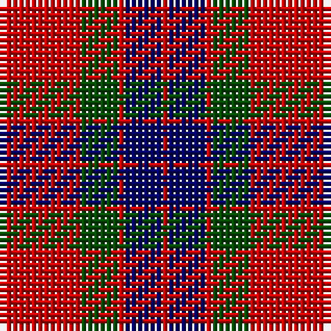

**Bands:** [RBRGRW](/stripes/rbrgrw/) · **Stripes:** [R DB R DG R LB](/stripes/stripes6/) R DB R DG R LB

This was sourced from weddslist.  It is a [6 band tartan](/bands/bands6/).

Original link http://www.weddslist.com/cgi-bin/tartans/pg.pl?source=rb

## Register references

External register numbers recorded for this tartan.

- Scottish Register of Tartans: [2540](https://www.tartanregister.gov.uk/tartanDetails.aspx?ref=2540)
- Scottish Register of Tartans: [2666](https://www.tartanregister.gov.uk/tartanDetails.aspx?ref=2666)
- Scottish Register of Tartans: [3808](https://www.tartanregister.gov.uk/tartanDetails.aspx?ref=3808)
- Scottish Tartans Authority (ITI): 218
- Scottish Tartans World Register: 1010
- Scottish Tartans World Register: 1585
- Scottish Tartans World Register: 218

## Thread count
N/1 R12 G6 R1 DB6 R/1

## Palette
Each colour and its ΔE from the base-6 reference it is a variant of.

| Colour | Shade | Base | ΔE (OKLab) |
|---|---|---|---|
| DB | <code style="background-color:#000064;">#000064</code> `#000064` | B <code style="background-color:#2A418A;">#2A418A</code> | 0.18 |
| G | <code style="background-color:#004C00;">#004C00</code> `#004C00` | G <code style="background-color:#006100;">#006100</code> | 0.07 |
| N | <code style="background-color:#D0D0D0;">#D0D0D0</code> `#D0D0D0` | W <code style="background-color:#F7F7F7;">#F7F7F7</code> | 0.12 |
| R | <code style="background-color:#C80000;">#C80000</code> `#C80000` | R <code style="background-color:#CC0000;">#CC0000</code> | 0.01 |

# Sample pattern

## Nearest tartans

The nearest existing variants by ΔTartan distance.

1. [Fraser Red Clan Tartan Tartan Number: 1424. Earliest known date: 1842 Early references include Wilson's of Bannockburn, but Wilson did not name the sett. D W Stewart contends that this is in fact an early Grant tartan which he traced to a portrait of Robert Grant of Lurg (1678-1771), hanging at Troup House before it was closed around 1894. It is undoubtedly the most popular Fraser pattern today. See products available Copyright © Blair Urquhart, Comrie, 2015](/setts/s6/r1db6r1dg6r12w1~x2/) — ΔT 0.47
1. [Fraser VS](/setts/s6/lr1r12dg6r1db6r1~x2/) — ΔT 0.71
1. [MacDuff #4](/setts/s7/r4k2r24k6db6dg16r3~x2/) — ΔT 0.74
1. [MacDuff](/setts/s7/r4k2r24k6db6g16r3~x2/) — ΔT 0.86
1. [MacQuarrie LO](/setts/s7/r6dg16r4db12r16lb1r2~x2/) — ΔT 0.86
1. [Finnigan (Estimated threadcount)](/setts/s6/r3db15r3g8r20k2~x2/) — ΔT 0.89
1. [Suntan (Masai Shuka) (District?)](/setts/s6/k3r11db3w1db3w1~x4/) — ΔT 0.89
1. [Carrick (Strathmore) District Tartan Tartan Number: 3216. Earliest known date: c.1999 Sales help Princess Diana Memorial Trust See products available Copyright © Blair Urquhart, Comrie, 2015](/setts/s7/r28db12r3dg20t2dg2r7~x2/) — ΔT 0.89
1. [Cetoloni (Personal)](/setts/s6/db1r12k6ly1k6db1~x4/) — ΔT 0.92
1. [Grant of Lurg](/setts/s6/r2db10r2g10r25w2~x2/) — ΔT 0.94

## Neighbour map

Every grey dot is one of 14313 variants placed by the first two principal components of the ΔTartan feature space (44% of its variance). Red is this tartan; blue dots are its nearest — click one to open its page.

<svg viewBox="0 0 640 380" role="img" style="max-width:100%;height:auto;border:1px solid #e0e0e0;border-radius:4px;display:block" xmlns="http://www.w3.org/2000/svg"><image href="/nn/cloud.v1.png" width="640" height="380"/><a href="/setts/s6/r1db6r1dg6r12w1~x2/"><circle cx="293.7" cy="188.2" r="4" fill="#3465a4"><title>Fraser Red Clan Tartan Tartan Number: 1424. Earliest known date: 1842 Early references include Wilson's of Bannockburn, but Wilson did not name the sett. D W Stewart contends that this is in fact an early Grant tartan which he traced to a portrait of Robert Grant of Lurg (1678-1771), hanging at Troup House before it was closed around 1894. It is undoubtedly the most popular Fraser pattern today. See products available Copyright © Blair Urquhart, Comrie, 2015</title></circle></a><a href="/setts/s6/lr1r12dg6r1db6r1~x2/"><circle cx="299.0" cy="197.0" r="4" fill="#3465a4"><title>Fraser VS</title></circle></a><a href="/setts/s7/r4k2r24k6db6dg16r3~x2/"><circle cx="279.2" cy="183.0" r="4" fill="#3465a4"><title>MacDuff #4</title></circle></a><a href="/setts/s7/r4k2r24k6db6g16r3~x2/"><circle cx="261.4" cy="178.4" r="4" fill="#3465a4"><title>MacDuff</title></circle></a><a href="/setts/s7/r6dg16r4db12r16lb1r2~x2/"><circle cx="268.5" cy="186.2" r="4" fill="#3465a4"><title>MacQuarrie LO</title></circle></a><a href="/setts/s6/r3db15r3g8r20k2~x2/"><circle cx="286.7" cy="207.6" r="4" fill="#3465a4"><title>Finnigan (Estimated threadcount)</title></circle></a><a href="/setts/s6/k3r11db3w1db3w1~x4/"><circle cx="266.1" cy="178.0" r="4" fill="#3465a4"><title>Suntan (Masai Shuka) (District?)</title></circle></a><a href="/setts/s7/r28db12r3dg20t2dg2r7~x2/"><circle cx="309.1" cy="185.3" r="4" fill="#3465a4"><title>Carrick (Strathmore) District Tartan Tartan Number: 3216. Earliest known date: c.1999 Sales help Princess Diana Memorial Trust See products available Copyright © Blair Urquhart, Comrie, 2015</title></circle></a><a href="/setts/s6/db1r12k6ly1k6db1~x4/"><circle cx="273.6" cy="187.6" r="4" fill="#3465a4"><title>Cetoloni (Personal)</title></circle></a><a href="/setts/s6/r2db10r2g10r25w2~x2/"><circle cx="328.6" cy="179.1" r="4" fill="#3465a4"><title>Grant of Lurg</title></circle></a><circle cx="281.6" cy="184.6" r="5" fill="#c00000"/></svg>

ID: /setts/s6/lb1r12dg6r1db6r1/
