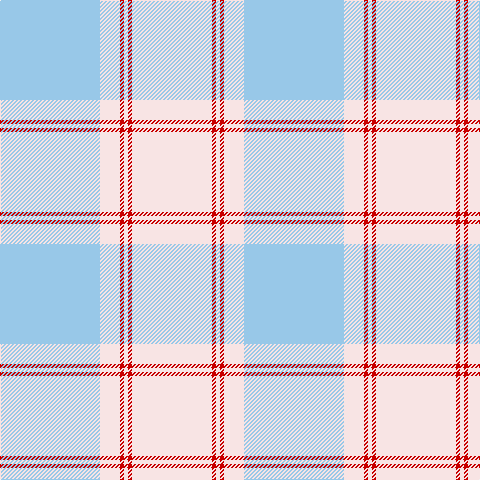

In pattern [WRWRWW](/stripes/wrwrww/).

This was sourced from tartans-authority.  It is a [6 stripe tartan](/stripes/stripes6/).

Original link http://www.tartansauthority.com/tartan-ferret/display/7203/

## Thread count
LB/100 LN20 R4 LN4 R4 LN/80

## Palette
Each colour and its ΔE from the base-6 reference it is a variant of.

| Colour | Shade | Base | ΔE (OKLab) |
|---|---|---|---|
| LB | <code style="background-color:#98C8E8;">#98C8E8</code> `#98C8E8` | W <code style="background-color:#F7F7F7;">#F7F7F7</code> | 0.18 |
| LN | <code style="background-color:#F8E4E4;">#F8E4E4</code> `#F8E4E4` | W <code style="background-color:#F7F7F7;">#F7F7F7</code> | 0.05 |
| R | <code style="background-color:#C80000;">#C80000</code> `#C80000` | R <code style="background-color:#CC0000;">#CC0000</code> | 0.01 |

# Sample pattern

## Nearest tartans

The nearest existing variants by ΔTartan distance.

1. [Amazon](/setts/s8/w8lb30w60lb15lo2lb2lo2lb5~x2/) — ΔT 1.11
1. [Banatherton Union](/setts/s10/lg10lr8ly1lb5w5lg28lr2ly1lb8w5~x2/) — ΔT 2.72
1. [Tenmaya](/setts/s8/w3y36lp6b6lp6b12lp32w3/) — ΔT 2.76
1. [Stuart of Bute 2013 (Fashion)](/setts/s9/o16lb8n1lb2n1lb1n8o34w2~x2/) — ΔT 2.81
1. [Banatherton Union](/setts/s10/lg10o8ly1lb5w5lg28o2ly1lb8w5~x2/) — ΔT 2.87
1. [Titanium (Fashion)](/setts/s9/n44o8n8o22lb4o4lb11o2lb2~x2/) — ΔT 2.89
1. [Lochnagar Trade Tartan Tartan Number: 1771. Earliest known date: pre 2003 Colours represents the Scottish hills, the water, and the heather. See products available Copyright © Blair Urquhart, Comrie, 2015](/setts/s6/w1dp1lb7o4lb1w1~x4/) — ΔT 2.92
1. [Ailsa, Gold (Dance)](/setts/s6/ly8w3ly28w32dp3w4~x2/) — ΔT 2.92
1. [Orkney Slate (Fashion)](/setts/s8/n8o74lb8n42o11dp2o16n4/) — ΔT 2.96
1. [Stuart of Bute St Colmac](/setts/s9/o16lb8dy1lb2dy1lb1dy8o34w2~x2/) — ΔT 2.98

## Neighbour map

Every grey dot is one of 14299 variants placed by the first two principal components of the ΔTartan feature space (44% of its variance). Red is this tartan; blue dots are its nearest — click one to open its page.

<svg viewBox="0 0 640 380" role="img" style="max-width:100%;height:auto;border:1px solid #e0e0e0;border-radius:4px;display:block" xmlns="http://www.w3.org/2000/svg"><image href="/nn/cloud.v1.png" width="640" height="380"/><a href="/setts/s8/w8lb30w60lb15lo2lb2lo2lb5~x2/"><circle cx="482.9" cy="178.0" r="4" fill="#3465a4"><title>Amazon</title></circle></a><a href="/setts/s10/lg10lr8ly1lb5w5lg28lr2ly1lb8w5~x2/"><circle cx="375.2" cy="170.7" r="4" fill="#3465a4"><title>Banatherton Union</title></circle></a><a href="/setts/s8/w3y36lp6b6lp6b12lp32w3/"><circle cx="341.2" cy="227.4" r="4" fill="#3465a4"><title>Tenmaya</title></circle></a><a href="/setts/s9/o16lb8n1lb2n1lb1n8o34w2~x2/"><circle cx="533.6" cy="168.9" r="4" fill="#3465a4"><title>Stuart of Bute 2013 (Fashion)</title></circle></a><a href="/setts/s10/lg10o8ly1lb5w5lg28o2ly1lb8w5~x2/"><circle cx="334.6" cy="148.0" r="4" fill="#3465a4"><title>Banatherton Union</title></circle></a><a href="/setts/s9/n44o8n8o22lb4o4lb11o2lb2~x2/"><circle cx="379.5" cy="181.5" r="4" fill="#3465a4"><title>Titanium (Fashion)</title></circle></a><a href="/setts/s6/w1dp1lb7o4lb1w1~x4/"><circle cx="318.5" cy="229.7" r="4" fill="#3465a4"><title>Lochnagar Trade Tartan Tartan Number: 1771. Earliest known date: pre 2003 Colours represents the Scottish hills, the water, and the heather. See products available Copyright © Blair Urquhart, Comrie, 2015</title></circle></a><a href="/setts/s6/ly8w3ly28w32dp3w4~x2/"><circle cx="384.8" cy="225.5" r="4" fill="#3465a4"><title>Ailsa, Gold (Dance)</title></circle></a><a href="/setts/s8/n8o74lb8n42o11dp2o16n4/"><circle cx="524.6" cy="194.5" r="4" fill="#3465a4"><title>Orkney Slate (Fashion)</title></circle></a><a href="/setts/s9/o16lb8dy1lb2dy1lb1dy8o34w2~x2/"><circle cx="529.0" cy="165.4" r="4" fill="#3465a4"><title>Stuart of Bute St Colmac</title></circle></a><circle cx="448.8" cy="205.7" r="5" fill="#c00000"/></svg>

ID: /setts/s6/lb25w5r1w1r1w20~x4/
