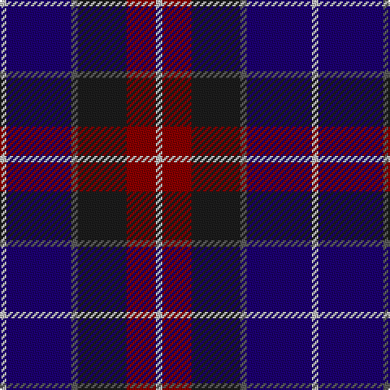

In pattern [WBBBRW](/stripes/wbbbrw/).

This was sourced from register-of-tartans.  It is a [6 stripe tartan](/stripes/stripes6/).

Original link https://www.tartanregister.gov.uk/tartanDetails.aspx?ref=3256

## Attestations

This cloth appears in 2 source records; the oldest owns this page.

- 01/01/1998 — Open Championship (1998) (register-of-tartans, [record](https://www.tartanregister.gov.uk/tartanDetails.aspx?ref=3256))
- 1998 — Open Championship (1998) (Corporate) (tartans-authority, [record](http://www.tartansauthority.com/tartan-ferret/display/2575/))

## Register references

External register numbers recorded for this tartan.

- Scottish Register of Tartans: [3256](https://www.tartanregister.gov.uk/tartanDetails.aspx?ref=3256)
- Scottish Tartans Authority (ITI): 2575
- Scottish Tartans World Register: 2575

## Thread count
Na/4 DB40 N4 K30 DR18 Na/4

## Palette
Each colour and the base-6 reference it is a variant of.

| Colour | Shade | Base |
|---|---|---|
| DB | <code style="background-color:#1C0070;">#1C0070</code> `oklch(26.3% 0.162 277.1)` <small>#1C0070</small> | B <code style="background-color:#2A418A;">#2A418A</code> |
| DR | <code style="background-color:#880000;">#880000</code> `oklch(39.4% 0.162 29.2)` <small>#880000</small> | R <code style="background-color:#CC0000;">#CC0000</code> |
| K | <code style="background-color:#1C1C1C;">#1C1C1C</code> `oklch(22.6% 0.000 89.9)` <small>#1C1C1C</small> | B <code style="background-color:#2A418A;">#2A418A</code> |
| N | <code style="background-color:#5C5C5C;">#5C5C5C</code> `oklch(47.5% 0.000 89.9)` <small>#5C5C5C</small> | B <code style="background-color:#2A418A;">#2A418A</code> |
| Na | <code style="background-color:#C0C0C0;">#C0C0C0</code> `oklch(80.8% 0.000 89.9)` <small>#C0C0C0</small> | W <code style="background-color:#F7F7F7;">#F7F7F7</code> |

# Sample pattern

## Nearest tartans

The nearest existing variants by ΔTartan distance, with this tartan at the top so the swatches line up against it.

ΔTartan

Tartan

Sett

—

<a href="/ttd/edit/#slug=lb2db20n2dt15r9lb2~x2">Open Championship (1998)</a> <a class="nn-out" href="/setts/s6/lb2db20n2dt15r9lb2~x2/" title="open its dictionary page">↗</a>

0.97

<a href="/ttd/edit/#slug=dp6k3dp21k23w3dg24r3~x2">Colquhoun #3</a> <a class="nn-out" href="/setts/s7/dp6k3dp21k23w3dg24r3~x2/" title="open its dictionary page">↗</a>

1.08

<a href="/ttd/edit/#slug=w2db15y2db20r9w2~x2">The Open Championship</a> <a class="nn-out" href="/setts/s6/w2db15y2db20r9w2~x2/" title="open its dictionary page">↗</a>

1.11

<a href="/ttd/edit/#slug=w2k1dp10k6db12ly2~x2">Soroptimist International Corporate Tartan Tartan Number: 3097. Earliest known date: 2002 Non-repeating sett. Launched at the Federation of Great Britain &amp; Ireland Conference in 2002 during the Presidency of Lynn Dunning. The design and the colours have been chosen carefully to symbolise the purple heather of the mountains and hills of Scotland together with the blue and gold of Soroptimist International woven together with the white hand of Peace. See products available Copyright © Blair Urquhart, Comrie, 2015</a> <a class="nn-out" href="/setts/s6/w2k1dp10k6db12ly2~x2/" title="open its dictionary page">↗</a>

1.14

<a href="/ttd/edit/#slug=k2w1k12g5db11r1~x2">New England (Fashion)</a> <a class="nn-out" href="/setts/s6/k2w1k12g5db11r1~x2/" title="open its dictionary page">↗</a>

1.16

<a href="/ttd/edit/#slug=dp22lo10dp6lr18dp50db71k6">Charleston Police Department</a> <a class="nn-out" href="/setts/s7/dp22lo10dp6lr18dp50db71k6/" title="open its dictionary page">↗</a>

1.17

<a href="/ttd/edit/#slug=db15r6dg8k2w2k2~x6">Stovell (2015)</a> <a class="nn-out" href="/setts/s6/db15r6dg8k2w2k2~x6/" title="open its dictionary page">↗</a>

1.18

<a href="/ttd/edit/#slug=db4dg2r18r10dg10db29b4~x2">Ross Dempster (Personal)</a> <a class="nn-out" href="/setts/s7/db4dg2r18r10dg10db29b4~x2/" title="open its dictionary page">↗</a>

1.18

<a href="/ttd/edit/#slug=db31t4db6k19r20ly4~x2">Fife (McGill)</a> <a class="nn-out" href="/setts/s6/db31t4db6k19r20ly4~x2/" title="open its dictionary page">↗</a>

1.19

<a href="/ttd/edit/#slug=db22r3db2r3db2k17o18dg4~x2">Scotch House 2000, antique</a> <a class="nn-out" href="/setts/s8/db22r3db2r3db2k17o18dg4~x2/" title="open its dictionary page">↗</a>

1.19

<a href="/ttd/edit/#slug=r4db24k12g14k4lb3~x2">MacPhail Hunting #2</a> <a class="nn-out" href="/setts/s6/r4db24k12g14k4lb3~x2/" title="open its dictionary page">↗</a>

## Neighbour map

Every grey dot is one of 14299 variants placed by the first two principal components of the ΔTartan feature space (44% of its variance). Red is this tartan; blue dots are its nearest — click one to open its page.

<svg viewBox="0 0 640 380" role="img" style="max-width:100%;height:auto;border:1px solid #e0e0e0;border-radius:4px;display:block" xmlns="http://www.w3.org/2000/svg"><image href="/nn/cloud.v1.png" width="640" height="380"/><a href="/setts/s7/dp6k3dp21k23w3dg24r3~x2/"><circle cx="158.2" cy="206.7" r="4" fill="#3465a4"><title>Colquhoun #3</title></circle></a><a href="/setts/s6/w2db15y2db20r9w2~x2/"><circle cx="177.1" cy="188.2" r="4" fill="#3465a4"><title>The Open Championship</title></circle></a><a href="/setts/s6/w2k1dp10k6db12ly2~x2/"><circle cx="170.2" cy="188.9" r="4" fill="#3465a4"><title>Soroptimist International Corporate Tartan Tartan Number: 3097. Earliest known date: 2002 Non-repeating sett. Launched at the Federation of Great Britain &amp; Ireland Conference in 2002 during the Presidency of Lynn Dunning. The design and the colours have been chosen carefully to symbolise the purple heather of the mountains and hills of Scotland together with the blue and gold of Soroptimist International woven together with the white hand of Peace. See products available Copyright © Blair Urquhart, Comrie, 2015</title></circle></a><a href="/setts/s6/k2w1k12g5db11r1~x2/"><circle cx="238.4" cy="203.6" r="4" fill="#3465a4"><title>New England (Fashion)</title></circle></a><a href="/setts/s7/dp22lo10dp6lr18dp50db71k6/"><circle cx="262.2" cy="200.0" r="4" fill="#3465a4"><title>Charleston Police Department</title></circle></a><a href="/setts/s6/db15r6dg8k2w2k2~x6/"><circle cx="182.2" cy="210.6" r="4" fill="#3465a4"><title>Stovell (2015)</title></circle></a><a href="/setts/s7/db4dg2r18r10dg10db29b4~x2/"><circle cx="224.9" cy="183.7" r="4" fill="#3465a4"><title>Ross Dempster (Personal)</title></circle></a><a href="/setts/s6/db31t4db6k19r20ly4~x2/"><circle cx="188.6" cy="209.0" r="4" fill="#3465a4"><title>Fife (McGill)</title></circle></a><a href="/setts/s8/db22r3db2r3db2k17o18dg4~x2/"><circle cx="167.8" cy="174.0" r="4" fill="#3465a4"><title>Scotch House 2000, antique</title></circle></a><a href="/setts/s6/r4db24k12g14k4lb3~x2/"><circle cx="172.5" cy="220.7" r="4" fill="#3465a4"><title>MacPhail Hunting #2</title></circle></a><circle cx="205.3" cy="203.6" r="5" fill="#c00000"/></svg>

ID: /setts/s6/lb2db20n2dt15r9lb2~x2/
