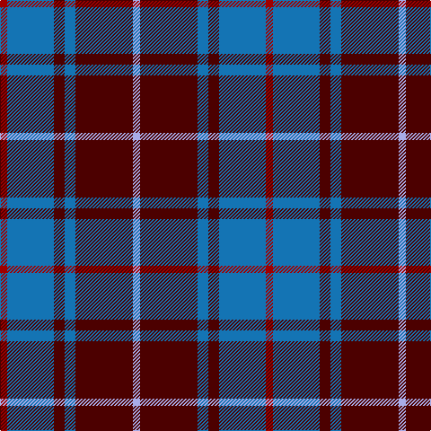

**Bands:** [RBBBBW](/stripes/rbbbbw/) · **Stripes:** [R B DR B DR LB](/stripes/stripes6/) R B DR B DR LB

This was sourced from register-of-tartans.  It is a [6 band tartan](/bands/bands6/).

Original link https://www.tartanregister.gov.uk/tartanDetails.aspx?ref=2283

## Attestations

This cloth appears in 2 source records; the oldest owns this page.

- 01/01/1997 — MacArthur-Fox Blue (Personal) (register-of-tartans, [record](https://www.tartanregister.gov.uk/tartanDetails.aspx?ref=2283))
- 1997 — MacArthur-Fox Blue (Personal) (tartans-authority, [record](http://www.tartansauthority.com/tartan-ferret/display/459/))

## Register references

External register numbers recorded for this tartan.

- Scottish Register of Tartans: [2283](https://www.tartanregister.gov.uk/tartanDetails.aspx?ref=2283)
- Scottish Tartans Authority (ITI): 459
- Scottish Tartans World Register: 459

## Thread count
DRa/8 B52 DR12 B12 DR64 LP/8

## Palette
Each colour and its ΔE from the base-6 reference it is a variant of.

| Colour | Shade | Base | ΔE (OKLab) |
|---|---|---|---|
| B | <code style="background-color:#1474B4;">#1474B4</code> `#1474B4` | B <code style="background-color:#2A418A;">#2A418A</code> | 0.15 |
| DR | <code style="background-color:#4C0000;">#4C0000</code> `#4C0000` | B <code style="background-color:#2A418A;">#2A418A</code> | 0.25 |
| DRa | <code style="background-color:#A00000;">#A00000</code> `#A00000` | R <code style="background-color:#CC0000;">#CC0000</code> | 0.09 |
| LP | <code style="background-color:#A8ACE8;">#A8ACE8</code> `#A8ACE8` | W <code style="background-color:#F7F7F7;">#F7F7F7</code> | 0.23 |

# Sample pattern

## Nearest tartans

The nearest existing variants by ΔTartan distance.

1. [Dege, of Saville Row](/setts/s6/o11db1o3db1db9r1~x4/) — ΔT 0.85
1. [Balfour #2](/setts/s6/db18ly2dy6ly2dy19r3~x2/) — ΔT 1.02
1. [Balfour (Clan)](/setts/s6/db18ly2dy6ly2dy19r3~x4/) — ΔT 1.02
1. [Donnolly](/setts/s6/db3g21db3o21db35w3~x2/) — ΔT 1.03
1. [University of Notre Dame](/setts/s6/r5db35k25db8ly10r5~x2/) — ΔT 1.10
1. [Thayer USA](/setts/s6/r5db25w5db3dg25db3~x2/) — ΔT 1.10
1. [Dunbog Primary (School)](/setts/s6/r12db3g5db16ly2g2~x2/) — ΔT 1.13
1. [McIntosh, Georgina (Personal)](/setts/s6/db9r1db2r1r4w1~x12/) — ΔT 1.18
1. [O'Long (Personal)](/setts/s7/g22dp22g3dp11w3dp4w3~x2/) — ΔT 1.21
1. [Thayer USA (Name)](/setts/s6/r5db25w5db3g25db3~x2/) — ΔT 1.28

## Neighbour map

Every grey dot is one of 14313 variants placed by the first two principal components of the ΔTartan feature space (44% of its variance). Red is this tartan; blue dots are its nearest — click one to open its page.

<svg viewBox="0 0 640 380" role="img" style="max-width:100%;height:auto;border:1px solid #e0e0e0;border-radius:4px;display:block" xmlns="http://www.w3.org/2000/svg"><image href="/nn/cloud.v1.png" width="640" height="380"/><a href="/setts/s6/o11db1o3db1db9r1~x4/"><circle cx="329.3" cy="208.4" r="4" fill="#3465a4"><title>Dege, of Saville Row</title></circle></a><a href="/setts/s6/db18ly2dy6ly2dy19r3~x2/"><circle cx="297.6" cy="218.5" r="4" fill="#3465a4"><title>Balfour #2</title></circle></a><a href="/setts/s6/db18ly2dy6ly2dy19r3~x4/"><circle cx="297.6" cy="218.5" r="4" fill="#3465a4"><title>Balfour (Clan)</title></circle></a><a href="/setts/s6/db3g21db3o21db35w3~x2/"><circle cx="265.1" cy="207.2" r="4" fill="#3465a4"><title>Donnolly</title></circle></a><a href="/setts/s6/r5db35k25db8ly10r5~x2/"><circle cx="220.8" cy="221.3" r="4" fill="#3465a4"><title>University of Notre Dame</title></circle></a><a href="/setts/s6/r5db25w5db3dg25db3~x2/"><circle cx="250.3" cy="215.7" r="4" fill="#3465a4"><title>Thayer USA</title></circle></a><a href="/setts/s6/r12db3g5db16ly2g2~x2/"><circle cx="223.8" cy="209.6" r="4" fill="#3465a4"><title>Dunbog Primary (School)</title></circle></a><a href="/setts/s6/db9r1db2r1r4w1~x12/"><circle cx="285.7" cy="201.4" r="4" fill="#3465a4"><title>McIntosh, Georgina (Personal)</title></circle></a><a href="/setts/s7/g22dp22g3dp11w3dp4w3~x2/"><circle cx="305.5" cy="223.1" r="4" fill="#3465a4"><title>O'Long (Personal)</title></circle></a><a href="/setts/s6/r5db25w5db3g25db3~x2/"><circle cx="251.8" cy="216.1" r="4" fill="#3465a4"><title>Thayer USA (Name)</title></circle></a><circle cx="279.2" cy="216.6" r="5" fill="#c00000"/></svg>

ID: /setts/s6/lb2dr16b3dr3b13r2~x4/
