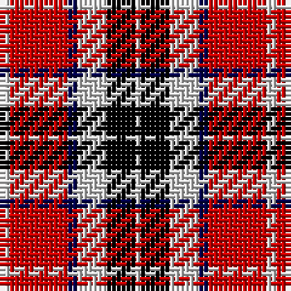

In pattern [WKWBRW](/stripes/wkwbrw/).

This was sourced from weddslist.  It is a [6 stripe tartan](/stripes/stripes6/).

Original link http://www.weddslist.com/cgi-bin/tartans/pg.pl?source=rb

## Thread count
N/2 R12 DB2 N6 K6 N/1

## Palette
Each colour and the base-6 reference it is a variant of.

| Colour | Shade | Base |
|---|---|---|
| DB | <code style="background-color:#00004C;">#00004C</code> `oklch(18.8% 0.130 264.1)` <small>#00004C</small> | B <code style="background-color:#2A418A;">#2A418A</code> |
| K | <code style="background-color:#000000;">#000000</code> `oklch(0.0% 0.000 0.0)` <small>#000000</small> | K <code style="background-color:#000000;">#000000</code> |
| N | <code style="background-color:#D0D0D0;">#D0D0D0</code> `oklch(85.8% 0.000 89.9)` <small>#D0D0D0</small> | W <code style="background-color:#F7F7F7;">#F7F7F7</code> |
| R | <code style="background-color:#C80000;">#C80000</code> `oklch(52.3% 0.215 29.2)` <small>#C80000</small> | R <code style="background-color:#CC0000;">#CC0000</code> |

# Sample pattern

## Nearest tartans

The nearest existing variants by ΔTartan distance.

1. [SAL Cubiska Stenen](/setts/s5/r15g3w2k10w5~x2/) — ΔT 1.01
1. [Rose, White dress](/setts/s6/r32db6k6g6w18k3/) — ΔT 1.08
1. [Fazzolettone (Fashion?)](/setts/s7/w2db3r24db15w6db3ly2~x2/) — ΔT 1.12
1. [Aberdeen University](/setts/s5/ly2r15k7db8ly2~x4/) — ΔT 1.18
1. [Wallace Dress, Red (Dance)](/setts/s5/k3r28k10w28t3~x2/) — ΔT 1.19
1. [Memery (Reston, USA)](/setts/s9/w4k6r3k15r3k6r27db9w2~x2/) — ΔT 1.20
1. [Wcwm 759-2](/setts/s6/lb5r34k22r4o24r4~x2/) — ΔT 1.21
1. [Thompson/Thomson/MacTavish](/setts/s6/t2r12db2t6k6t1~x4/) — ΔT 1.21
1. [Graham Red](/setts/s9/lr1k1r10g10k5lr5r10k1lr1~x4/) — ΔT 1.23
1. [Thom(p)son camel](/setts/s6/r4o30k6w13k13w3~x2/) — ΔT 1.23

## Neighbour map

Every grey dot is one of 14299 variants placed by the first two principal components of the ΔTartan feature space (44% of its variance). Red is this tartan; blue dots are its nearest — click one to open its page.

<svg viewBox="0 0 640 380" role="img" style="max-width:100%;height:auto;border:1px solid #e0e0e0;border-radius:4px;display:block" xmlns="http://www.w3.org/2000/svg"><image href="/nn/cloud.v1.png" width="640" height="380"/><a href="/setts/s5/r15g3w2k10w5~x2/"><circle cx="166.1" cy="205.8" r="4" fill="#3465a4"><title>SAL Cubiska Stenen</title></circle></a><a href="/setts/s6/r32db6k6g6w18k3/"><circle cx="180.3" cy="154.9" r="4" fill="#3465a4"><title>Rose, White dress</title></circle></a><a href="/setts/s7/w2db3r24db15w6db3ly2~x2/"><circle cx="240.4" cy="158.3" r="4" fill="#3465a4"><title>Fazzolettone (Fashion?)</title></circle></a><a href="/setts/s5/ly2r15k7db8ly2~x4/"><circle cx="185.9" cy="213.6" r="4" fill="#3465a4"><title>Aberdeen University</title></circle></a><a href="/setts/s5/k3r28k10w28t3~x2/"><circle cx="183.6" cy="185.9" r="4" fill="#3465a4"><title>Wallace Dress, Red (Dance)</title></circle></a><a href="/setts/s9/w4k6r3k15r3k6r27db9w2~x2/"><circle cx="225.6" cy="151.2" r="4" fill="#3465a4"><title>Memery (Reston, USA)</title></circle></a><a href="/setts/s6/lb5r34k22r4o24r4~x2/"><circle cx="206.4" cy="202.6" r="4" fill="#3465a4"><title>Wcwm 759-2</title></circle></a><a href="/setts/s6/t2r12db2t6k6t1~x4/"><circle cx="216.7" cy="192.1" r="4" fill="#3465a4"><title>Thompson/Thomson/MacTavish</title></circle></a><a href="/setts/s9/lr1k1r10g10k5lr5r10k1lr1~x4/"><circle cx="201.2" cy="171.6" r="4" fill="#3465a4"><title>Graham Red</title></circle></a><a href="/setts/s6/r4o30k6w13k13w3~x2/"><circle cx="185.0" cy="187.3" r="4" fill="#3465a4"><title>Thom(p)son camel</title></circle></a><circle cx="186.0" cy="173.3" r="5" fill="#c00000"/></svg>

ID: /setts/s6/lb2r12db2lb6k6lb1/
