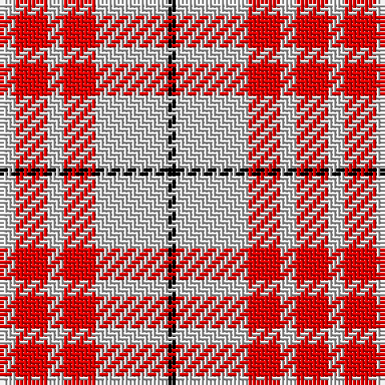

In pattern [KWRWRW](/stripes/kwrwrw/).

This was sourced from weddslist.  It is a [6 stripe tartan](/stripes/stripes6/).

Original link http://www.weddslist.com/cgi-bin/tartans/pg.pl?source=rb

## Thread count
N/4 R8 N4 R8 N18 K/2

## Palette
Each colour and the base-6 reference it is a variant of.

| Colour | Shade | Base |
|---|---|---|
| K | <code style="background-color:#000000;">#000000</code> `oklch(0.0% 0.000 0.0)` <small>#000000</small> | K <code style="background-color:#000000;">#000000</code> |
| N | <code style="background-color:#D0D0D0;">#D0D0D0</code> `oklch(85.8% 0.000 89.9)` <small>#D0D0D0</small> | W <code style="background-color:#F7F7F7;">#F7F7F7</code> |
| R | <code style="background-color:#FF0000;">#FF0000</code> `oklch(62.8% 0.258 29.2)` <small>#FF0000</small> | R <code style="background-color:#CC0000;">#CC0000</code> |

# Sample pattern

## Nearest tartans

The nearest existing variants by ΔTartan distance.

1. [Clayton Dress (Dance)](/setts/s6/w8r14w8r14w35k4~x2/) — ΔT 1.22
1. [MacRae of Conchra #2](/setts/s4/k5w37r37w5~x2/) — ΔT 1.23
1. [Erskine Red & White (Dance)](/setts/s6/r2w1r9w9r1w2~x6/) — ΔT 1.36
1. [Milne Dress Family Tartan Tartan Number: 634. Earliest known date: pre 2003 Milnes are usually regarded as being a Sept of the Gordons or of the Ogilvys. See products available Copyright © Blair Urquhart, Comrie, 2015](/setts/s8/w18db4w18r30w18db4w9dp4/) — ΔT 1.37
1. [Lewis, Magenta (Dance)](/setts/s4/w4m31w35lg4~x2/) — ΔT 1.37
1. [Milne, dress](/setts/s8/w18db4w18r30w18db4w9p4/) — ΔT 1.38
1. [Buchanan #5](/setts/s6/k2w28r13w2r13w2~x2/) — ΔT 1.41
1. [MacPherson Dress Red (Dance)](/setts/s7/w5dp3w26r20w3r8ly3~x2/) — ΔT 1.43
1. [MacPherson, Red](/setts/s7/w5p3w26r20w3r8ly3~x2/) — ΔT 1.43
1. [Twilfit](/setts/s9/db25r46w11r11w7r11w11r46db12/) — ΔT 1.44

## Neighbour map

Every grey dot is one of 14299 variants placed by the first two principal components of the ΔTartan feature space (44% of its variance). Red is this tartan; blue dots are its nearest — click one to open its page.

<svg viewBox="0 0 640 380" role="img" style="max-width:100%;height:auto;border:1px solid #e0e0e0;border-radius:4px;display:block" xmlns="http://www.w3.org/2000/svg"><image href="/nn/cloud.v1.png" width="640" height="380"/><a href="/setts/s6/w8r14w8r14w35k4~x2/"><circle cx="303.4" cy="198.2" r="4" fill="#3465a4"><title>Clayton Dress (Dance)</title></circle></a><a href="/setts/s4/k5w37r37w5~x2/"><circle cx="281.3" cy="221.5" r="4" fill="#3465a4"><title>MacRae of Conchra #2</title></circle></a><a href="/setts/s6/r2w1r9w9r1w2~x6/"><circle cx="321.6" cy="198.0" r="4" fill="#3465a4"><title>Erskine Red &amp; White (Dance)</title></circle></a><a href="/setts/s8/w18db4w18r30w18db4w9dp4/"><circle cx="269.7" cy="188.9" r="4" fill="#3465a4"><title>Milne Dress Family Tartan Tartan Number: 634. Earliest known date: pre 2003 Milnes are usually regarded as being a Sept of the Gordons or of the Ogilvys. See products available Copyright © Blair Urquhart, Comrie, 2015</title></circle></a><a href="/setts/s4/w4m31w35lg4~x2/"><circle cx="307.0" cy="217.6" r="4" fill="#3465a4"><title>Lewis, Magenta (Dance)</title></circle></a><a href="/setts/s8/w18db4w18r30w18db4w9p4/"><circle cx="270.7" cy="189.9" r="4" fill="#3465a4"><title>Milne, dress</title></circle></a><a href="/setts/s6/k2w28r13w2r13w2~x2/"><circle cx="322.9" cy="170.6" r="4" fill="#3465a4"><title>Buchanan #5</title></circle></a><a href="/setts/s7/w5dp3w26r20w3r8ly3~x2/"><circle cx="266.7" cy="168.8" r="4" fill="#3465a4"><title>MacPherson Dress Red (Dance)</title></circle></a><a href="/setts/s7/w5p3w26r20w3r8ly3~x2/"><circle cx="265.2" cy="168.6" r="4" fill="#3465a4"><title>MacPherson, Red</title></circle></a><a href="/setts/s9/db25r46w11r11w7r11w11r46db12/"><circle cx="318.6" cy="204.7" r="4" fill="#3465a4"><title>Twilfit</title></circle></a><circle cx="321.8" cy="205.5" r="5" fill="#c00000"/></svg>

ID: /setts/s6/lb2r4lb2r4lb9k1~x2/
