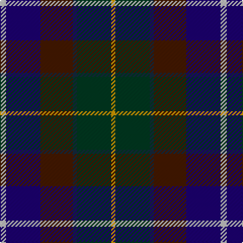

**Bands:** [YGBBBW](/stripes/ygbbbw/) · **Stripes:** [LO DG DT DO DB LB](/stripes/stripes6/) LO DG DT DO DB LB

This was sourced from tartans-authority.  It is a [6 band tartan](/bands/bands6/).

Original link http://www.tartansauthority.com/tartan-ferret/display/1781/

## Attestations

This cloth appears in 2 source records; the oldest owns this page.

- 1959 — Ancient Atlantic (Fashion) (tartans-authority, [record](http://www.tartansauthority.com/tartan-ferret/display/1781/))
- 01/01/1964 — Ancient Atlantic (SINDEX) (register-of-tartans, [record](https://www.tartanregister.gov.uk/tartanDetails.aspx?ref=72))

## Register references

External register numbers recorded for this tartan.

- Scottish Register of Tartans: [72](https://www.tartanregister.gov.uk/tartanDetails.aspx?ref=72)
- Scottish Tartans Authority (ITI): 1781
- Scottish Tartans World Register: 1781

## Thread count
N/6 DB34 DR32 DN4 DG34 DY/4

## Palette
Each colour and its ΔE from the base-6 reference it is a variant of.

| Colour | Shade | Base | ΔE (OKLab) |
|---|---|---|---|
| DB | <code style="background-color:#1C0070;">#1C0070</code> `#1C0070` | B <code style="background-color:#2A418A;">#2A418A</code> | 0.14 |
| DG | <code style="background-color:#003820;">#003820</code> `#003820` | G <code style="background-color:#006100;">#006100</code> | 0.15 |
| DN | <code style="background-color:#14283C;">#14283C</code> `#14283C` | B <code style="background-color:#2A418A;">#2A418A</code> | 0.15 |
| DR | <code style="background-color:#441800;">#441800</code> `#441800` | B <code style="background-color:#2A418A;">#2A418A</code> | 0.23 |
| DY | <code style="background-color:#D09800;">#D09800</code> `#D09800` | Y <code style="background-color:#F2BF00;">#F2BF00</code> | 0.12 |
| N | <code style="background-color:#C0C0C0;">#C0C0C0</code> `#C0C0C0` | W <code style="background-color:#F7F7F7;">#F7F7F7</code> | 0.17 |

# Sample pattern

## Nearest tartans

The nearest existing variants by ΔTartan distance.

1. [Atlantic Ancient Trade Tartan Tartan Number: 1781. Earliest known date: 1968 Also known as Murray of Atholl, it has been authorized by Ian Murray, Duke of Atholl. See products available Copyright © Blair Urquhart, Comrie, 2015](/setts/s6/w3db17dy16db2dg17ly2~x2/) — ΔT 0.73
1. [Gracey (2013)](/setts/s7/r3dp8g20k20db17k3lg3~x2/) — ΔT 0.79
1. [Ayrshire (International Tartans)](/setts/s7/dp11db2t4db21k16dg19ly4~x2/) — ΔT 0.99
1. [Lenaghan (Personal)](/setts/s7/db10dg5g5k1ly2k1db10~x2/) — ΔT 1.02
1. [Grandfather Mountain Games (District](/setts/s7/r3dg20k2n11k2db20lr2~x2/) — ΔT 1.05
1. [Meeson Hunting](/setts/s6/k26n10dt19r6ly2db9~x2/) — ΔT 1.10
1. [Junior Chamber International (Corp)](/setts/s7/r4dg16k16db4dg3db12lo2~x2/) — ΔT 1.15
1. [Myres Castle (Corporate)](/setts/s7/g3dg12dp6g3dp15lo2dp2~x2/) — ΔT 1.18
1. [MacDonald (Flora.. )](/setts/s7/dg17ly2k14r2db9r2db10~x2/) — ΔT 1.20
1. [Blairmore House](/setts/s8/db17w2db2r2db2do12dg16lo3~x4/) — ΔT 1.23

## Neighbour map

Every grey dot is one of 14299 variants placed by the first two principal components of the ΔTartan feature space (44% of its variance). Red is this tartan; blue dots are its nearest — click one to open its page.

<svg viewBox="0 0 640 380" role="img" style="max-width:100%;height:auto;border:1px solid #e0e0e0;border-radius:4px;display:block" xmlns="http://www.w3.org/2000/svg"><image href="/nn/cloud.v1.png" width="640" height="380"/><a href="/setts/s6/w3db17dy16db2dg17ly2~x2/"><circle cx="132.5" cy="206.4" r="4" fill="#3465a4"><title>Atlantic Ancient Trade Tartan Tartan Number: 1781. Earliest known date: 1968 Also known as Murray of Atholl, it has been authorized by Ian Murray, Duke of Atholl. See products available Copyright © Blair Urquhart, Comrie, 2015</title></circle></a><a href="/setts/s7/r3dp8g20k20db17k3lg3~x2/"><circle cx="111.3" cy="212.4" r="4" fill="#3465a4"><title>Gracey (2013)</title></circle></a><a href="/setts/s7/dp11db2t4db21k16dg19ly4~x2/"><circle cx="111.2" cy="202.1" r="4" fill="#3465a4"><title>Ayrshire (International Tartans)</title></circle></a><a href="/setts/s7/db10dg5g5k1ly2k1db10~x2/"><circle cx="131.6" cy="207.7" r="4" fill="#3465a4"><title>Lenaghan (Personal)</title></circle></a><a href="/setts/s7/r3dg20k2n11k2db20lr2~x2/"><circle cx="155.2" cy="183.6" r="4" fill="#3465a4"><title>Grandfather Mountain Games (District</title></circle></a><a href="/setts/s6/k26n10dt19r6ly2db9~x2/"><circle cx="181.2" cy="214.4" r="4" fill="#3465a4"><title>Meeson Hunting</title></circle></a><a href="/setts/s7/r4dg16k16db4dg3db12lo2~x2/"><circle cx="161.6" cy="226.9" r="4" fill="#3465a4"><title>Junior Chamber International (Corp)</title></circle></a><a href="/setts/s7/g3dg12dp6g3dp15lo2dp2~x2/"><circle cx="175.4" cy="201.3" r="4" fill="#3465a4"><title>Myres Castle (Corporate)</title></circle></a><a href="/setts/s7/dg17ly2k14r2db9r2db10~x2/"><circle cx="160.9" cy="220.5" r="4" fill="#3465a4"><title>MacDonald (Flora.. )</title></circle></a><a href="/setts/s8/db17w2db2r2db2do12dg16lo3~x4/"><circle cx="176.9" cy="189.6" r="4" fill="#3465a4"><title>Blairmore House</title></circle></a><circle cx="143.3" cy="213.6" r="5" fill="#c00000"/></svg>

ID: /setts/s6/lb3db17do16dt2dg17lo2~x2/
