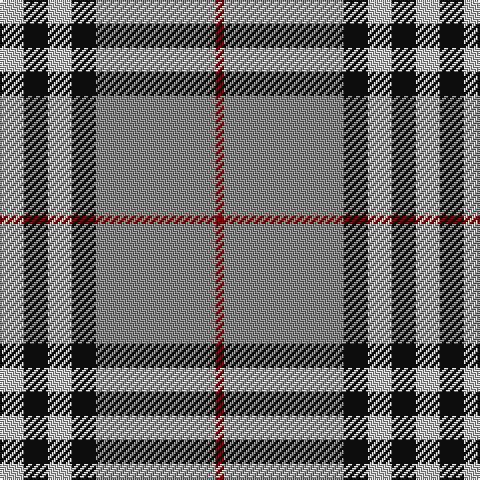

**Bands:** [RRKWKW](/stripes/rrkwkw/) · **Stripes:** [R O K LB K LB](/stripes/stripes6/) R O K LB K LB

This was sourced from register-of-tartans.  It is a [6 band tartan](/bands/bands6/).

Original link https://www.tartanregister.gov.uk/tartanDetails.aspx?ref=4130

## Attestations

This cloth appears in 2 source records; the oldest owns this page.

- 01/01/2002 — Tiree Grey (register-of-tartans, [record](https://www.tartanregister.gov.uk/tartanDetails.aspx?ref=4130))
- pre 2002 — Tiree Grey (Fashion) (tartans-authority, [record](http://www.tartansauthority.com/tartan-ferret/display/5110/))

## Register references

External register numbers recorded for this tartan.

- Scottish Register of Tartans: [4130](https://www.tartanregister.gov.uk/tartanDetails.aspx?ref=4130)
- Scottish Tartans Authority (ITI): 5110

## Thread count
N/12 K12 N12 K12 Na60 DR/4

## Palette
Each colour and its ΔE from the base-6 reference it is a variant of.

| Colour | Shade | Base | ΔE (OKLab) |
|---|---|---|---|
| DR | <code style="background-color:#880000;">#880000</code> `#880000` | R <code style="background-color:#CC0000;">#CC0000</code> | 0.15 |
| K | <code style="background-color:#101010;">#101010</code> `#101010` | K <code style="background-color:#000000;">#000000</code> | 0.17 |
| LN | <code style="background-color:#E0E0E0;">#E0E0E0</code> `#E0E0E0` | W <code style="background-color:#F7F7F7;">#F7F7F7</code> | 0.07 |
| N | <code style="background-color:#C0C0C0;">#C0C0C0</code> `#C0C0C0` | W <code style="background-color:#F7F7F7;">#F7F7F7</code> | 0.17 |
| Na | <code style="background-color:#888888;">#888888</code> `#888888` | R <code style="background-color:#CC0000;">#CC0000</code> | 0.24 |

# Sample pattern

## Nearest tartans

The nearest existing variants by ΔTartan distance.

1. [Kansai Highland Games Corporate Tartan Tartan Number: 2708. Earliest known date: 1999 Designed for the first Highland Games in Japan, started by Maud Robertson and heavy weight husband, Masonori Nomiyam. See products available Copyright © Blair Urquhart, Comrie, 2015](/setts/s5/dp2k1dp16g16w2~x4/) — ΔT 0.89
1. [Burberry Grey (Original)](/setts/s5/k5w7k5y20db1~x4/) — ΔT 0.90
1. [Perkins 2015](/setts/s7/k3t10ly5t29k10r6k2~x2/) — ΔT 0.94
1. [Kansai Highland Games](/setts/s5/dp2k1dp16g17w2~x4/) — ΔT 0.95
1. [Merrick, Camel](/setts/s7/r1lb5k8o18lb1k1lb1~x4/) — ΔT 1.00
1. [Downside (Corporate)](/setts/s6/r4o41k5w14k18r4~x2/) — ΔT 1.06
1. [Stutterheim](/setts/s6/k4ly18n44k3ly10k4/) — ΔT 1.06
1. [Kyle Tartan Tartan Number: 1288. Earliest known date: pre 1984 Seen in Service Station at Gretna Green in 1984 by Angela Nisbett MSTS . Berars no relation to the other two Kyles (3615 & 3616). See products available Copyright © Blair Urquhart, Comrie, 2015](/setts/s7/o19k2w4k2n5k2n5~x2/) — ΔT 1.12
1. [Yusra (Malay) (Personal)](/setts/s7/r12ly3w14dt10ly2dt24r2~x2/) — ΔT 1.15
1. [Pollock (Name)](/setts/s7/g6lo2g32k8w6lo20g5~x2/) — ΔT 1.16

## Neighbour map

Every grey dot is one of 14299 variants placed by the first two principal components of the ΔTartan feature space (44% of its variance). Red is this tartan; blue dots are its nearest — click one to open its page.

<svg viewBox="0 0 640 380" role="img" style="max-width:100%;height:auto;border:1px solid #e0e0e0;border-radius:4px;display:block" xmlns="http://www.w3.org/2000/svg"><image href="/nn/cloud.v1.png" width="640" height="380"/><a href="/setts/s5/dp2k1dp16g16w2~x4/"><circle cx="293.0" cy="180.2" r="4" fill="#3465a4"><title>Kansai Highland Games Corporate Tartan Tartan Number: 2708. Earliest known date: 1999 Designed for the first Highland Games in Japan, started by Maud Robertson and heavy weight husband, Masonori Nomiyam. See products available Copyright © Blair Urquhart, Comrie, 2015</title></circle></a><a href="/setts/s5/k5w7k5y20db1~x4/"><circle cx="280.6" cy="176.0" r="4" fill="#3465a4"><title>Burberry Grey (Original)</title></circle></a><a href="/setts/s7/k3t10ly5t29k10r6k2~x2/"><circle cx="317.3" cy="176.0" r="4" fill="#3465a4"><title>Perkins 2015</title></circle></a><a href="/setts/s5/dp2k1dp16g17w2~x4/"><circle cx="288.3" cy="176.1" r="4" fill="#3465a4"><title>Kansai Highland Games</title></circle></a><a href="/setts/s7/r1lb5k8o18lb1k1lb1~x4/"><circle cx="295.4" cy="142.8" r="4" fill="#3465a4"><title>Merrick, Camel</title></circle></a><a href="/setts/s6/r4o41k5w14k18r4~x2/"><circle cx="224.3" cy="181.7" r="4" fill="#3465a4"><title>Downside (Corporate)</title></circle></a><a href="/setts/s6/k4ly18n44k3ly10k4/"><circle cx="305.9" cy="177.5" r="4" fill="#3465a4"><title>Stutterheim</title></circle></a><a href="/setts/s7/o19k2w4k2n5k2n5~x2/"><circle cx="255.7" cy="188.3" r="4" fill="#3465a4"><title>Kyle Tartan Tartan Number: 1288. Earliest known date: pre 1984 Seen in Service Station at Gretna Green in 1984 by Angela Nisbett MSTS . Berars no relation to the other two Kyles (3615 &amp; 3616). See products available Copyright © Blair Urquhart, Comrie, 2015</title></circle></a><a href="/setts/s7/r12ly3w14dt10ly2dt24r2~x2/"><circle cx="230.1" cy="180.5" r="4" fill="#3465a4"><title>Yusra (Malay) (Personal)</title></circle></a><a href="/setts/s7/g6lo2g32k8w6lo20g5~x2/"><circle cx="293.9" cy="174.1" r="4" fill="#3465a4"><title>Pollock (Name)</title></circle></a><circle cx="291.5" cy="170.8" r="5" fill="#c00000"/></svg>

ID: /setts/s6/lb3k3lb3k3o15r1~x4/
