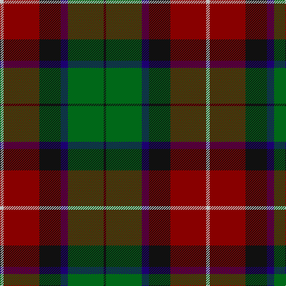

This page is one **sett** — a single exact thread-count. It belongs to the [tartan](/tartans/lb3r30k18db6g30k2/)
(the same proportion at any scale), whose colour order is pattern [KGBKRW](/stripes/kgbkrw/).

Sourced from register-of-tartans.  It is a [6 stripe tartan](/stripes/stripes6/).

Original link https://www.tartanregister.gov.uk/tartanDetails.aspx?ref=407

2 attestations — the source records this cloth was collapsed from (oldest owns this page)

<ul>
<li>01/01/2002 — Bryant (Dalgleish) (Personal) (register-of-tartans, <a href="https://www.tartanregister.gov.uk/tartanDetails.aspx?ref=407">record</a>)</li>
<li>pre 2002 — Bryant (Dalgleish) (Personal) (tartans-authority, <a href="http://www.tartansauthority.com/tartan-ferret/display/4146/">record</a>)</li>
</ul>

## Register references

External register numbers recorded for this tartan.

- Scottish Register of Tartans: [407](https://www.tartanregister.gov.uk/tartanDetails.aspx?ref=407)
- Scottish Tartans Authority (ITI): 4146

## Thread count
N/6 DR60 K36 DB12 G60 K/4

## Palette

Palette: <strong>Tartan Register</strong>
<table><thead><tr><th>Colour</th><th>Threads</th><th>Shade</th><th>Base</th><th>OKLCh</th></tr></thead><tbody><tr><td>N/</td><td style="text-align:right;font-variant-numeric:tabular-nums">6</td><td><code style="background-color:#C0C0C0;">#C0C0C0</code> <small style="color:#888">#C0C0C0</small></td><td>W <code style="background-color:#F7F7F7;">#F7F7F7</code></td><td><small style="color:#888">oklch(80.8% 0.000 89.9)</small></td></tr><tr><td>DR</td><td style="text-align:right;font-variant-numeric:tabular-nums">60</td><td><code style="background-color:#880000;">#880000</code> <small style="color:#888">#880000</small></td><td>R <code style="background-color:#CC0000;">#CC0000</code></td><td><small style="color:#888">oklch(39.4% 0.162 29.2)</small></td></tr><tr><td>K</td><td style="text-align:right;font-variant-numeric:tabular-nums">36</td><td><code style="background-color:#101010;">#101010</code> <small style="color:#888">#101010</small></td><td>K <code style="background-color:#000000;">#000000</code></td><td><small style="color:#888">oklch(17.3% 0.000 89.9)</small></td></tr><tr><td>DB</td><td style="text-align:right;font-variant-numeric:tabular-nums">12</td><td><code style="background-color:#1C0070;">#1C0070</code> <small style="color:#888">#1C0070</small></td><td>B <code style="background-color:#2A418A;">#2A418A</code></td><td><small style="color:#888">oklch(26.3% 0.162 277.1)</small></td></tr><tr><td>G</td><td style="text-align:right;font-variant-numeric:tabular-nums">60</td><td><code style="background-color:#006818;">#006818</code> <small style="color:#888">#006818</small></td><td>G <code style="background-color:#006100;">#006100</code></td><td><small style="color:#888">oklch(45.0% 0.142 145.0)</small></td></tr><tr><td>K/</td><td style="text-align:right;font-variant-numeric:tabular-nums">4</td><td><code style="background-color:#101010;">#101010</code> <small style="color:#888">#101010</small></td><td>K <code style="background-color:#000000;">#000000</code></td><td><small style="color:#888">oklch(17.3% 0.000 89.9)</small></td></tr></tbody></table>

# Sample pattern

## Nearest tartans

The nearest existing variants by ΔTartan distance, with this tartan at the top so the swatches line up against it.

ΔTartan

Tartan

Sett

—

<a href="/ttd/edit/#slug=lb3r30k18db6g30k2~x2">Bryant (Dalgleish) (Personal)</a> <a class="nn-out" href="/setts/s6/lb3r30k18db6g30k2~x2/" title="open its dictionary page">↗</a>

0.87

<a href="/ttd/edit/#slug=r2y18k2y3k20dy30w2~x2">Bennett, J P. (Personal)</a> <a class="nn-out" href="/setts/s7/r2y18k2y3k20dy30w2~x2/" title="open its dictionary page">↗</a>

1.00

<a href="/ttd/edit/#slug=db4r11db1g8r2g4k1lo2~x4">Craik of Assington (Personal)</a> <a class="nn-out" href="/setts/s8/db4r11db1g8r2g4k1lo2~x4/" title="open its dictionary page">↗</a>

1.06

<a href="/ttd/edit/#slug=g3db12w1dg12r12dg2~x2">Patterson, John (Personal)</a> <a class="nn-out" href="/setts/s6/g3db12w1dg12r12dg2~x2/" title="open its dictionary page">↗</a>

1.08

<a href="/ttd/edit/#slug=dgi3db12w1dg12r12dg2~x2">Patterson, John (Personal)</a> <a class="nn-out" href="/setts/s6/dgi3db12w1dg12r12dg2~x2/" title="open its dictionary page">↗</a>

1.10

<a href="/ttd/edit/#slug=db18k5r26k5g25k5db18ly2~x2">St. Clement of Rome (Corporate)</a> <a class="nn-out" href="/setts/s8/db18k5r26k5g25k5db18ly2~x2/" title="open its dictionary page">↗</a>

1.10

<a href="/ttd/edit/#slug=db6k3r14k3g14k3db6ly1~x4">Kilgour (Asymmetrical)</a> <a class="nn-out" href="/setts/s8/db6k3r14k3g14k3db6ly1~x4/" title="open its dictionary page">↗</a>

1.10

<a href="/ttd/edit/#slug=db6ly1db6k3r14k3g14k3~x4">Kilgour (Cant)</a> <a class="nn-out" href="/setts/s8/db6ly1db6k3r14k3g14k3~x4/" title="open its dictionary page">↗</a>

1.10

<a href="/ttd/edit/#slug=db6k3g14k3r14k3db6ly1~x4">Kilgour (Symmetrical)</a> <a class="nn-out" href="/setts/s8/db6k3g14k3r14k3db6ly1~x4/" title="open its dictionary page">↗</a>

1.11

<a href="/ttd/edit/#slug=dp18k7g5r4g7k1ly2~x2">Regent</a> <a class="nn-out" href="/setts/s7/dp18k7g5r4g7k1ly2~x2/" title="open its dictionary page">↗</a>

1.13

<a href="/ttd/edit/#slug=k6t1r18db6dg18k2~x2">Eachaidh (Personal)</a> <a class="nn-out" href="/setts/s6/k6t1r18db6dg18k2~x2/" title="open its dictionary page">↗</a>

## Neighbour map

Every grey dot is one of 14359 variants placed by the first two principal components of the ΔTartan feature space (44% of its variance). Red is this tartan; blue dots are its nearest — click one to open its page.

<svg viewBox="0 0 640 380" role="img" style="max-width:100%;height:auto;border:1px solid #e0e0e0;border-radius:4px;display:block" xmlns="http://www.w3.org/2000/svg"><image href="/nn/cloud.v1.png" width="640" height="380"/><a href="/setts/s7/r2y18k2y3k20dy30w2~x2/"><circle cx="231.9" cy="173.2" r="4" fill="#3465a4"><title>Bennett, J P. (Personal)</title></circle></a><a href="/setts/s8/db4r11db1g8r2g4k1lo2~x4/"><circle cx="208.9" cy="187.7" r="4" fill="#3465a4"><title>Craik of Assington (Personal)</title></circle></a><a href="/setts/s6/g3db12w1dg12r12dg2~x2/"><circle cx="168.9" cy="200.8" r="4" fill="#3465a4"><title>Patterson, John (Personal)</title></circle></a><a href="/setts/s6/dgi3db12w1dg12r12dg2~x2/"><circle cx="162.9" cy="196.7" r="4" fill="#3465a4"><title>Patterson, John (Personal)</title></circle></a><a href="/setts/s8/db18k5r26k5g25k5db18ly2~x2/"><circle cx="158.6" cy="186.3" r="4" fill="#3465a4"><title>St. Clement of Rome (Corporate)</title></circle></a><a href="/setts/s8/db6k3r14k3g14k3db6ly1~x4/"><circle cx="136.7" cy="175.1" r="4" fill="#3465a4"><title>Kilgour (Asymmetrical)</title></circle></a><a href="/setts/s8/db6ly1db6k3r14k3g14k3~x4/"><circle cx="136.7" cy="175.1" r="4" fill="#3465a4"><title>Kilgour (Cant)</title></circle></a><a href="/setts/s8/db6k3g14k3r14k3db6ly1~x4/"><circle cx="136.7" cy="175.1" r="4" fill="#3465a4"><title>Kilgour (Symmetrical)</title></circle></a><a href="/setts/s7/dp18k7g5r4g7k1ly2~x2/"><circle cx="215.0" cy="170.7" r="4" fill="#3465a4"><title>Regent</title></circle></a><a href="/setts/s6/k6t1r18db6dg18k2~x2/"><circle cx="237.2" cy="198.7" r="4" fill="#3465a4"><title>Eachaidh (Personal)</title></circle></a><circle cx="193.2" cy="191.4" r="5" fill="#c00000"/></svg>

ID: /setts/s6/lb3r30k18db6g30k2~x2/
