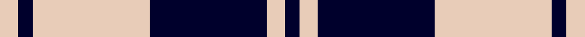
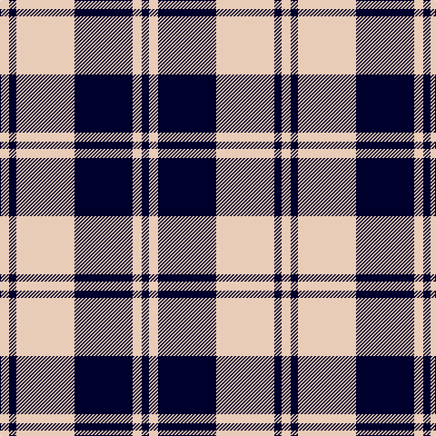

In pattern [KWKWKW](/stripes/kwkwkw/).

This was sourced from tartans-authority.  It is a [6 stripe tartan](/stripes/stripes6/).

Original link http://www.tartansauthority.com/tartan-ferret/display/8681/

## Thread count
LR/10 DB8 LR64 DB64 LR10 DB/8

## Palette
Each colour and the base-6 reference it is a variant of.

| Colour | Shade | Base |
|---|---|---|
| DB | <code style="background-color:#00002C;">#00002C</code> `oklch(13.2% 0.092 264.1)` <small>#00002C</small> | K <code style="background-color:#000000;">#000000</code> |
| LR | <code style="background-color:#E8CCB8;">#E8CCB8</code> `oklch(86.3% 0.042 57.7)` <small>#E8CCB8</small> | W <code style="background-color:#F7F7F7;">#F7F7F7</code> |

# Sample pattern

## Nearest tartans

The nearest existing variants by ΔTartan distance.

1. [Erskine BW MINI Design Tartan Tartan Number: 12466. Earliest known date: Generated for display purposes. Reduced copy of the original 1246 Erskine BW. See products available Copyright © Blair Urquhart, Comrie, 2015](/setts/s6/k2w1k9w9k1w2~x3/) — ΔT 0.69
1. [Cairn (Marton Mills)](/setts/s5/k2w1k8w8k1~x8/) — ΔT 0.85
1. [Erskine (Black and White)](/setts/s6/k2w1k9w9k1w2~x6/) — ΔT 0.90
1. [MacMugen](/setts/s6/k3lr16k4lr3k12w2~x3/) — ΔT 1.25
1. [MacLeod, Black & White](/setts/s5/w8k1w8k12w1~x2/) — ΔT 1.28
1. [Scott (Abbreviated)](/setts/s7/w2k1w6k6w2k1w1~x2/) — ΔT 1.34
1. [MacPhee (Black and White)](/setts/s4/k22w3k3w22~x2/) — ΔT 1.35
1. [Ailsa, Navy (Dance)](/setts/s6/db8w3db28w32k3w4~x2/) — ΔT 1.36
1. [Lewis, Navy (Dance)](/setts/s4/db4w35db31w4~x2/) — ΔT 1.46
1. [MacFie of Colonsay Dress (Fashion?)](/setts/s9/w2k11w2k2w16k2w2k11lo2~x4/) — ΔT 1.46

## Neighbour map

Every grey dot is one of 14299 variants placed by the first two principal components of the ΔTartan feature space (44% of its variance). Red is this tartan; blue dots are its nearest — click one to open its page.

<svg viewBox="0 0 640 380" role="img" style="max-width:100%;height:auto;border:1px solid #e0e0e0;border-radius:4px;display:block" xmlns="http://www.w3.org/2000/svg"><image href="/nn/cloud.v1.png" width="640" height="380"/><a href="/setts/s6/k2w1k9w9k1w2~x3/"><circle cx="299.2" cy="217.4" r="4" fill="#3465a4"><title>Erskine BW MINI Design Tartan Tartan Number: 12466. Earliest known date: Generated for display purposes. Reduced copy of the original 1246 Erskine BW. See products available Copyright © Blair Urquhart, Comrie, 2015</title></circle></a><a href="/setts/s5/k2w1k8w8k1~x8/"><circle cx="312.6" cy="237.3" r="4" fill="#3465a4"><title>Cairn (Marton Mills)</title></circle></a><a href="/setts/s6/k2w1k9w9k1w2~x6/"><circle cx="294.5" cy="213.5" r="4" fill="#3465a4"><title>Erskine (Black and White)</title></circle></a><a href="/setts/s6/k3lr16k4lr3k12w2~x3/"><circle cx="251.6" cy="220.9" r="4" fill="#3465a4"><title>MacMugen</title></circle></a><a href="/setts/s5/w8k1w8k12w1~x2/"><circle cx="320.2" cy="229.4" r="4" fill="#3465a4"><title>MacLeod, Black &amp; White</title></circle></a><a href="/setts/s7/w2k1w6k6w2k1w1~x2/"><circle cx="299.8" cy="231.1" r="4" fill="#3465a4"><title>Scott (Abbreviated)</title></circle></a><a href="/setts/s4/k22w3k3w22~x2/"><circle cx="284.4" cy="248.4" r="4" fill="#3465a4"><title>MacPhee (Black and White)</title></circle></a><a href="/setts/s6/db8w3db28w32k3w4~x2/"><circle cx="279.3" cy="189.9" r="4" fill="#3465a4"><title>Ailsa, Navy (Dance)</title></circle></a><a href="/setts/s4/db4w35db31w4~x2/"><circle cx="307.3" cy="241.2" r="4" fill="#3465a4"><title>Lewis, Navy (Dance)</title></circle></a><a href="/setts/s9/w2k11w2k2w16k2w2k11lo2~x4/"><circle cx="263.7" cy="182.0" r="4" fill="#3465a4"><title>MacFie of Colonsay Dress (Fashion?)</title></circle></a><circle cx="304.6" cy="219.1" r="5" fill="#c00000"/></svg>

ID: /setts/s6/lb5k4lb32k32lb5k4~x2/
