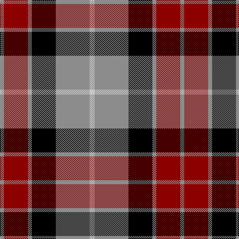

This page is one **sett** — a single exact thread-count. It belongs to the [tartan](/tartans/na5n34k24n4dr24n4/)
(the same proportion at any scale), whose colour order is pattern [RRRKRW](/stripes/rrrkrw/).

Sourced from register-of-tartans.  It is a [6 stripe tartan](/stripes/stripes6/).

Original link https://www.tartanregister.gov.uk/tartanDetails.aspx?ref=4552

## Register references

External register numbers recorded for this tartan.

- Scottish Register of Tartans: [4552](https://www.tartanregister.gov.uk/tartanDetails.aspx?ref=4552)
- Scottish Tartans Authority (ITI): 4281

## Thread count
Na/10 N68 K48 N8 DR48 N/8

## Palette
Each colour and the base-6 reference it is a variant of.

| Colour | Shade | Base |
|---|---|---|
| DR | <code style="background-color:#8C0000;">#8C0000</code> `oklch(40.2% 0.165 29.2)` <small>#8C0000</small> | R <code style="background-color:#CC0000;">#CC0000</code> |
| K | <code style="background-color:#000000;">#000000</code> `oklch(0.0% 0.000 0.0)` <small>#000000</small> | K <code style="background-color:#000000;">#000000</code> |
| N | <code style="background-color:#8C8C8C;">#8C8C8C</code> `oklch(64.0% 0.000 89.9)` <small>#8C8C8C</small> | R <code style="background-color:#CC0000;">#CC0000</code> |
| Na | <code style="background-color:#C8C8C8;">#C8C8C8</code> `oklch(83.3% 0.000 89.9)` <small>#C8C8C8</small> | W <code style="background-color:#F7F7F7;">#F7F7F7</code> |

# Sample pattern

## Nearest tartans

The nearest existing variants by ΔTartan distance, with this tartan at the top so the swatches line up against it.

ΔTartan

Tartan

Sett

—

<a href="/ttd/edit/#slug=lb5o34k24o4r24o4~x2">Wcwm 759-3</a> <a class="nn-out" href="/setts/s6/lb5o34k24o4r24o4~x2/" title="open its dictionary page">↗</a>

0.58

<a href="/ttd/edit/#slug=r4o30k6w13k13w3~x2">Thom(p)son camel</a> <a class="nn-out" href="/setts/s6/r4o30k6w13k13w3~x2/" title="open its dictionary page">↗</a>

0.71

<a href="/ttd/edit/#slug=w23db6w6r5k35r10~x2">Meg, Merrilees</a> <a class="nn-out" href="/setts/s6/w23db6w6r5k35r10~x2/" title="open its dictionary page">↗</a>

0.79

<a href="/ttd/edit/#slug=lb5r34k22r4o24r4~x2">Wcwm 759-2</a> <a class="nn-out" href="/setts/s6/lb5r34k22r4o24r4~x2/" title="open its dictionary page">↗</a>

0.83

<a href="/ttd/edit/#slug=r2y20k5w10k10r2~x2">Thom(p)son, Grey</a> <a class="nn-out" href="/setts/s6/r2y20k5w10k10r2~x2/" title="open its dictionary page">↗</a>

0.91

<a href="/ttd/edit/#slug=r12db3g5db16ly2g2~x2">Dunbog Primary (School)</a> <a class="nn-out" href="/setts/s6/r12db3g5db16ly2g2~x2/" title="open its dictionary page">↗</a>

0.94

<a href="/ttd/edit/#slug=r2dg17r8db8ly2~x4">British Hills</a> <a class="nn-out" href="/setts/s5/r2dg17r8db8ly2~x4/" title="open its dictionary page">↗</a>

0.98

<a href="/ttd/edit/#slug=r3y27k6lo13k14r3~x2">Thompson/Thomson/MacTavish special grey</a> <a class="nn-out" href="/setts/s6/r3y27k6lo13k14r3~x2/" title="open its dictionary page">↗</a>

0.99

<a href="/ttd/edit/#slug=g3k15r8g2o8k2~x4">Thompson Black (Fashion)</a> <a class="nn-out" href="/setts/s6/g3k15r8g2o8k2~x4/" title="open its dictionary page">↗</a>

1.00

<a href="/ttd/edit/#slug=db3r2g5r8db12w3~x2">Edinburgh Bus Company (Corporate)</a> <a class="nn-out" href="/setts/s6/db3r2g5r8db12w3~x2/" title="open its dictionary page">↗</a>

1.04

<a href="/ttd/edit/#slug=o3k7o2w2o12k2o2o3~x2">Daks</a> <a class="nn-out" href="/setts/s8/o3k7o2w2o12k2o2o3~x2/" title="open its dictionary page">↗</a>

## Neighbour map

Every grey dot is one of 14299 variants placed by the first two principal components of the ΔTartan feature space (44% of its variance). Red is this tartan; blue dots are its nearest — click one to open its page.

<svg viewBox="0 0 640 380" role="img" style="max-width:100%;height:auto;border:1px solid #e0e0e0;border-radius:4px;display:block" xmlns="http://www.w3.org/2000/svg"><image href="/nn/cloud.v1.png" width="640" height="380"/><a href="/setts/s6/r4o30k6w13k13w3~x2/"><circle cx="185.0" cy="187.3" r="4" fill="#3465a4"><title>Thom(p)son camel</title></circle></a><a href="/setts/s6/w23db6w6r5k35r10~x2/"><circle cx="158.8" cy="199.2" r="4" fill="#3465a4"><title>Meg, Merrilees</title></circle></a><a href="/setts/s6/lb5r34k22r4o24r4~x2/"><circle cx="206.4" cy="202.6" r="4" fill="#3465a4"><title>Wcwm 759-2</title></circle></a><a href="/setts/s6/r2y20k5w10k10r2~x2/"><circle cx="164.9" cy="190.5" r="4" fill="#3465a4"><title>Thom(p)son, Grey</title></circle></a><a href="/setts/s6/r12db3g5db16ly2g2~x2/"><circle cx="223.9" cy="209.5" r="4" fill="#3465a4"><title>Dunbog Primary (School)</title></circle></a><a href="/setts/s5/r2dg17r8db8ly2~x4/"><circle cx="220.6" cy="221.1" r="4" fill="#3465a4"><title>British Hills</title></circle></a><a href="/setts/s6/r3y27k6lo13k14r3~x2/"><circle cx="192.4" cy="206.6" r="4" fill="#3465a4"><title>Thompson/Thomson/MacTavish special grey</title></circle></a><a href="/setts/s6/g3k15r8g2o8k2~x4/"><circle cx="201.2" cy="223.0" r="4" fill="#3465a4"><title>Thompson Black (Fashion)</title></circle></a><a href="/setts/s6/db3r2g5r8db12w3~x2/"><circle cx="182.2" cy="229.9" r="4" fill="#3465a4"><title>Edinburgh Bus Company (Corporate)</title></circle></a><a href="/setts/s8/o3k7o2w2o12k2o2o3~x2/"><circle cx="174.7" cy="202.3" r="4" fill="#3465a4"><title>Daks</title></circle></a><circle cx="190.9" cy="202.0" r="5" fill="#c00000"/></svg>

ID: /setts/s6/lb5o34k24o4r24o4~x2/
