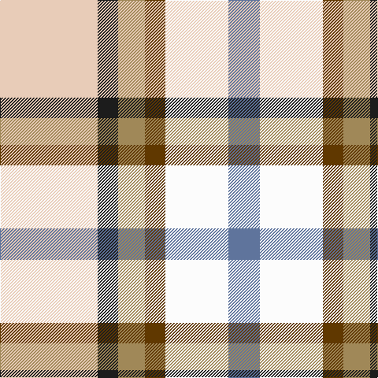

**Bands:** [BWGYBW](/stripes/bwgybw/) · **Stripes:** [T W DY LO DT LB](/stripes/stripes6/) T W DY LO DT LB

This was sourced from register-of-tartans.  It is a [6 band tartan](/bands/bands6/).

Original link https://www.tartanregister.gov.uk/tartanDetails.aspx?ref=11030

## Register references

External register numbers recorded for this tartan.

- Scottish Register of Tartans: [11030](https://www.tartanregister.gov.uk/tartanDetails.aspx?ref=11030)

## Thread count
LR/124 K26 LT34 T26 W80 B/40

## Palette
Each colour and its ΔE from the base-6 reference it is a variant of.

| Colour | Shade | Base | ΔE (OKLab) |
|---|---|---|---|
| B | <code style="background-color:#5F749C;">#5F749C</code> `#5F749C` | B <code style="background-color:#2A418A;">#2A418A</code> | 0.17 |
| K | <code style="background-color:#1C1C1C;">#1C1C1C</code> `#1C1C1C` | B <code style="background-color:#2A418A;">#2A418A</code> | 0.21 |
| LR | <code style="background-color:#E8CCB8;">#E8CCB8</code> `#E8CCB8` | W <code style="background-color:#F7F7F7;">#F7F7F7</code> | 0.12 |
| LT | <code style="background-color:#A08858;">#A08858</code> `#A08858` | Y <code style="background-color:#F2BF00;">#F2BF00</code> | 0.21 |
| T | <code style="background-color:#603800;">#603800</code> `#603800` | G <code style="background-color:#006100;">#006100</code> | 0.16 |
| W | <code style="background-color:#FCFCFC;">#FCFCFC</code> `#FCFCFC` | W <code style="background-color:#F7F7F7;">#F7F7F7</code> | 0.01 |

# Sample pattern

## Nearest tartans

The nearest existing variants by ΔTartan distance.

1. [MacGregor-Ryan (Personal)](/setts/s6/lb67k13dy17dy13w40t20~x2/) — ΔT 0.68
1. [SCH '67 Class](/setts/s6/db3r2lr15w10k2lo3~x2/) — ΔT 1.24
1. [Desang (Corporate)](/setts/s8/db4w2k3lb8g2lb8w2r4~x4/) — ΔT 1.47
1. [Edmonton, City of](/setts/s9/t8ly2g4ly2dp4ly2t8w15lo2~x4/) — ΔT 1.52
1. [Fraser, Red dress](/setts/s7/r4db18r4g19w25r10w4~x2/) — ΔT 1.53
1. [Devon Rural Skills Trust](/setts/s8/w5y4t1y4r4t1dg4ly1~x6/) — ΔT 1.61
1. [Ontario, Northern](/setts/s7/o17y5db2w12db2ly4g7~x2/) — ΔT 1.63
1. [Montessori School of Denver](/setts/s6/g25r9b3ly7w3dp11/) — ΔT 1.65
1. [Desang](/setts/s8/dr4w2lb8dg2lb8k3w2db4~x2/) — ΔT 1.65
1. [Fraser Red Dress](/setts/s7/r4db18r4dg19w25r10w4~x2/) — ΔT 1.70

## Neighbour map

Every grey dot is one of 14299 variants placed by the first two principal components of the ΔTartan feature space (44% of its variance). Red is this tartan; blue dots are its nearest — click one to open its page.

<svg viewBox="0 0 640 380" role="img" style="max-width:100%;height:auto;border:1px solid #e0e0e0;border-radius:4px;display:block" xmlns="http://www.w3.org/2000/svg"><image href="/nn/cloud.v1.png" width="640" height="380"/><a href="/setts/s6/lb67k13dy17dy13w40t20~x2/"><circle cx="90.1" cy="190.8" r="4" fill="#3465a4"><title>MacGregor-Ryan (Personal)</title></circle></a><a href="/setts/s6/db3r2lr15w10k2lo3~x2/"><circle cx="133.2" cy="155.9" r="4" fill="#3465a4"><title>SCH '67 Class</title></circle></a><a href="/setts/s8/db4w2k3lb8g2lb8w2r4~x4/"><circle cx="97.4" cy="190.7" r="4" fill="#3465a4"><title>Desang (Corporate)</title></circle></a><a href="/setts/s9/t8ly2g4ly2dp4ly2t8w15lo2~x4/"><circle cx="88.5" cy="153.5" r="4" fill="#3465a4"><title>Edmonton, City of</title></circle></a><a href="/setts/s7/r4db18r4g19w25r10w4~x2/"><circle cx="86.6" cy="192.6" r="4" fill="#3465a4"><title>Fraser, Red dress</title></circle></a><a href="/setts/s8/w5y4t1y4r4t1dg4ly1~x6/"><circle cx="36.8" cy="199.0" r="4" fill="#3465a4"><title>Devon Rural Skills Trust</title></circle></a><a href="/setts/s7/o17y5db2w12db2ly4g7~x2/"><circle cx="105.1" cy="173.8" r="4" fill="#3465a4"><title>Ontario, Northern</title></circle></a><a href="/setts/s6/g25r9b3ly7w3dp11/"><circle cx="127.0" cy="167.9" r="4" fill="#3465a4"><title>Montessori School of Denver</title></circle></a><a href="/setts/s8/dr4w2lb8dg2lb8k3w2db4~x2/"><circle cx="92.5" cy="190.5" r="4" fill="#3465a4"><title>Desang</title></circle></a><a href="/setts/s7/r4db18r4dg19w25r10w4~x2/"><circle cx="86.0" cy="191.0" r="4" fill="#3465a4"><title>Fraser Red Dress</title></circle></a><circle cx="69.8" cy="189.8" r="5" fill="#c00000"/></svg>

ID: /setts/s6/lb62dt13lo17dy13w40t20~x2/
