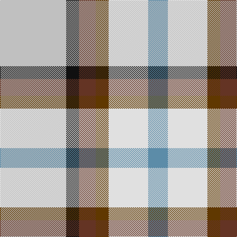

This page is one **sett** — a single exact thread-count. It belongs to the [tartan](/tartans/n67k13t17ta13ln40b20/)
(the same proportion at any scale), whose colour order is pattern [BWGGKW](/stripes/bwggkw/).

Sourced from tartans-authority.  It is a [6 stripe tartan](/stripes/stripes6/).

Original link http://www.tartansauthority.com/tartan-ferret/display/11030/

## Thread count
N/134 K26 T34 Ta26 LN80 B/40

## Palette
Each colour and the base-6 reference it is a variant of.

| Colour | Shade | Base |
|---|---|---|
| B | <code style="background-color:#5C8CA8;">#5C8CA8</code> `oklch(61.7% 0.067 235.0)` <small>#5C8CA8</small> | B <code style="background-color:#2A418A;">#2A418A</code> |
| K | <code style="background-color:#101010;">#101010</code> `oklch(17.3% 0.000 89.9)` <small>#101010</small> | K <code style="background-color:#000000;">#000000</code> |
| LN | <code style="background-color:#E0E0E0;">#E0E0E0</code> `oklch(90.7% 0.000 89.9)` <small>#E0E0E0</small> | W <code style="background-color:#F7F7F7;">#F7F7F7</code> |
| N | <code style="background-color:#C0C0C0;">#C0C0C0</code> `oklch(80.8% 0.000 89.9)` <small>#C0C0C0</small> | W <code style="background-color:#F7F7F7;">#F7F7F7</code> |
| T | <code style="background-color:#643424;">#643424</code> `oklch(38.3% 0.074 39.1)` <small>#643424</small> | G <code style="background-color:#006100;">#006100</code> |
| Ta | <code style="background-color:#603800;">#603800</code> `oklch(38.1% 0.084 66.7)` <small>#603800</small> | G <code style="background-color:#006100;">#006100</code> |

# Sample pattern

## Nearest tartans

The nearest existing variants by ΔTartan distance, with this tartan at the top so the swatches line up against it.

ΔTartan

Tartan

Sett

—

<a href="/ttd/edit/#slug=lb67k13dy17dy13w40t20~x2">MacGregor-Ryan (Personal)</a> <a class="nn-out" href="/setts/s6/lb67k13dy17dy13w40t20~x2/" title="open its dictionary page">↗</a>

0.68

<a href="/ttd/edit/#slug=lb62dt13lo17dy13w40t20~x2">MacGregor-Ryan (Personal)</a> <a class="nn-out" href="/setts/s6/lb62dt13lo17dy13w40t20~x2/" title="open its dictionary page">↗</a>

1.12

<a href="/ttd/edit/#slug=db3r2lr15w10k2lo3~x2">SCH '67 Class</a> <a class="nn-out" href="/setts/s6/db3r2lr15w10k2lo3~x2/" title="open its dictionary page">↗</a>

1.12

<a href="/ttd/edit/#slug=g25r9b3ly7w3dp11">Montessori School of Denver</a> <a class="nn-out" href="/setts/s6/g25r9b3ly7w3dp11/" title="open its dictionary page">↗</a>

1.31

<a href="/ttd/edit/#slug=r4db18r4g19w25r10w4~x2">Fraser, Red dress</a> <a class="nn-out" href="/setts/s7/r4db18r4g19w25r10w4~x2/" title="open its dictionary page">↗</a>

1.35

<a href="/ttd/edit/#slug=o17y5db2w12db2ly4g7~x2">Ontario, Northern</a> <a class="nn-out" href="/setts/s7/o17y5db2w12db2ly4g7~x2/" title="open its dictionary page">↗</a>

1.36

<a href="/ttd/edit/#slug=t8ly2g4ly2dp4ly2t8w15lo2~x4">Edmonton, City of</a> <a class="nn-out" href="/setts/s9/t8ly2g4ly2dp4ly2t8w15lo2~x4/" title="open its dictionary page">↗</a>

1.41

<a href="/ttd/edit/#slug=k8r12w8dg15n30ly5~x2">Reekie (Edmonton)</a> <a class="nn-out" href="/setts/s6/k8r12w8dg15n30ly5~x2/" title="open its dictionary page">↗</a>

1.42

<a href="/ttd/edit/#slug=db4w2k3lb8g2lb8w2r4~x4">Desang (Corporate)</a> <a class="nn-out" href="/setts/s8/db4w2k3lb8g2lb8w2r4~x4/" title="open its dictionary page">↗</a>

1.43

<a href="/ttd/edit/#slug=r4db18r4dg19w25r10w4~x2">Fraser Red Dress</a> <a class="nn-out" href="/setts/s7/r4db18r4dg19w25r10w4~x2/" title="open its dictionary page">↗</a>

1.48

<a href="/ttd/edit/#slug=dg3b12dg12w12dg2w12dg3~x2">Game Fair (Corporate)</a> <a class="nn-out" href="/setts/s7/dg3b12dg12w12dg2w12dg3~x2/" title="open its dictionary page">↗</a>

## Neighbour map

Every grey dot is one of 14299 variants placed by the first two principal components of the ΔTartan feature space (44% of its variance). Red is this tartan; blue dots are its nearest — click one to open its page.

<svg viewBox="0 0 640 380" role="img" style="max-width:100%;height:auto;border:1px solid #e0e0e0;border-radius:4px;display:block" xmlns="http://www.w3.org/2000/svg"><image href="/nn/cloud.v1.png" width="640" height="380"/><a href="/setts/s6/lb62dt13lo17dy13w40t20~x2/"><circle cx="69.8" cy="189.8" r="4" fill="#3465a4"><title>MacGregor-Ryan (Personal)</title></circle></a><a href="/setts/s6/db3r2lr15w10k2lo3~x2/"><circle cx="133.2" cy="155.9" r="4" fill="#3465a4"><title>SCH '67 Class</title></circle></a><a href="/setts/s6/g25r9b3ly7w3dp11/"><circle cx="127.0" cy="167.9" r="4" fill="#3465a4"><title>Montessori School of Denver</title></circle></a><a href="/setts/s7/r4db18r4g19w25r10w4~x2/"><circle cx="86.6" cy="192.6" r="4" fill="#3465a4"><title>Fraser, Red dress</title></circle></a><a href="/setts/s7/o17y5db2w12db2ly4g7~x2/"><circle cx="105.1" cy="173.8" r="4" fill="#3465a4"><title>Ontario, Northern</title></circle></a><a href="/setts/s9/t8ly2g4ly2dp4ly2t8w15lo2~x4/"><circle cx="88.5" cy="153.5" r="4" fill="#3465a4"><title>Edmonton, City of</title></circle></a><a href="/setts/s6/k8r12w8dg15n30ly5~x2/"><circle cx="87.0" cy="197.2" r="4" fill="#3465a4"><title>Reekie (Edmonton)</title></circle></a><a href="/setts/s8/db4w2k3lb8g2lb8w2r4~x4/"><circle cx="97.4" cy="190.7" r="4" fill="#3465a4"><title>Desang (Corporate)</title></circle></a><a href="/setts/s7/r4db18r4dg19w25r10w4~x2/"><circle cx="86.0" cy="191.0" r="4" fill="#3465a4"><title>Fraser Red Dress</title></circle></a><a href="/setts/s7/dg3b12dg12w12dg2w12dg3~x2/"><circle cx="87.0" cy="193.6" r="4" fill="#3465a4"><title>Game Fair (Corporate)</title></circle></a><circle cx="90.1" cy="190.8" r="5" fill="#c00000"/></svg>

ID: /setts/s6/lb67k13dy17dy13w40t20~x2/
