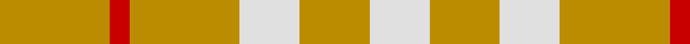

**Bands:** [WYWYRY](/stripes/wywyry/) · **Stripes:** [W LO W LO R LO](/stripes/stripes6/) W LO W LO R LO

This was sourced from register-of-tartans.  It is a [6 band tartan](/bands/bands6/).

Original link https://www.tartanregister.gov.uk/tartanDetails.aspx?ref=5074

## Register references

External register numbers recorded for this tartan.

- Scottish Register of Tartans: [5074](https://www.tartanregister.gov.uk/tartanDetails.aspx?ref=5074)
- Scottish Tartans Authority (ITI): 3842

## Thread count
DY/22 R4 DY22 LN12 DY14 LN/12

## Palette
Each colour and its ΔE from the base-6 reference it is a variant of.

| Colour | Shade | Base | ΔE (OKLab) |
|---|---|---|---|
| DY | <code style="background-color:#BC8C00;">#BC8C00</code> `#BC8C00` | Y <code style="background-color:#F2BF00;">#F2BF00</code> | 0.16 |
| LN | <code style="background-color:#E0E0E0;">#E0E0E0</code> `#E0E0E0` | W <code style="background-color:#F7F7F7;">#F7F7F7</code> | 0.07 |
| R | <code style="background-color:#C80000;">#C80000</code> `#C80000` | R <code style="background-color:#CC0000;">#CC0000</code> | 0.01 |
| Y | <code style="background-color:#E8C000;">#E8C000</code> `#E8C000` | Y <code style="background-color:#F2BF00;">#F2BF00</code> | 0.02 |

# Sample pattern

## Nearest tartans

The nearest existing variants by ΔTartan distance.

1. [Virgin One (Corporate)](/setts/s4/lo7w6lo11r2~x2/) — ΔT 0.91
1. [One Account](/setts/s6/ly12w5ly6w5ly12r2~x2/) — ΔT 1.39
1. [One Account (Corporate)](/setts/s4/ly6w5ly12r2~x2/) — ΔT 1.65
1. [Glufree](/setts/s8/ly8r2ly8g1r6ly3g4ly2~x4/) — ΔT 1.67
1. [Amber Rose (Fashion)](/setts/s5/lo1o4lo4o6w1~x10/) — ΔT 2.41
1. [Burt's Highlanders (Fashion)](/setts/s5/lo40g13lo6db13lo22~x2/) — ΔT 2.45
1. [Fallow Deer, The](/setts/s6/o3w17o11w2o11w2~x4/) — ΔT 2.58
1. [Caspari (Corporate)](/setts/s7/r8ly2r15g10r4g10r4~x2/) — ΔT 2.60
1. [Unidentified 24](/setts/s7/ly1r3g7r3g7r3ly1~x4/) — ΔT 2.67
1. [Twilfit](/setts/s9/t25r46w11r11w7r11w11r46t12/) — ΔT 2.68

## Neighbour map

Every grey dot is one of 14313 variants placed by the first two principal components of the ΔTartan feature space (44% of its variance). Red is this tartan; blue dots are its nearest — click one to open its page.

<svg viewBox="0 0 640 380" role="img" style="max-width:100%;height:auto;border:1px solid #e0e0e0;border-radius:4px;display:block" xmlns="http://www.w3.org/2000/svg"><image href="/nn/cloud.v1.png" width="640" height="380"/><a href="/setts/s4/lo7w6lo11r2~x2/"><circle cx="401.1" cy="305.4" r="4" fill="#3465a4"><title>Virgin One (Corporate)</title></circle></a><a href="/setts/s6/ly12w5ly6w5ly12r2~x2/"><circle cx="415.6" cy="276.8" r="4" fill="#3465a4"><title>One Account</title></circle></a><a href="/setts/s4/ly6w5ly12r2~x2/"><circle cx="419.1" cy="282.1" r="4" fill="#3465a4"><title>One Account (Corporate)</title></circle></a><a href="/setts/s8/ly8r2ly8g1r6ly3g4ly2~x4/"><circle cx="348.5" cy="240.1" r="4" fill="#3465a4"><title>Glufree</title></circle></a><a href="/setts/s5/lo1o4lo4o6w1~x10/"><circle cx="374.5" cy="285.4" r="4" fill="#3465a4"><title>Amber Rose (Fashion)</title></circle></a><a href="/setts/s5/lo40g13lo6db13lo22~x2/"><circle cx="375.0" cy="245.1" r="4" fill="#3465a4"><title>Burt's Highlanders (Fashion)</title></circle></a><a href="/setts/s6/o3w17o11w2o11w2~x4/"><circle cx="344.5" cy="240.2" r="4" fill="#3465a4"><title>Fallow Deer, The</title></circle></a><a href="/setts/s7/r8ly2r15g10r4g10r4~x2/"><circle cx="341.8" cy="256.3" r="4" fill="#3465a4"><title>Caspari (Corporate)</title></circle></a><a href="/setts/s7/ly1r3g7r3g7r3ly1~x4/"><circle cx="308.4" cy="250.4" r="4" fill="#3465a4"><title>Unidentified 24</title></circle></a><a href="/setts/s9/t25r46w11r11w7r11w11r46t12/"><circle cx="364.1" cy="227.0" r="4" fill="#3465a4"><title>Twilfit</title></circle></a><circle cx="376.7" cy="295.4" r="5" fill="#c00000"/></svg>

ID: /setts/s6/lo11r2lo11w6lo7w6~x2/
