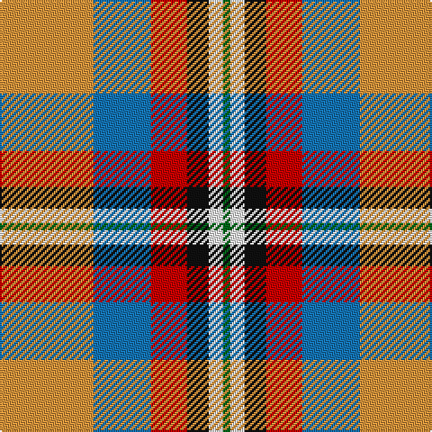

In pattern [GWKRBY](/stripes/gwkrby/).

This was sourced from register-of-tartans.  It is a [6 stripe tartan](/stripes/stripes6/).

Original link https://www.tartanregister.gov.uk/tartanDetails.aspx?ref=175

## Attestations

This cloth appears in 2 source records; the oldest owns this page.

- 01/01/2003 — Ball (register-of-tartans, [record](https://www.tartanregister.gov.uk/tartanDetails.aspx?ref=175))
- 2003 — Ball (Name) (tartans-authority, [record](http://www.tartansauthority.com/tartan-ferret/display/6056/))

## Register references

External register numbers recorded for this tartan.

- Scottish Register of Tartans: [175](https://www.tartanregister.gov.uk/tartanDetails.aspx?ref=175)
- Scottish Tartans Authority (ITI): 6056

## Thread count
O/52 B32 R20 K12 W8 G/4

## Palette
Each colour and its ΔE from the base-6 reference it is a variant of.

| Colour | Shade | Base | ΔE (OKLab) |
|---|---|---|---|
| B | <code style="background-color:#1474B4;">#1474B4</code> `#1474B4` | B <code style="background-color:#2A418A;">#2A418A</code> | 0.15 |
| DB | <code style="background-color:#2C2C80;">#2C2C80</code> `#2C2C80` | B <code style="background-color:#2A418A;">#2A418A</code> | 0.06 |
| G | <code style="background-color:#006818;">#006818</code> `#006818` | G <code style="background-color:#006100;">#006100</code> | 0.02 |
| K | <code style="background-color:#101010;">#101010</code> `#101010` | K <code style="background-color:#000000;">#000000</code> | 0.17 |
| LR | <code style="background-color:#E87878;">#E87878</code> `#E87878` | R <code style="background-color:#CC0000;">#CC0000</code> | 0.19 |
| O | <code style="background-color:#DC943C;">#DC943C</code> `#DC943C` | Y <code style="background-color:#F2BF00;">#F2BF00</code> | 0.12 |
| R | <code style="background-color:#C80000;">#C80000</code> `#C80000` | R <code style="background-color:#CC0000;">#CC0000</code> | 0.01 |
| W | <code style="background-color:#FCFCFC;">#FCFCFC</code> `#FCFCFC` | W <code style="background-color:#F7F7F7;">#F7F7F7</code> | 0.01 |
| Y | <code style="background-color:#E8C000;">#E8C000</code> `#E8C000` | Y <code style="background-color:#F2BF00;">#F2BF00</code> | 0.02 |

# Sample pattern

## Nearest tartans

The nearest existing variants by ΔTartan distance.

1. [Christie (London) (Personal)](/setts/s6/w5r25t18g4k2ly5~x2/) — ΔT 0.84
1. [Ball Hunting](/setts/s6/lo13g8k5lb3w2r1~x4/) — ΔT 0.96
1. [Canadian Shield (Personal)](/setts/s7/r5dg8do13o21y34w55dg3/) — ΔT 1.01
1. [Porcupine City of](/setts/s7/r10n3db1lb8db1lo2g5~x4/) — ΔT 1.04
1. [De Maynard (Personal)](/setts/s8/dp2o9g8o4ly1o4db10w2~x4/) — ΔT 1.06
1. [Nicolson of Taransay (Personal)](/setts/s7/w6g10r22db16g2g4g5~x2/) — ΔT 1.07
1. [MacLean, dress](/setts/s6/r1w12g6r8t3ly1~x4/) — ΔT 1.14
1. [MacLachlan Dress Clan Tartan Tartan Number: 828. Earliest known date: 1990 Based on the MacLachlan pattern in Old And Rare See products available Copyright © Blair Urquhart, Comrie, 2015](/setts/s7/r34w3g4g23w24k3g4~x2/) — ΔT 1.16
1. [Oor Wullie (Corporate)](/setts/s7/ly3r3ly2r20k16lb24w2~x2/) — ΔT 1.16
1. [Barbour -Modern](/setts/s7/lb4ly2lb21k11w2n21r2~x2/) — ΔT 1.19

## Neighbour map

Every grey dot is one of 14299 variants placed by the first two principal components of the ΔTartan feature space (44% of its variance). Red is this tartan; blue dots are its nearest — click one to open its page.

<svg viewBox="0 0 640 380" role="img" style="max-width:100%;height:auto;border:1px solid #e0e0e0;border-radius:4px;display:block" xmlns="http://www.w3.org/2000/svg"><image href="/nn/cloud.v1.png" width="640" height="380"/><a href="/setts/s6/w5r25t18g4k2ly5~x2/"><circle cx="189.6" cy="148.3" r="4" fill="#3465a4"><title>Christie (London) (Personal)</title></circle></a><a href="/setts/s6/lo13g8k5lb3w2r1~x4/"><circle cx="141.5" cy="152.8" r="4" fill="#3465a4"><title>Ball Hunting</title></circle></a><a href="/setts/s7/r5dg8do13o21y34w55dg3/"><circle cx="153.4" cy="120.8" r="4" fill="#3465a4"><title>Canadian Shield (Personal)</title></circle></a><a href="/setts/s7/r10n3db1lb8db1lo2g5~x4/"><circle cx="116.5" cy="163.3" r="4" fill="#3465a4"><title>Porcupine City of</title></circle></a><a href="/setts/s8/dp2o9g8o4ly1o4db10w2~x4/"><circle cx="141.3" cy="162.2" r="4" fill="#3465a4"><title>De Maynard (Personal)</title></circle></a><a href="/setts/s7/w6g10r22db16g2g4g5~x2/"><circle cx="105.7" cy="161.2" r="4" fill="#3465a4"><title>Nicolson of Taransay (Personal)</title></circle></a><a href="/setts/s6/r1w12g6r8t3ly1~x4/"><circle cx="158.9" cy="164.8" r="4" fill="#3465a4"><title>MacLean, dress</title></circle></a><a href="/setts/s7/r34w3g4g23w24k3g4~x2/"><circle cx="154.6" cy="155.2" r="4" fill="#3465a4"><title>MacLachlan Dress Clan Tartan Tartan Number: 828. Earliest known date: 1990 Based on the MacLachlan pattern in Old And Rare See products available Copyright © Blair Urquhart, Comrie, 2015</title></circle></a><a href="/setts/s7/ly3r3ly2r20k16lb24w2~x2/"><circle cx="129.5" cy="127.7" r="4" fill="#3465a4"><title>Oor Wullie (Corporate)</title></circle></a><a href="/setts/s7/lb4ly2lb21k11w2n21r2~x2/"><circle cx="148.7" cy="143.3" r="4" fill="#3465a4"><title>Barbour -Modern</title></circle></a><circle cx="151.1" cy="151.4" r="5" fill="#c00000"/></svg>

ID: /setts/s6/lo13b8r5k3w2g1~x4/
