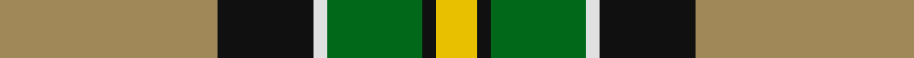
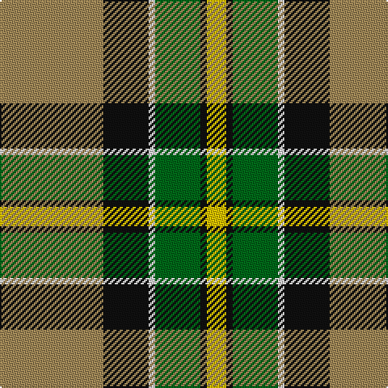

In pattern [YKGWKY](/stripes/ykgwky/).

This was sourced from tartans-authority.  It is a [6 stripe tartan](/stripes/stripes6/).

Original link http://www.tartansauthority.com/tartan-ferret/display/5141/

## Thread count
LT/64 K28 LN4 G28 K4 Y/12

## Palette
Each colour and the base-6 reference it is a variant of.

| Colour | Shade | Base |
|---|---|---|
| G | <code style="background-color:#006818;">#006818</code> `oklch(45.0% 0.142 145.0)` <small>#006818</small> | G <code style="background-color:#006100;">#006100</code> |
| K | <code style="background-color:#101010;">#101010</code> `oklch(17.3% 0.000 89.9)` <small>#101010</small> | K <code style="background-color:#000000;">#000000</code> |
| LN | <code style="background-color:#E0E0E0;">#E0E0E0</code> `oklch(90.7% 0.000 89.9)` <small>#E0E0E0</small> | W <code style="background-color:#F7F7F7;">#F7F7F7</code> |
| LT | <code style="background-color:#A08858;">#A08858</code> `oklch(63.7% 0.071 84.0)` <small>#A08858</small> | Y <code style="background-color:#F2BF00;">#F2BF00</code> |
| Y | <code style="background-color:#E8C000;">#E8C000</code> `oklch(81.9% 0.168 93.7)` <small>#E8C000</small> | Y <code style="background-color:#F2BF00;">#F2BF00</code> |

# Sample pattern

## Nearest tartans

The nearest existing variants by ΔTartan distance.

1. [Regalia](/setts/s7/dg1dy7dg7o2dy1ly15w1~x4/) — ΔT 0.75
1. [Bryan Wedding (Personal)](/setts/s6/dy30ly5t10k10w2k2~x2/) — ΔT 1.01
1. [Afternoon Tea / Afternoon Tea](/setts/s6/w15k8m25k72g98ly15/) — ΔT 1.10
1. [Mellor (Name)](/setts/s6/w8k16g32dt3lo5w5~x2/) — ΔT 1.15
1. [Fraser Yellow](/setts/s7/r2w2ly27dg14ly2db14ly2~x2/) — ΔT 1.19
1. [COG USA, THE](/setts/s6/lo9dg18t9r1w1db1~x4/) — ΔT 1.24
1. [St Andrews Bay](/setts/s7/lo30w4lo20g20k20lo3k6~x2/) — ΔT 1.25
1. [Cornish National Small Set Tartan Tartan Number: 7651. Earliest known date: See products available Copyright © Blair Urquhart, Comrie, 2015](/setts/s6/w2k11ly11t3k1r1~x2/) — ΔT 1.25
1. [St. Lawrence #2 (Fashion)](/setts/s8/g2do13g11ly5do1lo21g2dy1~x2/) — ΔT 1.27
1. [MacLamroc](/setts/s6/ly4k1dg16k16r1w3~x2/) — ΔT 1.27

## Neighbour map

Every grey dot is one of 14299 variants placed by the first two principal components of the ΔTartan feature space (44% of its variance). Red is this tartan; blue dots are its nearest — click one to open its page.

<svg viewBox="0 0 640 380" role="img" style="max-width:100%;height:auto;border:1px solid #e0e0e0;border-radius:4px;display:block" xmlns="http://www.w3.org/2000/svg"><image href="/nn/cloud.v1.png" width="640" height="380"/><a href="/setts/s7/dg1dy7dg7o2dy1ly15w1~x4/"><circle cx="211.3" cy="144.5" r="4" fill="#3465a4"><title>Regalia</title></circle></a><a href="/setts/s6/dy30ly5t10k10w2k2~x2/"><circle cx="252.7" cy="161.5" r="4" fill="#3465a4"><title>Bryan Wedding (Personal)</title></circle></a><a href="/setts/s6/w15k8m25k72g98ly15/"><circle cx="201.5" cy="180.6" r="4" fill="#3465a4"><title>Afternoon Tea / Afternoon Tea</title></circle></a><a href="/setts/s6/w8k16g32dt3lo5w5~x2/"><circle cx="187.3" cy="178.6" r="4" fill="#3465a4"><title>Mellor (Name)</title></circle></a><a href="/setts/s7/r2w2ly27dg14ly2db14ly2~x2/"><circle cx="224.1" cy="142.1" r="4" fill="#3465a4"><title>Fraser Yellow</title></circle></a><a href="/setts/s6/lo9dg18t9r1w1db1~x4/"><circle cx="231.6" cy="147.6" r="4" fill="#3465a4"><title>COG USA, THE</title></circle></a><a href="/setts/s7/lo30w4lo20g20k20lo3k6~x2/"><circle cx="199.3" cy="197.7" r="4" fill="#3465a4"><title>St Andrews Bay</title></circle></a><a href="/setts/s6/w2k11ly11t3k1r1~x2/"><circle cx="173.7" cy="158.0" r="4" fill="#3465a4"><title>Cornish National Small Set Tartan Tartan Number: 7651. Earliest known date: See products available Copyright © Blair Urquhart, Comrie, 2015</title></circle></a><a href="/setts/s8/g2do13g11ly5do1lo21g2dy1~x2/"><circle cx="210.7" cy="142.6" r="4" fill="#3465a4"><title>St. Lawrence #2 (Fashion)</title></circle></a><a href="/setts/s6/ly4k1dg16k16r1w3~x2/"><circle cx="212.8" cy="162.7" r="4" fill="#3465a4"><title>MacLamroc</title></circle></a><circle cx="216.0" cy="162.8" r="5" fill="#c00000"/></svg>

ID: /setts/s6/lo16k7w1g7k1ly3~x4/
