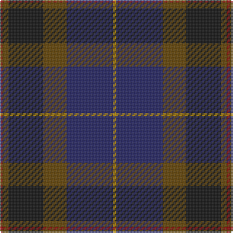

**Bands:** [RGKGBY](/stripes/rgkgby/) · **Stripes:** [R DY K DY DB LO](/stripes/stripes6/) R DY K DY DB LO

This was sourced from register-of-tartans.  It is a [6 band tartan](/bands/bands6/).

Original link https://www.tartanregister.gov.uk/tartanDetails.aspx?ref=4874

## Register references

External register numbers recorded for this tartan.

- Scottish Register of Tartans: [4874](https://www.tartanregister.gov.uk/tartanDetails.aspx?ref=4874)
- Scottish Tartans Authority (ITI): 3711

## Thread count
DR/2 T4 K24 T16 DB32 DY/2

## Palette
Each colour and its ΔE from the base-6 reference it is a variant of.

| Colour | Shade | Base | ΔE (OKLab) |
|---|---|---|---|
| DB | <code style="background-color:#202060;">#202060</code> `#202060` | B <code style="background-color:#2A418A;">#2A418A</code> | 0.11 |
| DR | <code style="background-color:#880000;">#880000</code> `#880000` | R <code style="background-color:#CC0000;">#CC0000</code> | 0.15 |
| DY | <code style="background-color:#BC8C00;">#BC8C00</code> `#BC8C00` | Y <code style="background-color:#F2BF00;">#F2BF00</code> | 0.16 |
| K | <code style="background-color:#101010;">#101010</code> `#101010` | K <code style="background-color:#000000;">#000000</code> | 0.17 |
| T | <code style="background-color:#604000;">#604000</code> `#604000` | G <code style="background-color:#006100;">#006100</code> | 0.14 |

# Sample pattern

## Nearest tartans

The nearest existing variants by ΔTartan distance.

1. [Bobby Jones (Personal)](/setts/s6/lo1db16dy8dt12dy2r1~x2/) — ΔT 0.84
1. [Passion of Scotland, Pewter (Fashion](/setts/s5/n8o3n34k34dp3~x2/) — ΔT 1.05
1. [Andover](/setts/s6/r1n12k6k1do10r1~x4/) — ΔT 1.09
1. [Bouncing Blackie (Personal)](/setts/s7/dp5db8dt13g21db34dt55o3/) — ΔT 1.13
1. [Dallard (Personal)](/setts/s5/k37dg37n8k3dp5~x2/) — ΔT 1.16
1. [Passion of Scotland (Fashion)](/setts/s7/dt6o4dt2db25k30g2k2~x2/) — ΔT 1.18
1. [Cultoquhey Hotel Corporate Tartan Tartan Number: 3393. Earliest known date: circa1990 Designed by Peter MacDonald as a Cook tartan for the former owners (David & Anna) of the Cultoquhey Hotel near Crieff. When they left, if became the house tartan of the hotel See products available Copyright © Blair Urquhart, Comrie, 2015](/setts/s5/ly3dg32k11db22r3~x2/) — ΔT 1.21
1. [Dempster, Ross (Personal)](/setts/s7/db4dg2r17r9dg10db30n2~x2/) — ΔT 1.22
1. [Kilkenny, County (District)](/setts/s7/dr4dg27o2db25lo5dg3o3~x2/) — ΔT 1.22
1. [Bailies of Bennachie Corporate Tartan Tartan Number: 3628. Earliest known date: 2002 The Bailes of Bennachie were founded in 1973 as caretakers of the mountain in Aberdeenshire, with the aim of 'preserving the amenity of the hill'. The tartan was produced on the occasion of the 25th anniversary to help create funds to continue their task. The colours reflect the autumn shades on the hill. See products available Copyright © Blair Urquhart, Comrie, 2015](/setts/s7/y27dr2y4o15db26k2db6~x2/) — ΔT 1.26

## Neighbour map

Every grey dot is one of 14313 variants placed by the first two principal components of the ΔTartan feature space (44% of its variance). Red is this tartan; blue dots are its nearest — click one to open its page.

<svg viewBox="0 0 640 380" role="img" style="max-width:100%;height:auto;border:1px solid #e0e0e0;border-radius:4px;display:block" xmlns="http://www.w3.org/2000/svg"><image href="/nn/cloud.v1.png" width="640" height="380"/><a href="/setts/s6/lo1db16dy8dt12dy2r1~x2/"><circle cx="305.9" cy="228.9" r="4" fill="#3465a4"><title>Bobby Jones (Personal)</title></circle></a><a href="/setts/s5/n8o3n34k34dp3~x2/"><circle cx="313.9" cy="246.2" r="4" fill="#3465a4"><title>Passion of Scotland, Pewter (Fashion</title></circle></a><a href="/setts/s6/r1n12k6k1do10r1~x4/"><circle cx="255.4" cy="216.5" r="4" fill="#3465a4"><title>Andover</title></circle></a><a href="/setts/s7/dp5db8dt13g21db34dt55o3/"><circle cx="344.5" cy="218.3" r="4" fill="#3465a4"><title>Bouncing Blackie (Personal)</title></circle></a><a href="/setts/s5/k37dg37n8k3dp5~x2/"><circle cx="295.9" cy="245.5" r="4" fill="#3465a4"><title>Dallard (Personal)</title></circle></a><a href="/setts/s7/dt6o4dt2db25k30g2k2~x2/"><circle cx="334.7" cy="210.6" r="4" fill="#3465a4"><title>Passion of Scotland (Fashion)</title></circle></a><a href="/setts/s5/ly3dg32k11db22r3~x2/"><circle cx="271.2" cy="243.2" r="4" fill="#3465a4"><title>Cultoquhey Hotel Corporate Tartan Tartan Number: 3393. Earliest known date: circa1990 Designed by Peter MacDonald as a Cook tartan for the former owners (David &amp; Anna) of the Cultoquhey Hotel near Crieff. When they left, if became the house tartan of the hotel See products available Copyright © Blair Urquhart, Comrie, 2015</title></circle></a><a href="/setts/s7/db4dg2r17r9dg10db30n2~x2/"><circle cx="281.3" cy="194.9" r="4" fill="#3465a4"><title>Dempster, Ross (Personal)</title></circle></a><a href="/setts/s7/dr4dg27o2db25lo5dg3o3~x2/"><circle cx="282.7" cy="194.9" r="4" fill="#3465a4"><title>Kilkenny, County (District)</title></circle></a><a href="/setts/s7/y27dr2y4o15db26k2db6~x2/"><circle cx="261.3" cy="206.9" r="4" fill="#3465a4"><title>Bailies of Bennachie Corporate Tartan Tartan Number: 3628. Earliest known date: 2002 The Bailes of Bennachie were founded in 1973 as caretakers of the mountain in Aberdeenshire, with the aim of 'preserving the amenity of the hill'. The tartan was produced on the occasion of the 25th anniversary to help create funds to continue their task. The colours reflect the autumn shades on the hill. See products available Copyright © Blair Urquhart, Comrie, 2015</title></circle></a><circle cx="286.0" cy="218.0" r="5" fill="#c00000"/></svg>

ID: /setts/s6/lo1db16dy8k12dy2r1~x2/
