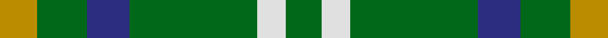

In pattern [GWGBGY](/stripes/gwgbgy/).

This was sourced from tartans-authority.  It is a [6 stripe tartan](/stripes/stripes6/).

Original link http://www.tartansauthority.com/tartan-ferret/display/7410/

## Also known as

This cloth is also recorded under:

- Meath County, Crest Range

## Attestations

This cloth appears in 2 source records; the oldest owns this page.

- 2004 — Meath County Crest (Fashion) (tartans-authority, [record](http://www.tartansauthority.com/tartan-ferret/display/7410/))
- 01/05/2005 — Meath County, Crest Range (register-of-tartans, [record](https://www.tartanregister.gov.uk/tartanDetails.aspx?ref=5054))

## Register references

External register numbers recorded for this tartan.

- Scottish Register of Tartans: [5054](https://www.tartanregister.gov.uk/tartanDetails.aspx?ref=5054)
- Scottish Tartans Authority (ITI): 7410
- Scottish Tartans World Register: 3095

## Thread count
DY/21 G28 DB24 G72 LN16 G/20

## Palette
Each colour and its ΔE from the base-6 reference it is a variant of.

| Colour | Shade | Base | ΔE (OKLab) |
|---|---|---|---|
| DB | <code style="background-color:#2C2C80;">#2C2C80</code> `#2C2C80` | B <code style="background-color:#2A418A;">#2A418A</code> | 0.06 |
| DY | <code style="background-color:#BC8C00;">#BC8C00</code> `#BC8C00` | Y <code style="background-color:#F2BF00;">#F2BF00</code> | 0.16 |
| G | <code style="background-color:#006818;">#006818</code> `#006818` | G <code style="background-color:#006100;">#006100</code> | 0.02 |
| LN | <code style="background-color:#E0E0E0;">#E0E0E0</code> `#E0E0E0` | W <code style="background-color:#F7F7F7;">#F7F7F7</code> | 0.07 |

# Sample pattern

## Nearest tartans

The nearest existing variants by ΔTartan distance.

1. [Justus hunting](/setts/s7/db1g4r1g1ly1g4db1~x12/) — ΔT 1.03
1. [Justus Hunting (Personal)](/setts/s7/db1dg4r1dg1lo1dg4db1~x12/) — ΔT 1.37
1. [Moore Caledonian (Personal)](/setts/s6/r1k6g6ly1g6ly1~x6/) — ΔT 1.51
1. [Bean Hunting](/setts/s7/db6r15g41r15db20g41t6/) — ΔT 1.52
1. [Milton](/setts/s6/g8r3g4k6g9dp2~x2/) — ΔT 1.53
1. [Milton (Name?)](/setts/s6/g8r3g4k6g9dp2~x4/) — ΔT 1.53
1. [Wilson's No.140](/setts/s4/k2ly1g7t1~x2/) — ΔT 1.58
1. [Bacon, Green (Fashion)](/setts/s4/g14k3r3lr2~x2/) — ΔT 1.66
1. [Ayrton of Laoch (Personal)](/setts/s10/r2g12ly2g12db3g2db2g2db4r2~x2/) — ΔT 1.69
1. [Cameron of Lochiel (Hunting) Clan/Family Tartan Tartan Number: 5351. Earliest known date: 01/01/1940 Design close to Cameron Hunting which has two red lines shown in Vestiarium Scoticum. This design evolved in the 1940s by J G MacKay of Portree and was first put on show at the Cameron Gathering at Achnacarry in 1956. (original STA ref: 1535) See products available Copyright © Blair Urquhart, Comrie, 2015](/setts/s7/r5g20r5g20db24g6ly4/) — ΔT 1.69

## Neighbour map

Every grey dot is one of 14299 variants placed by the first two principal components of the ΔTartan feature space (44% of its variance). Red is this tartan; blue dots are its nearest — click one to open its page.

<svg viewBox="0 0 640 380" role="img" style="max-width:100%;height:auto;border:1px solid #e0e0e0;border-radius:4px;display:block" xmlns="http://www.w3.org/2000/svg"><image href="/nn/cloud.v1.png" width="640" height="380"/><a href="/setts/s7/db1g4r1g1ly1g4db1~x12/"><circle cx="345.1" cy="264.3" r="4" fill="#3465a4"><title>Justus hunting</title></circle></a><a href="/setts/s7/db1dg4r1dg1lo1dg4db1~x12/"><circle cx="360.1" cy="271.1" r="4" fill="#3465a4"><title>Justus Hunting (Personal)</title></circle></a><a href="/setts/s6/r1k6g6ly1g6ly1~x6/"><circle cx="262.6" cy="243.2" r="4" fill="#3465a4"><title>Moore Caledonian (Personal)</title></circle></a><a href="/setts/s7/db6r15g41r15db20g41t6/"><circle cx="284.3" cy="246.5" r="4" fill="#3465a4"><title>Bean Hunting</title></circle></a><a href="/setts/s6/g8r3g4k6g9dp2~x2/"><circle cx="269.2" cy="280.7" r="4" fill="#3465a4"><title>Milton</title></circle></a><a href="/setts/s6/g8r3g4k6g9dp2~x4/"><circle cx="269.2" cy="280.7" r="4" fill="#3465a4"><title>Milton (Name?)</title></circle></a><a href="/setts/s4/k2ly1g7t1~x2/"><circle cx="337.4" cy="247.7" r="4" fill="#3465a4"><title>Wilson's No.140</title></circle></a><a href="/setts/s4/g14k3r3lr2~x2/"><circle cx="347.5" cy="250.5" r="4" fill="#3465a4"><title>Bacon, Green (Fashion)</title></circle></a><a href="/setts/s10/r2g12ly2g12db3g2db2g2db4r2~x2/"><circle cx="345.3" cy="221.1" r="4" fill="#3465a4"><title>Ayrton of Laoch (Personal)</title></circle></a><a href="/setts/s7/r5g20r5g20db24g6ly4/"><circle cx="264.1" cy="247.8" r="4" fill="#3465a4"><title>Cameron of Lochiel (Hunting) Clan/Family Tartan Tartan Number: 5351. Earliest known date: 01/01/1940 Design close to Cameron Hunting which has two red lines shown in Vestiarium Scoticum. This design evolved in the 1940s by J G MacKay of Portree and was first put on show at the Cameron Gathering at Achnacarry in 1956. (original STA ref: 1535) See products available Copyright © Blair Urquhart, Comrie, 2015</title></circle></a><circle cx="307.6" cy="269.6" r="5" fill="#c00000"/></svg>

ID: /setts/s6/lo21g28db24g72w16g20/
