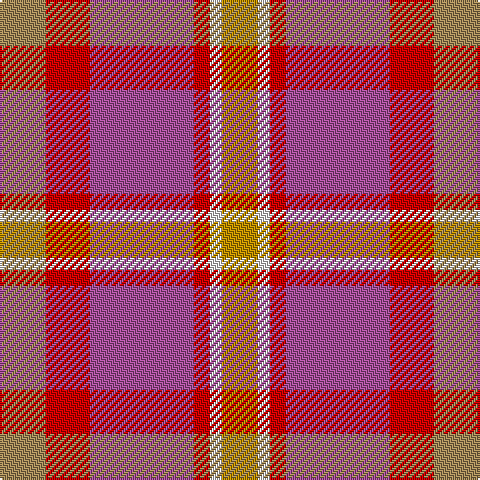

This page is one **sett** — a single exact thread-count. It belongs to the [tartan](/tartans/lt23r22p52r8ln6dy18/)
(the same proportion at any scale), whose colour order is pattern [YRRRWY](/stripes/yrrrwy/).

Sourced from tartans-authority.  It is a [6 stripe tartan](/stripes/stripes6/).

Original link http://www.tartansauthority.com/tartan-ferret/display/7142/

2 attestations — the source records this cloth was collapsed from (oldest owns this page)

<ul>
<li>pre 2005 — Lady Boys of Bangkok (Corporate) (tartans-authority, <a href="http://www.tartansauthority.com/tartan-ferret/display/7142/">record</a>)</li>
<li>undated — Lady Boys of Bangkok (register-of-tartans, <a href="https://www.tartanregister.gov.uk/tartanDetails.aspx?ref=5075">record</a>)</li>
</ul>

## Register references

External register numbers recorded for this tartan.

- Scottish Register of Tartans: [5075](https://www.tartanregister.gov.uk/tartanDetails.aspx?ref=5075)
- Scottish Tartans Authority (ITI): 7142
- Scottish Tartans World Register: 3069

## Thread count
LT/23 R22 P52 R8 LN6 DY/18

## Palette
Each colour and the base-6 reference it is a variant of.

| Colour | Shade | Base |
|---|---|---|
| DY | <code style="background-color:#BC8C00;">#BC8C00</code> `oklch(66.8% 0.137 84.1)` <small>#BC8C00</small> | Y <code style="background-color:#F2BF00;">#F2BF00</code> |
| LN | <code style="background-color:#E0E0E0;">#E0E0E0</code> `oklch(90.7% 0.000 89.9)` <small>#E0E0E0</small> | W <code style="background-color:#F7F7F7;">#F7F7F7</code> |
| LT | <code style="background-color:#A08858;">#A08858</code> `oklch(63.7% 0.071 84.0)` <small>#A08858</small> | Y <code style="background-color:#F2BF00;">#F2BF00</code> |
| P | <code style="background-color:#A45098;">#A45098</code> `oklch(56.0% 0.143 333.0)` <small>#A45098</small> | R <code style="background-color:#CC0000;">#CC0000</code> |
| R | <code style="background-color:#C80000;">#C80000</code> `oklch(52.3% 0.215 29.2)` <small>#C80000</small> | R <code style="background-color:#CC0000;">#CC0000</code> |

# Sample pattern

## Nearest tartans

The nearest existing variants by ΔTartan distance, with this tartan at the top so the swatches line up against it.

ΔTartan

Tartan

Sett

—

<a href="/ttd/edit/#slug=lo23r22m52r8w6lo18">Lady Boys of Bangkok (Corporate)</a> <a class="nn-out" href="/setts/s6/lo23r22m52r8w6lo18/" title="open its dictionary page">↗</a>

1.56

<a href="/ttd/edit/#slug=w6lr27dr6o40lr44w8o4">Susan G Komen 06</a> <a class="nn-out" href="/setts/s7/w6lr27dr6o40lr44w8o4/" title="open its dictionary page">↗</a>

1.57

<a href="/ttd/edit/#slug=n7r1dt6r8lr1~x8">Callum (Buchan) (Name)</a> <a class="nn-out" href="/setts/s5/n7r1dt6r8lr1~x8/" title="open its dictionary page">↗</a>

1.63

<a href="/ttd/edit/#slug=dp2t9dp3r7r19ly2~x2">Stevens #3</a> <a class="nn-out" href="/setts/s6/dp2t9dp3r7r19ly2~x2/" title="open its dictionary page">↗</a>

1.66

<a href="/ttd/edit/#slug=k1r9n8y8w1~x2">Pople (Name)</a> <a class="nn-out" href="/setts/s5/k1r9n8y8w1~x2/" title="open its dictionary page">↗</a>

1.73

<a href="/ttd/edit/#slug=lo36do15lo9r31lo5do4r16~x2">Manhattan Ethnic</a> <a class="nn-out" href="/setts/s7/lo36do15lo9r31lo5do4r16~x2/" title="open its dictionary page">↗</a>

1.76

<a href="/ttd/edit/#slug=lr2o1r10o12o10lr6r10o1lr2~x2">Unidentified, Sett</a> <a class="nn-out" href="/setts/s9/lr2o1r10o12o10lr6r10o1lr2~x2/" title="open its dictionary page">↗</a>

1.78

<a href="/ttd/edit/#slug=db15n20do12r34lb3~x2">McCurdy-Stribbling (Personal)</a> <a class="nn-out" href="/setts/s5/db15n20do12r34lb3~x2/" title="open its dictionary page">↗</a>

1.85

<a href="/ttd/edit/#slug=o24lo8dr2lo8dr2lo8o15g2~x2">Unidentified from Winnipeg</a> <a class="nn-out" href="/setts/s8/o24lo8dr2lo8dr2lo8o15g2~x2/" title="open its dictionary page">↗</a>

1.92

<a href="/ttd/edit/#slug=r5o3r19dr6o5dr6n12n5n12n3~x2">Roscommon</a> <a class="nn-out" href="/setts/s10/r5o3r19dr6o5dr6n12n5n12n3~x2/" title="open its dictionary page">↗</a>

1.96

<a href="/ttd/edit/#slug=lr2dy1r10o12dy10lr6r10dy1lr2~x2">Unidentified Sett</a> <a class="nn-out" href="/setts/s9/lr2dy1r10o12dy10lr6r10dy1lr2~x2/" title="open its dictionary page">↗</a>

## Neighbour map

Every grey dot is one of 14299 variants placed by the first two principal components of the ΔTartan feature space (44% of its variance). Red is this tartan; blue dots are its nearest — click one to open its page.

<svg viewBox="0 0 640 380" role="img" style="max-width:100%;height:auto;border:1px solid #e0e0e0;border-radius:4px;display:block" xmlns="http://www.w3.org/2000/svg"><image href="/nn/cloud.v1.png" width="640" height="380"/><a href="/setts/s7/w6lr27dr6o40lr44w8o4/"><circle cx="219.1" cy="195.6" r="4" fill="#3465a4"><title>Susan G Komen 06</title></circle></a><a href="/setts/s5/n7r1dt6r8lr1~x8/"><circle cx="258.5" cy="263.0" r="4" fill="#3465a4"><title>Callum (Buchan) (Name)</title></circle></a><a href="/setts/s6/dp2t9dp3r7r19ly2~x2/"><circle cx="245.6" cy="194.2" r="4" fill="#3465a4"><title>Stevens #3</title></circle></a><a href="/setts/s5/k1r9n8y8w1~x2/"><circle cx="201.0" cy="236.6" r="4" fill="#3465a4"><title>Pople (Name)</title></circle></a><a href="/setts/s7/lo36do15lo9r31lo5do4r16~x2/"><circle cx="245.0" cy="220.1" r="4" fill="#3465a4"><title>Manhattan Ethnic</title></circle></a><a href="/setts/s9/lr2o1r10o12o10lr6r10o1lr2~x2/"><circle cx="260.7" cy="220.0" r="4" fill="#3465a4"><title>Unidentified, Sett</title></circle></a><a href="/setts/s5/db15n20do12r34lb3~x2/"><circle cx="206.5" cy="222.2" r="4" fill="#3465a4"><title>McCurdy-Stribbling (Personal)</title></circle></a><a href="/setts/s8/o24lo8dr2lo8dr2lo8o15g2~x2/"><circle cx="230.4" cy="187.7" r="4" fill="#3465a4"><title>Unidentified from Winnipeg</title></circle></a><a href="/setts/s10/r5o3r19dr6o5dr6n12n5n12n3~x2/"><circle cx="232.2" cy="235.8" r="4" fill="#3465a4"><title>Roscommon</title></circle></a><a href="/setts/s9/lr2dy1r10o12dy10lr6r10dy1lr2~x2/"><circle cx="214.9" cy="191.1" r="4" fill="#3465a4"><title>Unidentified Sett</title></circle></a><circle cx="228.7" cy="219.4" r="5" fill="#c00000"/></svg>

ID: /setts/s6/lo23r22m52r8w6lo18/
