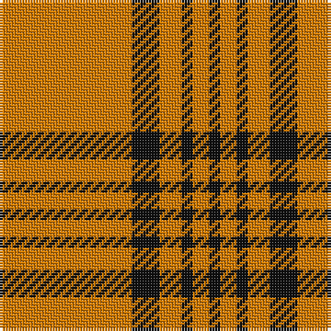

This page is one **sett** — a single exact thread-count. It belongs to the [tartan](/tartans/o24k5o4k2o3k2/)
(the same proportion at any scale), whose colour order is pattern [KYKYKY](/stripes/kykyky/).

Sourced from tartans-authority.  It is a [6 stripe tartan](/stripes/stripes6/).

Original link http://www.tartansauthority.com/tartan-ferret/display/3074/

## Thread count
O/48 K10 O8 K4 O6 K/4

## Palette
Each colour and the base-6 reference it is a variant of.

| Colour | Shade | Base |
|---|---|---|
| K | <code style="background-color:#101010;">#101010</code> `oklch(17.3% 0.000 89.9)` <small>#101010</small> | K <code style="background-color:#000000;">#000000</code> |
| O | <code style="background-color:#D87C00;">#D87C00</code> `oklch(67.3% 0.155 61.8)` <small>#D87C00</small> | Y <code style="background-color:#F2BF00;">#F2BF00</code> |

# Sample pattern

## Nearest tartans

The nearest existing variants by ΔTartan distance, with this tartan at the top so the swatches line up against it.

ΔTartan

Tartan

Sett

—

<a href="/ttd/edit/#slug=lo24k5lo4k2lo3k2~x2">Schranz-Gritte (Corporate)</a> <a class="nn-out" href="/setts/s6/lo24k5lo4k2lo3k2~x2/" title="open its dictionary page">↗</a>

1.41

<a href="/ttd/edit/#slug=lo3k2lo4k5lo24k5lo4k2lo3k2~x2">Schranz-Gritte</a> <a class="nn-out" href="/setts/s10/lo3k2lo4k5lo24k5lo4k2lo3k2~x2/" title="open its dictionary page">↗</a>

1.46

<a href="/ttd/edit/#slug=lo4k6lo1k1lo16k2~x2">Monoch Airline</a> <a class="nn-out" href="/setts/s6/lo4k6lo1k1lo16k2~x2/" title="open its dictionary page">↗</a>

1.59

<a href="/ttd/edit/#slug=dr3lo3dr4dr2lo18dr1lo2dr2~x4">Loughheed (Personal)</a> <a class="nn-out" href="/setts/s8/dr3lo3dr4dr2lo18dr1lo2dr2~x4/" title="open its dictionary page">↗</a>

1.76

<a href="/ttd/edit/#slug=w7dy7w7dy40r3~x2">Coca Cola</a> <a class="nn-out" href="/setts/s5/w7dy7w7dy40r3~x2/" title="open its dictionary page">↗</a>

1.82

<a href="/ttd/edit/#slug=w15dy15w15dy80r6">Coca Cola (Corporate)</a> <a class="nn-out" href="/setts/s5/w15dy15w15dy80r6/" title="open its dictionary page">↗</a>

1.87

<a href="/ttd/edit/#slug=g3lo3k10lo26k3lo3~x2">Volkswagen Orange Trim</a> <a class="nn-out" href="/setts/s6/g3lo3k10lo26k3lo3~x2/" title="open its dictionary page">↗</a>

1.87

<a href="/ttd/edit/#slug=lo26k10lo3g3lo3k3~x6">Volkswagen Orange Trim (Fashion)</a> <a class="nn-out" href="/setts/s6/lo26k10lo3g3lo3k3~x6/" title="open its dictionary page">↗</a>

2.05

<a href="/ttd/edit/#slug=o12lb1k2o1r1~x8">Lochcarron Camel</a> <a class="nn-out" href="/setts/s5/o12lb1k2o1r1~x8/" title="open its dictionary page">↗</a>

2.07

<a href="/ttd/edit/#slug=dy48ly9dy6ly9dy12ly4dy2ly16~x2">Yellow Pencil</a> <a class="nn-out" href="/setts/s8/dy48ly9dy6ly9dy12ly4dy2ly16~x2/" title="open its dictionary page">↗</a>

2.20

<a href="/ttd/edit/#slug=w3k5lo3r3lo32k2lo3~x2">Bro-Dreger</a> <a class="nn-out" href="/setts/s7/w3k5lo3r3lo32k2lo3~x2/" title="open its dictionary page">↗</a>

## Neighbour map

Every grey dot is one of 14299 variants placed by the first two principal components of the ΔTartan feature space (44% of its variance). Red is this tartan; blue dots are its nearest — click one to open its page.

<svg viewBox="0 0 640 380" role="img" style="max-width:100%;height:auto;border:1px solid #e0e0e0;border-radius:4px;display:block" xmlns="http://www.w3.org/2000/svg"><image href="/nn/cloud.v1.png" width="640" height="380"/><a href="/setts/s10/lo3k2lo4k5lo24k5lo4k2lo3k2~x2/"><circle cx="447.0" cy="171.4" r="4" fill="#3465a4"><title>Schranz-Gritte</title></circle></a><a href="/setts/s6/lo4k6lo1k1lo16k2~x2/"><circle cx="446.7" cy="190.3" r="4" fill="#3465a4"><title>Monoch Airline</title></circle></a><a href="/setts/s8/dr3lo3dr4dr2lo18dr1lo2dr2~x4/"><circle cx="446.8" cy="162.3" r="4" fill="#3465a4"><title>Loughheed (Personal)</title></circle></a><a href="/setts/s5/w7dy7w7dy40r3~x2/"><circle cx="455.5" cy="196.4" r="4" fill="#3465a4"><title>Coca Cola</title></circle></a><a href="/setts/s5/w15dy15w15dy80r6/"><circle cx="445.4" cy="197.5" r="4" fill="#3465a4"><title>Coca Cola (Corporate)</title></circle></a><a href="/setts/s6/g3lo3k10lo26k3lo3~x2/"><circle cx="386.6" cy="195.4" r="4" fill="#3465a4"><title>Volkswagen Orange Trim</title></circle></a><a href="/setts/s6/lo26k10lo3g3lo3k3~x6/"><circle cx="386.6" cy="195.4" r="4" fill="#3465a4"><title>Volkswagen Orange Trim (Fashion)</title></circle></a><a href="/setts/s5/o12lb1k2o1r1~x8/"><circle cx="467.6" cy="173.6" r="4" fill="#3465a4"><title>Lochcarron Camel</title></circle></a><a href="/setts/s8/dy48ly9dy6ly9dy12ly4dy2ly16~x2/"><circle cx="438.3" cy="169.9" r="4" fill="#3465a4"><title>Yellow Pencil</title></circle></a><a href="/setts/s7/w3k5lo3r3lo32k2lo3~x2/"><circle cx="469.3" cy="144.3" r="4" fill="#3465a4"><title>Bro-Dreger</title></circle></a><circle cx="512.6" cy="194.4" r="5" fill="#c00000"/></svg>

ID: /setts/s6/lo24k5lo4k2lo3k2~x2/
