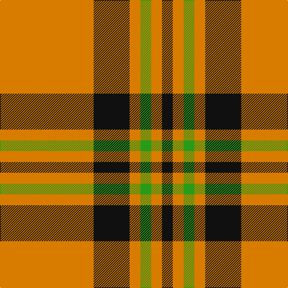

This page is one **sett** — a single exact thread-count. It belongs to the [tartan](/tartans/o26k10o3g3o3k3/)
(the same proportion at any scale), whose colour order is pattern [KYGYKY](/stripes/kygyky/).

Sourced from tartans-authority.  It is a [6 stripe tartan](/stripes/stripes6/).

Original link http://www.tartansauthority.com/tartan-ferret/display/7504/

## Also known as

This cloth is also recorded under:

- Volkswagen Orange Trim

2 attestations — the source records this cloth was collapsed from (oldest owns this page)

<ul>
<li>pre 2008 — Volkswagen Orange Trim (Fashion) (tartans-authority, <a href="http://www.tartansauthority.com/tartan-ferret/display/7504/">record</a>)</li>
<li>undated — Volkswagen Orange Fashion Tartan Tartan Number: 7504. Earliest known date: pre 2008 Small sample of Volkswagen upholstery fabric taken in to The Scottish Shoppe in Calgary, Alberta. Sample didn't show the complete sett but the proportions of what has been reconstructed here are correct. The threadcount has been multiplied by three and the actual sett in the vehicle was probably about 12 inches. The colours would be changed depending upon the body colour of the vehicle. Enquiries are being made with VW (Feb 2008) to try and pin down the patterns. See products available Copyright © Blair Urquhart, Comrie, 2015 (house-of-tartan, <a href="http://www.house-of-tartan.scotland.net/house/TartanViewjs.asp?colr=Def&tnam=7504">record</a>)</li>
</ul>

## Thread count
O/156 K60 O18 G18 O18 K/18

## Palette
Each colour and the base-6 reference it is a variant of.

| Colour | Shade | Base |
|---|---|---|
| G | <code style="background-color:#289C18;">#289C18</code> `oklch(60.6% 0.191 141.6)` <small>#289C18</small> | G <code style="background-color:#006100;">#006100</code> |
| K | <code style="background-color:#101010;">#101010</code> `oklch(17.3% 0.000 89.9)` <small>#101010</small> | K <code style="background-color:#000000;">#000000</code> |
| O | <code style="background-color:#D87C00;">#D87C00</code> `oklch(67.3% 0.155 61.8)` <small>#D87C00</small> | Y <code style="background-color:#F2BF00;">#F2BF00</code> |

# Sample pattern

## Nearest tartans

The nearest existing variants by ΔTartan distance, with this tartan at the top so the swatches line up against it.

ΔTartan

Tartan

Sett

—

<a href="/ttd/edit/#slug=lo26k10lo3g3lo3k3~x6">Volkswagen Orange Trim (Fashion)</a> <a class="nn-out" href="/setts/s6/lo26k10lo3g3lo3k3~x6/" title="open its dictionary page">↗</a>

0.00

<a href="/ttd/edit/#slug=g3lo3k10lo26k3lo3~x2">Volkswagen Orange Trim</a> <a class="nn-out" href="/setts/s6/g3lo3k10lo26k3lo3~x2/" title="open its dictionary page">↗</a>

1.27

<a href="/ttd/edit/#slug=o38w9o3dr9w3~x2">Loch Tummel</a> <a class="nn-out" href="/setts/s5/o38w9o3dr9w3~x2/" title="open its dictionary page">↗</a>

1.36

<a href="/ttd/edit/#slug=ly1k4ly1k4ly11r1ly1~x4">Baileville (Personal)</a> <a class="nn-out" href="/setts/s7/ly1k4ly1k4ly11r1ly1~x4/" title="open its dictionary page">↗</a>

1.40

<a href="/ttd/edit/#slug=w15dy15w15dy80r6">Coca Cola (Corporate)</a> <a class="nn-out" href="/setts/s5/w15dy15w15dy80r6/" title="open its dictionary page">↗</a>

1.40

<a href="/ttd/edit/#slug=k4o2r2o2k2o15ly2~x4">Welsh, National</a> <a class="nn-out" href="/setts/s7/k4o2r2o2k2o15ly2~x4/" title="open its dictionary page">↗</a>

1.42

<a href="/ttd/edit/#slug=ly1k4ly1k4ly11m1ly1~x4">Baillieville</a> <a class="nn-out" href="/setts/s7/ly1k4ly1k4ly11m1ly1~x4/" title="open its dictionary page">↗</a>

1.42

<a href="/ttd/edit/#slug=dy38w9dy3k9w3~x2">Loch Tummel</a> <a class="nn-out" href="/setts/s5/dy38w9dy3k9w3~x2/" title="open its dictionary page">↗</a>

1.45

<a href="/ttd/edit/#slug=w7dy7w7dy40r3~x2">Coca Cola</a> <a class="nn-out" href="/setts/s5/w7dy7w7dy40r3~x2/" title="open its dictionary page">↗</a>

1.52

<a href="/ttd/edit/#slug=w11r40g13r5g12r5~x2">Makhtoum</a> <a class="nn-out" href="/setts/s6/w11r40g13r5g12r5~x2/" title="open its dictionary page">↗</a>

1.52

<a href="/ttd/edit/#slug=lo4k6lo1k1lo16k2~x2">Monoch Airline</a> <a class="nn-out" href="/setts/s6/lo4k6lo1k1lo16k2~x2/" title="open its dictionary page">↗</a>

## Neighbour map

Every grey dot is one of 14299 variants placed by the first two principal components of the ΔTartan feature space (44% of its variance). Red is this tartan; blue dots are its nearest — click one to open its page.

<svg viewBox="0 0 640 380" role="img" style="max-width:100%;height:auto;border:1px solid #e0e0e0;border-radius:4px;display:block" xmlns="http://www.w3.org/2000/svg"><image href="/nn/cloud.v1.png" width="640" height="380"/><a href="/setts/s6/g3lo3k10lo26k3lo3~x2/"><circle cx="386.6" cy="195.4" r="4" fill="#3465a4"><title>Volkswagen Orange Trim</title></circle></a><a href="/setts/s5/o38w9o3dr9w3~x2/"><circle cx="408.1" cy="198.0" r="4" fill="#3465a4"><title>Loch Tummel</title></circle></a><a href="/setts/s7/ly1k4ly1k4ly11r1ly1~x4/"><circle cx="335.7" cy="173.9" r="4" fill="#3465a4"><title>Baileville (Personal)</title></circle></a><a href="/setts/s5/w15dy15w15dy80r6/"><circle cx="445.4" cy="197.5" r="4" fill="#3465a4"><title>Coca Cola (Corporate)</title></circle></a><a href="/setts/s7/k4o2r2o2k2o15ly2~x4/"><circle cx="345.3" cy="182.1" r="4" fill="#3465a4"><title>Welsh, National</title></circle></a><a href="/setts/s7/ly1k4ly1k4ly11m1ly1~x4/"><circle cx="330.9" cy="173.4" r="4" fill="#3465a4"><title>Baillieville</title></circle></a><a href="/setts/s5/dy38w9dy3k9w3~x2/"><circle cx="382.7" cy="192.8" r="4" fill="#3465a4"><title>Loch Tummel</title></circle></a><a href="/setts/s5/w7dy7w7dy40r3~x2/"><circle cx="455.5" cy="196.4" r="4" fill="#3465a4"><title>Coca Cola</title></circle></a><a href="/setts/s6/w11r40g13r5g12r5~x2/"><circle cx="328.7" cy="216.4" r="4" fill="#3465a4"><title>Makhtoum</title></circle></a><a href="/setts/s6/lo4k6lo1k1lo16k2~x2/"><circle cx="446.7" cy="190.3" r="4" fill="#3465a4"><title>Monoch Airline</title></circle></a><circle cx="386.6" cy="195.4" r="5" fill="#c00000"/></svg>

ID: /setts/s6/lo26k10lo3g3lo3k3~x6/
