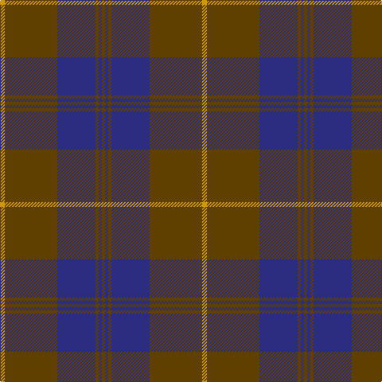

This page is one **sett** — a single exact thread-count. It belongs to the [tartan](/tartans/lo3dy33db24dy2db2dy2/)
(the same proportion at any scale), whose colour order is pattern [GBGBGY](/stripes/gbgbgy/).

Sourced from register-of-tartans.  It is a [6 stripe tartan](/stripes/stripes6/).

Original link https://www.tartanregister.gov.uk/tartanDetails.aspx?ref=1934

2 attestations — the source records this cloth was collapsed from (oldest owns this page)

<ul>
<li>01/06/1988 — Keepers of the Quaich (register-of-tartans, <a href="https://www.tartanregister.gov.uk/tartanDetails.aspx?ref=1934">record</a>)</li>
<li>June 1988 — Keepers of the Quaich (Corporate) (tartans-authority, <a href="http://www.tartansauthority.com/tartan-ferret/display/1731/">record</a>)</li>
</ul>

## Register references

External register numbers recorded for this tartan.

- Scottish Register of Tartans: [1934](https://www.tartanregister.gov.uk/tartanDetails.aspx?ref=1934)
- Scottish Tartans Authority (ITI): 1731
- Scottish Tartans World Register: 1731

## Thread count
DY/6 T66 DBa48 T4 DBa4 T/4

## Palette

Palette: <strong>Tartan Register</strong> <small style="color:#888">(5 of 6 colours)</small>
<table><thead><tr><th>Colour</th><th>Threads</th><th>Shade</th><th>Base</th><th>OKLCh</th></tr></thead><tbody><tr><td>DY/</td><td style="text-align:right;font-variant-numeric:tabular-nums">6</td><td><code style="background-color:#D09800;">#D09800</code> <small style="color:#888">#D09800</small></td><td>Y <code style="background-color:#F2BF00;">#F2BF00</code></td><td><small style="color:#888">oklch(71.4% 0.147 82.1)</small></td></tr><tr><td>T</td><td style="text-align:right;font-variant-numeric:tabular-nums">66</td><td><code style="background-color:#604000;">#604000</code> <small style="color:#888">#604000</small></td><td>G <code style="background-color:#006100;">#006100</code></td><td><small style="color:#888">oklch(39.8% 0.083 76.8)</small></td></tr><tr><td>DBa</td><td style="text-align:right;font-variant-numeric:tabular-nums">48</td><td><code style="background-color:#2C2C80;">#2C2C80</code> <small style="color:#888">#2C2C80</small></td><td>B <code style="background-color:#2A418A;">#2A418A</code></td><td><small style="color:#888">oklch(35.0% 0.138 276.6)</small></td></tr><tr><td>T</td><td style="text-align:right;font-variant-numeric:tabular-nums">4</td><td><code style="background-color:#604000;">#604000</code> <small style="color:#888">#604000</small></td><td>G <code style="background-color:#006100;">#006100</code></td><td><small style="color:#888">oklch(39.8% 0.083 76.8)</small></td></tr><tr><td>DBa</td><td style="text-align:right;font-variant-numeric:tabular-nums">4</td><td><code style="background-color:#2C2C80;">#2C2C80</code> <small style="color:#888">#2C2C80</small></td><td>B <code style="background-color:#2A418A;">#2A418A</code></td><td><small style="color:#888">oklch(35.0% 0.138 276.6)</small></td></tr><tr><td>T/</td><td style="text-align:right;font-variant-numeric:tabular-nums">4</td><td><code style="background-color:#604000;">#604000</code> <small style="color:#888">#604000</small></td><td>G <code style="background-color:#006100;">#006100</code></td><td><small style="color:#888">oklch(39.8% 0.083 76.8)</small></td></tr></tbody></table>

# Sample pattern

## Nearest tartans

The nearest existing variants by ΔTartan distance, with this tartan at the top so the swatches line up against it.

ΔTartan

Tartan

Sett

—

<a href="/ttd/edit/#slug=lo3dy33db24dy2db2dy2~x2">Keepers of the Quaich</a> <a class="nn-out" href="/setts/s6/lo3dy33db24dy2db2dy2~x2/" title="open its dictionary page">↗</a>

1.12

<a href="/ttd/edit/#slug=dy3db3dy3db27dy40y3">Keeper of the Quaich</a> <a class="nn-out" href="/setts/s6/dy3db3dy3db27dy40y3/" title="open its dictionary page">↗</a>

1.14

<a href="/ttd/edit/#slug=do3db3do3db27do40ly3">Keeper of the Quaich Corporate Tartan Tartan Number: 1731. Earliest known date: 1988 Restricted. Sample in STS collection. See products available Copyright © Blair Urquhart, Comrie, 2015</a> <a class="nn-out" href="/setts/s6/do3db3do3db27do40ly3/" title="open its dictionary page">↗</a>

1.32

<a href="/ttd/edit/#slug=n5r3n35k28n4k11n2~x2">Korner-MacPherson (Personal)</a> <a class="nn-out" href="/setts/s7/n5r3n35k28n4k11n2~x2/" title="open its dictionary page">↗</a>

1.38

<a href="/ttd/edit/#slug=db50do4db12do23ly4do4~x2">Sligo, County</a> <a class="nn-out" href="/setts/s6/db50do4db12do23ly4do4~x2/" title="open its dictionary page">↗</a>

1.38

<a href="/ttd/edit/#slug=do40n19k2n2lb2~x4">National Ballet of Canada</a> <a class="nn-out" href="/setts/s5/do40n19k2n2lb2~x4/" title="open its dictionary page">↗</a>

1.45

<a href="/ttd/edit/#slug=dp26r6g16dp8g3r2~x2">Perthshire Tourist Board (Corporate)</a> <a class="nn-out" href="/setts/s6/dp26r6g16dp8g3r2~x2/" title="open its dictionary page">↗</a>

1.47

<a href="/ttd/edit/#slug=db4r1db18n18lr1~x4">Ardee (Corporate)</a> <a class="nn-out" href="/setts/s5/db4r1db18n18lr1~x4/" title="open its dictionary page">↗</a>

1.49

<a href="/ttd/edit/#slug=dy11db1dy3dbi1db9r1~x4">Dege of Saville Row</a> <a class="nn-out" href="/setts/s6/dy11db1dy3dbi1db9r1~x4/" title="open its dictionary page">↗</a>

1.49

<a href="/ttd/edit/#slug=n6k16n6k16n45k4~x2">Grey Spirit Fashion Tartan Tartan Number: 6594. Earliest known date: 01/03/2005 A fashion tartan from ACS Clothing of Glasgow for use in their kilt hire business. Woven by Lochcarron. The grey is actually a grey/black marl (mixture) which can't be shown graphically. See products available Copyright © Blair Urquhart, Comrie, 2015</a> <a class="nn-out" href="/setts/s6/n6k16n6k16n45k4~x2/" title="open its dictionary page">↗</a>

1.50

<a href="/ttd/edit/#slug=n34k7n12k40n3k4t3~x2">TACC (Corporate)</a> <a class="nn-out" href="/setts/s7/n34k7n12k40n3k4t3~x2/" title="open its dictionary page">↗</a>

## Neighbour map

Every grey dot is one of 14359 variants placed by the first two principal components of the ΔTartan feature space (44% of its variance). Red is this tartan; blue dots are its nearest — click one to open its page.

<svg viewBox="0 0 640 380" role="img" style="max-width:100%;height:auto;border:1px solid #e0e0e0;border-radius:4px;display:block" xmlns="http://www.w3.org/2000/svg"><image href="/nn/cloud.v1.png" width="640" height="380"/><a href="/setts/s6/dy3db3dy3db27dy40y3/"><circle cx="471.9" cy="248.1" r="4" fill="#3465a4"><title>Keeper of the Quaich</title></circle></a><a href="/setts/s6/do3db3do3db27do40ly3/"><circle cx="457.4" cy="239.3" r="4" fill="#3465a4"><title>Keeper of the Quaich Corporate Tartan Tartan Number: 1731. Earliest known date: 1988 Restricted. Sample in STS collection. See products available Copyright © Blair Urquhart, Comrie, 2015</title></circle></a><a href="/setts/s7/n5r3n35k28n4k11n2~x2/"><circle cx="388.8" cy="212.5" r="4" fill="#3465a4"><title>Korner-MacPherson (Personal)</title></circle></a><a href="/setts/s6/db50do4db12do23ly4do4~x2/"><circle cx="472.0" cy="248.5" r="4" fill="#3465a4"><title>Sligo, County</title></circle></a><a href="/setts/s5/do40n19k2n2lb2~x4/"><circle cx="463.6" cy="207.9" r="4" fill="#3465a4"><title>National Ballet of Canada</title></circle></a><a href="/setts/s6/dp26r6g16dp8g3r2~x2/"><circle cx="378.5" cy="240.4" r="4" fill="#3465a4"><title>Perthshire Tourist Board (Corporate)</title></circle></a><a href="/setts/s5/db4r1db18n18lr1~x4/"><circle cx="399.8" cy="228.5" r="4" fill="#3465a4"><title>Ardee (Corporate)</title></circle></a><a href="/setts/s6/dy11db1dy3dbi1db9r1~x4/"><circle cx="399.4" cy="245.6" r="4" fill="#3465a4"><title>Dege of Saville Row</title></circle></a><a href="/setts/s6/n6k16n6k16n45k4~x2/"><circle cx="460.0" cy="269.0" r="4" fill="#3465a4"><title>Grey Spirit Fashion Tartan Tartan Number: 6594. Earliest known date: 01/03/2005 A fashion tartan from ACS Clothing of Glasgow for use in their kilt hire business. Woven by Lochcarron. The grey is actually a grey/black marl (mixture) which can't be shown graphically. See products available Copyright © Blair Urquhart, Comrie, 2015</title></circle></a><a href="/setts/s7/n34k7n12k40n3k4t3~x2/"><circle cx="369.6" cy="224.3" r="4" fill="#3465a4"><title>TACC (Corporate)</title></circle></a><circle cx="440.4" cy="221.2" r="5" fill="#c00000"/></svg>

ID: /setts/s6/lo3dy33db24dy2db2dy2~x2/
