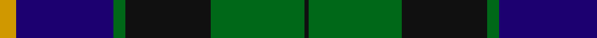

**Bands:** [KGKGBY](/stripes/kgkgby/) · **Stripes:** [K G K G DB LO](/stripes/stripes6/) K G K G DB LO

This was sourced from register-of-tartans.  It is a [6 band tartan](/bands/bands6/).

Original link https://www.tartanregister.gov.uk/tartanDetails.aspx?ref=1439

## Attestations

This cloth appears in 2 source records; the oldest owns this page.

- 01/01/1996 — Glenturret Distillery (register-of-tartans, [record](https://www.tartanregister.gov.uk/tartanDetails.aspx?ref=1439))
- pre 1996 — Glenturret Distillery (Corporate) (tartans-authority, [record](http://www.tartansauthority.com/tartan-ferret/display/1097/))

## Register references

External register numbers recorded for this tartan.

- Scottish Register of Tartans: [1439](https://www.tartanregister.gov.uk/tartanDetails.aspx?ref=1439)
- Scottish Tartans Authority (ITI): 1097
- Scottish Tartans World Register: 1097

## Thread count
DY/8 DB48 G6 K42 G46 K/2

## Palette
Each colour and its ΔE from the base-6 reference it is a variant of.

| Colour | Shade | Base | ΔE (OKLab) |
|---|---|---|---|
| DB | <code style="background-color:#1C0070;">#1C0070</code> `#1C0070` | B <code style="background-color:#2A418A;">#2A418A</code> | 0.14 |
| DY | <code style="background-color:#D09800;">#D09800</code> `#D09800` | Y <code style="background-color:#F2BF00;">#F2BF00</code> | 0.12 |
| G | <code style="background-color:#006818;">#006818</code> `#006818` | G <code style="background-color:#006100;">#006100</code> | 0.02 |
| K | <code style="background-color:#101010;">#101010</code> `#101010` | K <code style="background-color:#000000;">#000000</code> | 0.17 |

# Sample pattern

## Nearest tartans

The nearest existing variants by ΔTartan distance.

1. [Blair](/setts/s7/db4r1db18k20g18r1g4~x2/) — ΔT 0.95
1. [Dress Watch](/setts/s8/db4k3db18k18g18db1g2w4~x2/) — ΔT 0.99
1. [Smith, Sir William (?)](/setts/s6/ly3k1g20k20db18t3~x2/) — ΔT 1.01
1. [Louisville Spaulding (Personal)](/setts/s5/k20db50g50r3k3~x2/) — ΔT 1.07
1. [Herd Family Tartan Tartan Number: 170. Earliest known date: 1978 Woven for the wedding of William Hurd to Heather Petit. From JCT: STS monitoring committee recorded 1978. In march 2005. STS Record has the application being made by Councillor R J Herd, C.Eng, M.I.C.E., A.M.B.I.M. who had been granted arms by Lord Lyon. See products available Copyright © Blair Urquhart, Comrie, 2015](/setts/s6/db2g12k13w1db13w2~x2/) — ΔT 1.09
1. [Dundas #2](/setts/s7/k4db16k12g12r1g2k2~x2/) — ΔT 1.09
1. [Mowat](/setts/s7/db26k1db2k18ly2g16k16~x2/) — ΔT 1.09
1. [Naysmith (Name)](/setts/s6/r6db32k18g28k1lb2~x2/) — ΔT 1.11
1. [Gunn](/setts/s6/g2db12g1k12g12r2~x2/) — ΔT 1.13
1. [MacRobart (Personal)](/setts/s6/db30k10g10lb2g15lb2~x2/) — ΔT 1.18

## Neighbour map

Every grey dot is one of 14313 variants placed by the first two principal components of the ΔTartan feature space (44% of its variance). Red is this tartan; blue dots are its nearest — click one to open its page.

<svg viewBox="0 0 640 380" role="img" style="max-width:100%;height:auto;border:1px solid #e0e0e0;border-radius:4px;display:block" xmlns="http://www.w3.org/2000/svg"><image href="/nn/cloud.v1.png" width="640" height="380"/><a href="/setts/s7/db4r1db18k20g18r1g4~x2/"><circle cx="205.2" cy="184.8" r="4" fill="#3465a4"><title>Blair</title></circle></a><a href="/setts/s8/db4k3db18k18g18db1g2w4~x2/"><circle cx="197.2" cy="180.0" r="4" fill="#3465a4"><title>Dress Watch</title></circle></a><a href="/setts/s6/ly3k1g20k20db18t3~x2/"><circle cx="179.7" cy="184.0" r="4" fill="#3465a4"><title>Smith, Sir William (?)</title></circle></a><a href="/setts/s5/k20db50g50r3k3~x2/"><circle cx="255.4" cy="220.7" r="4" fill="#3465a4"><title>Louisville Spaulding (Personal)</title></circle></a><a href="/setts/s6/db2g12k13w1db13w2~x2/"><circle cx="187.8" cy="213.2" r="4" fill="#3465a4"><title>Herd Family Tartan Tartan Number: 170. Earliest known date: 1978 Woven for the wedding of William Hurd to Heather Petit. From JCT: STS monitoring committee recorded 1978. In march 2005. STS Record has the application being made by Councillor R J Herd, C.Eng, M.I.C.E., A.M.B.I.M. who had been granted arms by Lord Lyon. See products available Copyright © Blair Urquhart, Comrie, 2015</title></circle></a><a href="/setts/s7/k4db16k12g12r1g2k2~x2/"><circle cx="248.6" cy="216.6" r="4" fill="#3465a4"><title>Dundas #2</title></circle></a><a href="/setts/s7/db26k1db2k18ly2g16k16~x2/"><circle cx="286.8" cy="198.8" r="4" fill="#3465a4"><title>Mowat</title></circle></a><a href="/setts/s6/r6db32k18g28k1lb2~x2/"><circle cx="234.2" cy="167.2" r="4" fill="#3465a4"><title>Naysmith (Name)</title></circle></a><a href="/setts/s6/g2db12g1k12g12r2~x2/"><circle cx="216.4" cy="230.6" r="4" fill="#3465a4"><title>Gunn</title></circle></a><a href="/setts/s6/db30k10g10lb2g15lb2~x2/"><circle cx="264.1" cy="217.4" r="4" fill="#3465a4"><title>MacRobart (Personal)</title></circle></a><circle cx="225.9" cy="198.5" r="5" fill="#c00000"/></svg>

ID: /setts/s6/lo4db24g3k21g23k1~x2/
