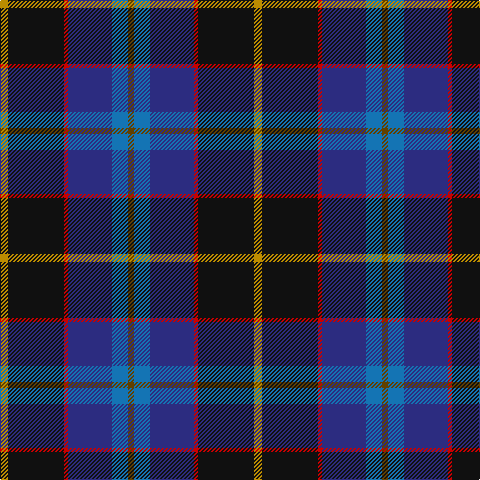

**Bands:** [GBBRKY](/stripes/gbbrky/) · **Stripes:** [DY B DB R K LO](/stripes/stripes6/) DY B DB R K LO

This was sourced from tartans-authority.  It is a [6 band tartan](/bands/bands6/).

Original link http://www.tartansauthority.com/tartan-ferret/display/10391/

## Thread count
DY/8 K56 R4 DB44 B16 T/6

## Palette
Each colour and its ΔE from the base-6 reference it is a variant of.

| Colour | Shade | Base | ΔE (OKLab) |
|---|---|---|---|
| B | <code style="background-color:#1474B4;">#1474B4</code> `#1474B4` | B <code style="background-color:#2A418A;">#2A418A</code> | 0.15 |
| DB | <code style="background-color:#2C2C80;">#2C2C80</code> `#2C2C80` | B <code style="background-color:#2A418A;">#2A418A</code> | 0.06 |
| DY | <code style="background-color:#BC8C00;">#BC8C00</code> `#BC8C00` | Y <code style="background-color:#F2BF00;">#F2BF00</code> | 0.16 |
| K | <code style="background-color:#101010;">#101010</code> `#101010` | K <code style="background-color:#000000;">#000000</code> | 0.17 |
| R | <code style="background-color:#C80000;">#C80000</code> `#C80000` | R <code style="background-color:#CC0000;">#CC0000</code> | 0.01 |
| T | <code style="background-color:#604000;">#604000</code> `#604000` | G <code style="background-color:#006100;">#006100</code> | 0.14 |

# Sample pattern

## Nearest tartans

The nearest existing variants by ΔTartan distance.

1. [Nicolson of Harris (Clan?)](/setts/s6/r3db15db8g5k2w1~x2/) — ΔT 0.68
1. [Pipers' Trail, The](/setts/s6/lo4b8dp4k53dt54w4/) — ΔT 0.90
1. [Scottish Italian](/setts/s8/b11db5g4w3r3k16db28b2~x2/) — ΔT 0.95
1. [Yates](/setts/s8/k37r4db30n7k10w5n10y7~x2/) — ΔT 1.04
1. [New England (Fashion)](/setts/s6/k2w1k12g5db11r1~x2/) — ΔT 1.04
1. [Hatfield & Mize (Personal)](/setts/s6/dg10w2dt10lo5db35r6~x2/) — ΔT 1.06
1. [Pipers' Trail, The](/setts/s6/ly4t8dp4k53db54w4/) — ΔT 1.06
1. [Yates (Personal)](/setts/s8/k29r3dt24n6k8w4n8o6~x2/) — ΔT 1.09
1. [Renfrewshire](/setts/s7/dp4db2t8db25k8g13ly4~x2/) — ΔT 1.13
1. [Grandfather Mountain Games (District](/setts/s7/r3dg20k2n11k2db20lr2~x2/) — ΔT 1.15

## Neighbour map

Every grey dot is one of 14313 variants placed by the first two principal components of the ΔTartan feature space (44% of its variance). Red is this tartan; blue dots are its nearest — click one to open its page.

<svg viewBox="0 0 640 380" role="img" style="max-width:100%;height:auto;border:1px solid #e0e0e0;border-radius:4px;display:block" xmlns="http://www.w3.org/2000/svg"><image href="/nn/cloud.v1.png" width="640" height="380"/><a href="/setts/s6/r3db15db8g5k2w1~x2/"><circle cx="222.1" cy="184.6" r="4" fill="#3465a4"><title>Nicolson of Harris (Clan?)</title></circle></a><a href="/setts/s6/lo4b8dp4k53dt54w4/"><circle cx="245.6" cy="170.1" r="4" fill="#3465a4"><title>Pipers' Trail, The</title></circle></a><a href="/setts/s8/b11db5g4w3r3k16db28b2~x2/"><circle cx="208.2" cy="156.0" r="4" fill="#3465a4"><title>Scottish Italian</title></circle></a><a href="/setts/s8/k37r4db30n7k10w5n10y7~x2/"><circle cx="174.4" cy="178.6" r="4" fill="#3465a4"><title>Yates</title></circle></a><a href="/setts/s6/k2w1k12g5db11r1~x2/"><circle cx="238.3" cy="203.6" r="4" fill="#3465a4"><title>New England (Fashion)</title></circle></a><a href="/setts/s6/dg10w2dt10lo5db35r6~x2/"><circle cx="254.4" cy="156.5" r="4" fill="#3465a4"><title>Hatfield &amp; Mize (Personal)</title></circle></a><a href="/setts/s6/ly4t8dp4k53db54w4/"><circle cx="232.6" cy="158.7" r="4" fill="#3465a4"><title>Pipers' Trail, The</title></circle></a><a href="/setts/s8/k29r3dt24n6k8w4n8o6~x2/"><circle cx="174.5" cy="178.5" r="4" fill="#3465a4"><title>Yates (Personal)</title></circle></a><a href="/setts/s7/dp4db2t8db25k8g13ly4~x2/"><circle cx="168.1" cy="173.7" r="4" fill="#3465a4"><title>Renfrewshire</title></circle></a><a href="/setts/s7/r3dg20k2n11k2db20lr2~x2/"><circle cx="155.0" cy="183.4" r="4" fill="#3465a4"><title>Grandfather Mountain Games (District</title></circle></a><circle cx="216.2" cy="177.7" r="5" fill="#c00000"/></svg>

ID: /setts/s6/lo4k28r2db22b8dy3~x2/
