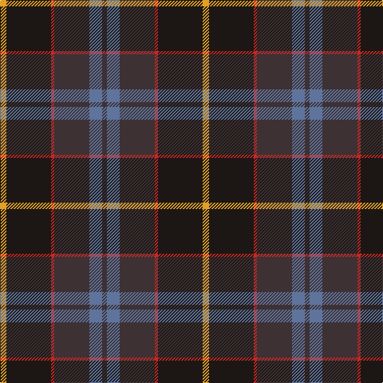

This page is one **sett** — a single exact thread-count. It belongs to the [tartan](/tartans/lo4k28r2do22t8do3/)
(the same proportion at any scale), whose colour order is pattern [BBBRKY](/stripes/bbbrky/).

Sourced from register-of-tartans.  It is a [6 stripe tartan](/stripes/stripes6/).

Original link https://www.tartanregister.gov.uk/tartanDetails.aspx?ref=10391

## Register references

External register numbers recorded for this tartan.

- Scottish Register of Tartans: [10391](https://www.tartanregister.gov.uk/tartanDetails.aspx?ref=10391)

## Thread count
Y/8 K56 R4 T44 B16 T/6

## Palette

Palette: <strong>Tartan Register</strong> <small style="color:#888">(3 of 5 colours)</small>
<table><thead><tr><th>Colour</th><th>Threads</th><th>Shade</th><th>Base</th><th>OKLCh</th></tr></thead><tbody><tr><td>Y/</td><td style="text-align:right;font-variant-numeric:tabular-nums">8</td><td><code style="background-color:#E0A126;">#E0A126</code> <small style="color:#888">#E0A126</small></td><td>Y <code style="background-color:#F2BF00;">#F2BF00</code></td><td><small style="color:#888">oklch(75.1% 0.146 78.3)</small></td></tr><tr><td>K</td><td style="text-align:right;font-variant-numeric:tabular-nums">56</td><td><code style="background-color:#1C1714;">#1C1714</code> <small style="color:#888">#1C1714</small></td><td>K <code style="background-color:#000000;">#000000</code></td><td><small style="color:#888">oklch(20.9% 0.010 52.9)</small></td></tr><tr><td>R</td><td style="text-align:right;font-variant-numeric:tabular-nums">4</td><td><code style="background-color:#CA2625;">#CA2625</code> <small style="color:#888">#CA2625</small></td><td>R <code style="background-color:#CC0000;">#CC0000</code></td><td><small style="color:#888">oklch(54.4% 0.199 27.2)</small></td></tr><tr><td>T</td><td style="text-align:right;font-variant-numeric:tabular-nums">44</td><td><code style="background-color:#3D3134;">#3D3134</code> <small style="color:#888">#3D3134</small></td><td>B <code style="background-color:#2A418A;">#2A418A</code></td><td><small style="color:#888">oklch(32.7% 0.018 1.4)</small></td></tr><tr><td>B</td><td style="text-align:right;font-variant-numeric:tabular-nums">16</td><td><code style="background-color:#5F749C;">#5F749C</code> <small style="color:#888">#5F749C</small></td><td>B <code style="background-color:#2A418A;">#2A418A</code></td><td><small style="color:#888">oklch(55.8% 0.067 262.9)</small></td></tr><tr><td>T/</td><td style="text-align:right;font-variant-numeric:tabular-nums">6</td><td><code style="background-color:#3D3134;">#3D3134</code> <small style="color:#888">#3D3134</small></td><td>B <code style="background-color:#2A418A;">#2A418A</code></td><td><small style="color:#888">oklch(32.7% 0.018 1.4)</small></td></tr></tbody></table>

# Sample pattern

## Nearest tartans

The nearest existing variants by ΔTartan distance, with this tartan at the top so the swatches line up against it.

ΔTartan

Tartan

Sett

—

<a href="/ttd/edit/#slug=lo4k28r2do22t8do3~x2">Loch Long One Design</a> <a class="nn-out" href="/setts/s6/lo4k28r2do22t8do3~x2/" title="open its dictionary page">↗</a>

0.81

<a href="/ttd/edit/#slug=k7t3dy30db30w3~x2">Douglas, (Brown)</a> <a class="nn-out" href="/setts/s5/k7t3dy30db30w3~x2/" title="open its dictionary page">↗</a>

0.82

<a href="/ttd/edit/#slug=r1n12k6ly1do10r1~x4">Andover (Fashion)</a> <a class="nn-out" href="/setts/s6/r1n12k6ly1do10r1~x4/" title="open its dictionary page">↗</a>

0.88

<a href="/ttd/edit/#slug=dr4dg27o2db25lo5dg3o3~x2">Kilkenny, County (District)</a> <a class="nn-out" href="/setts/s7/dr4dg27o2db25lo5dg3o3~x2/" title="open its dictionary page">↗</a>

0.90

<a href="/ttd/edit/#slug=r2do22g22do3db12y2~x2">Lisbon</a> <a class="nn-out" href="/setts/s6/r2do22g22do3db12y2~x2/" title="open its dictionary page">↗</a>

0.90

<a href="/ttd/edit/#slug=dy6o2dy12k4dt14k1dy3ly2~x2">Mica, Green (Fashion)</a> <a class="nn-out" href="/setts/s8/dy6o2dy12k4dt14k1dy3ly2~x2/" title="open its dictionary page">↗</a>

0.92

<a href="/ttd/edit/#slug=db4dg2r17r9dg10db30n2~x2">Dempster, Ross (Personal)</a> <a class="nn-out" href="/setts/s7/db4dg2r17r9dg10db30n2~x2/" title="open its dictionary page">↗</a>

0.94

<a href="/ttd/edit/#slug=y27dr2y4o15db26k2db6~x2">Bailies of Bennachie Corporate Tartan Tartan Number: 3628. Earliest known date: 2002 The Bailes of Bennachie were founded in 1973 as caretakers of the mountain in Aberdeenshire, with the aim of 'preserving the amenity of the hill'. The tartan was produced on the occasion of the 25th anniversary to help create funds to continue their task. The colours reflect the autumn shades on the hill. See products available Copyright © Blair Urquhart, Comrie, 2015</a> <a class="nn-out" href="/setts/s7/y27dr2y4o15db26k2db6~x2/" title="open its dictionary page">↗</a>

0.96

<a href="/ttd/edit/#slug=g27r2g4r15db26k2db6~x2">Bailies of Bennachie (Corporate)</a> <a class="nn-out" href="/setts/s7/g27r2g4r15db26k2db6~x2/" title="open its dictionary page">↗</a>

0.97

<a href="/ttd/edit/#slug=r1n12k6k1do10r1~x4">Andover</a> <a class="nn-out" href="/setts/s6/r1n12k6k1do10r1~x4/" title="open its dictionary page">↗</a>

0.98

<a href="/ttd/edit/#slug=k6dg11w2db22r2k4~x2">Leslie Hebridean Artifact Tartan Tartan Number: 1111. Earliest known date: 1740 From the Telfer Dunbar collection and said to date to C.1740s. See products available Copyright © Blair Urquhart, Comrie, 2015</a> <a class="nn-out" href="/setts/s6/k6dg11w2db22r2k4~x2/" title="open its dictionary page">↗</a>

## Neighbour map

Every grey dot is one of 14299 variants placed by the first two principal components of the ΔTartan feature space (44% of its variance). Red is this tartan; blue dots are its nearest — click one to open its page.

<svg viewBox="0 0 640 380" role="img" style="max-width:100%;height:auto;border:1px solid #e0e0e0;border-radius:4px;display:block" xmlns="http://www.w3.org/2000/svg"><image href="/nn/cloud.v1.png" width="640" height="380"/><a href="/setts/s5/k7t3dy30db30w3~x2/"><circle cx="259.5" cy="228.9" r="4" fill="#3465a4"><title>Douglas, (Brown)</title></circle></a><a href="/setts/s6/r1n12k6ly1do10r1~x4/"><circle cx="241.7" cy="208.0" r="4" fill="#3465a4"><title>Andover (Fashion)</title></circle></a><a href="/setts/s7/dr4dg27o2db25lo5dg3o3~x2/"><circle cx="282.8" cy="195.0" r="4" fill="#3465a4"><title>Kilkenny, County (District)</title></circle></a><a href="/setts/s6/r2do22g22do3db12y2~x2/"><circle cx="241.0" cy="217.9" r="4" fill="#3465a4"><title>Lisbon</title></circle></a><a href="/setts/s8/dy6o2dy12k4dt14k1dy3ly2~x2/"><circle cx="274.6" cy="194.8" r="4" fill="#3465a4"><title>Mica, Green (Fashion)</title></circle></a><a href="/setts/s7/db4dg2r17r9dg10db30n2~x2/"><circle cx="281.3" cy="195.0" r="4" fill="#3465a4"><title>Dempster, Ross (Personal)</title></circle></a><a href="/setts/s7/y27dr2y4o15db26k2db6~x2/"><circle cx="261.3" cy="207.1" r="4" fill="#3465a4"><title>Bailies of Bennachie Corporate Tartan Tartan Number: 3628. Earliest known date: 2002 The Bailes of Bennachie were founded in 1973 as caretakers of the mountain in Aberdeenshire, with the aim of 'preserving the amenity of the hill'. The tartan was produced on the occasion of the 25th anniversary to help create funds to continue their task. The colours reflect the autumn shades on the hill. See products available Copyright © Blair Urquhart, Comrie, 2015</title></circle></a><a href="/setts/s7/g27r2g4r15db26k2db6~x2/"><circle cx="240.9" cy="194.9" r="4" fill="#3465a4"><title>Bailies of Bennachie (Corporate)</title></circle></a><a href="/setts/s6/r1n12k6k1do10r1~x4/"><circle cx="255.5" cy="216.6" r="4" fill="#3465a4"><title>Andover</title></circle></a><a href="/setts/s6/k6dg11w2db22r2k4~x2/"><circle cx="261.6" cy="208.0" r="4" fill="#3465a4"><title>Leslie Hebridean Artifact Tartan Tartan Number: 1111. Earliest known date: 1740 From the Telfer Dunbar collection and said to date to C.1740s. See products available Copyright © Blair Urquhart, Comrie, 2015</title></circle></a><circle cx="265.4" cy="201.5" r="5" fill="#c00000"/></svg>

ID: /setts/s6/lo4k28r2do22t8do3~x2/
