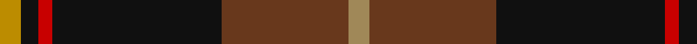

**Bands:** [YKRKGY](/stripes/ykrkgy/) · **Stripes:** [LO K R K DY LO](/stripes/stripes6/) LO K R K DY LO

This was sourced from register-of-tartans.  It is a [6 band tartan](/bands/bands6/).

Original link https://www.tartanregister.gov.uk/tartanDetails.aspx?ref=974

## Also known as

This cloth is also recorded under:

- Drambuie Hunting

## Attestations

This cloth appears in 2 source records; the oldest owns this page.

- 01/01/1998 — Drambuie Hunting (register-of-tartans, [record](https://www.tartanregister.gov.uk/tartanDetails.aspx?ref=974))
- pre 1998 — Drambuie Htg (Corporate) (tartans-authority, [record](http://www.tartansauthority.com/tartan-ferret/display/2475/))

## Register references

External register numbers recorded for this tartan.

- Scottish Register of Tartans: [974](https://www.tartanregister.gov.uk/tartanDetails.aspx?ref=974)
- Scottish Tartans Authority (ITI): 2475
- Scottish Tartans World Register: 2475

## Thread count
DY/6 K5 R4 K48 T36 LT/6

## Palette
Each colour and its ΔE from the base-6 reference it is a variant of.

| Colour | Shade | Base | ΔE (OKLab) |
|---|---|---|---|
| DY | <code style="background-color:#BC8C00;">#BC8C00</code> `#BC8C00` | Y <code style="background-color:#F2BF00;">#F2BF00</code> | 0.16 |
| K | <code style="background-color:#101010;">#101010</code> `#101010` | K <code style="background-color:#000000;">#000000</code> | 0.17 |
| LT | <code style="background-color:#A08858;">#A08858</code> `#A08858` | Y <code style="background-color:#F2BF00;">#F2BF00</code> | 0.21 |
| R | <code style="background-color:#C80000;">#C80000</code> `#C80000` | R <code style="background-color:#CC0000;">#CC0000</code> | 0.01 |
| T | <code style="background-color:#68381C;">#68381C</code> `#68381C` | G <code style="background-color:#006100;">#006100</code> | 0.17 |

# Sample pattern

## Nearest tartans

The nearest existing variants by ΔTartan distance.

1. [Wellmont Foundation (Corporate)](/setts/s7/dt12w2dt13dg3g2r24g3~x2/) — ΔT 1.11
1. [Drambuie Dress](/setts/s6/w6dy36k48r4k5ly6/) — ΔT 1.14
1. [Swedish Para Whisky Club (Corporate](/setts/s6/dr2dg14lb3dr13ly1dr2~x4/) — ΔT 1.15
1. [Joe Strummer Commemorative](/setts/s7/k3dy3y6k12y1dy2dy2~x4/) — ΔT 1.23
1. [Fraser Green](/setts/s6/lb2dr12g6dr1n6dr1~x4/) — ΔT 1.27
1. [Denny Hunting](/setts/s6/k4dg5k2dg5r17db2~x2/) — ΔT 1.28
1. [Black Raven](/setts/s7/k62db15dp15o20ly5db5k15~x2/) — ΔT 1.30
1. [MacShimsi Personal Tartan Tartan Number: 7318. Earliest known date: 2007 Designed for the MacShimsi Clan in Dundee See products available Copyright © Blair Urquhart, Comrie, 2015](/setts/s5/m11dr5dg5k40ly3~x2/) — ΔT 1.30
1. [Bryan Wedding (Personal)](/setts/s6/dy30ly5b10k10w2k2~x2/) — ΔT 1.33
1. [Loch Long One Design](/setts/s6/lo4k28r2do22t8do3~x2/) — ΔT 1.36

## Neighbour map

Every grey dot is one of 14299 variants placed by the first two principal components of the ΔTartan feature space (44% of its variance). Red is this tartan; blue dots are its nearest — click one to open its page.

<svg viewBox="0 0 640 380" role="img" style="max-width:100%;height:auto;border:1px solid #e0e0e0;border-radius:4px;display:block" xmlns="http://www.w3.org/2000/svg"><image href="/nn/cloud.v1.png" width="640" height="380"/><a href="/setts/s7/dt12w2dt13dg3g2r24g3~x2/"><circle cx="248.5" cy="179.7" r="4" fill="#3465a4"><title>Wellmont Foundation (Corporate)</title></circle></a><a href="/setts/s6/w6dy36k48r4k5ly6/"><circle cx="266.9" cy="173.8" r="4" fill="#3465a4"><title>Drambuie Dress</title></circle></a><a href="/setts/s6/dr2dg14lb3dr13ly1dr2~x4/"><circle cx="312.8" cy="199.0" r="4" fill="#3465a4"><title>Swedish Para Whisky Club (Corporate</title></circle></a><a href="/setts/s7/k3dy3y6k12y1dy2dy2~x4/"><circle cx="284.9" cy="206.1" r="4" fill="#3465a4"><title>Joe Strummer Commemorative</title></circle></a><a href="/setts/s6/lb2dr12g6dr1n6dr1~x4/"><circle cx="288.5" cy="212.1" r="4" fill="#3465a4"><title>Fraser Green</title></circle></a><a href="/setts/s6/k4dg5k2dg5r17db2~x2/"><circle cx="266.6" cy="215.9" r="4" fill="#3465a4"><title>Denny Hunting</title></circle></a><a href="/setts/s7/k62db15dp15o20ly5db5k15~x2/"><circle cx="290.0" cy="185.8" r="4" fill="#3465a4"><title>Black Raven</title></circle></a><a href="/setts/s5/m11dr5dg5k40ly3~x2/"><circle cx="366.4" cy="191.4" r="4" fill="#3465a4"><title>MacShimsi Personal Tartan Tartan Number: 7318. Earliest known date: 2007 Designed for the MacShimsi Clan in Dundee See products available Copyright © Blair Urquhart, Comrie, 2015</title></circle></a><a href="/setts/s6/dy30ly5b10k10w2k2~x2/"><circle cx="267.9" cy="171.8" r="4" fill="#3465a4"><title>Bryan Wedding (Personal)</title></circle></a><a href="/setts/s6/lo4k28r2do22t8do3~x2/"><circle cx="265.4" cy="201.5" r="4" fill="#3465a4"><title>Loch Long One Design</title></circle></a><circle cx="300.8" cy="189.9" r="5" fill="#c00000"/></svg>

ID: /setts/s6/lo6dy36k48r4k5lo6/
