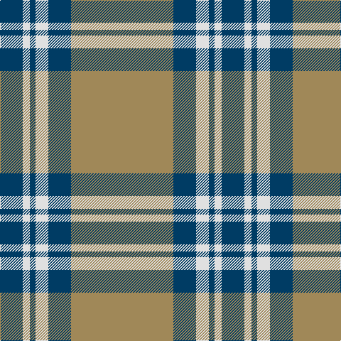

This page is one **sett** — a single exact thread-count. It belongs to the [tartan](/tartans/lt72db16ln9db4ln5db16/)
(the same proportion at any scale), whose colour order is pattern [BWBWBY](/stripes/bwbwby/).

Sourced from register-of-tartans.  It is a [6 stripe tartan](/stripes/stripes6/).

Original link https://www.tartanregister.gov.uk/tartanDetails.aspx?ref=2465

2 attestations — the source records this cloth was collapsed from (oldest owns this page)

<ul>
<li>01/01/1997 — Machair (register-of-tartans, <a href="https://www.tartanregister.gov.uk/tartanDetails.aspx?ref=2465">record</a>)</li>
<li>pre 1998 — Machair (Fashion) (tartans-authority, <a href="http://www.tartansauthority.com/tartan-ferret/display/2430/">record</a>)</li>
</ul>

## Register references

External register numbers recorded for this tartan.

- Scottish Register of Tartans: [2465](https://www.tartanregister.gov.uk/tartanDetails.aspx?ref=2465)
- Scottish Tartans Authority (ITI): 2430
- Scottish Tartans World Register: 2430

## Thread count
LT/144 DB32 LN18 DB8 LN10 DB/32

## Palette
Each colour and the base-6 reference it is a variant of.

| Colour | Shade | Base |
|---|---|---|
| DB | <code style="background-color:#003C64;">#003C64</code> `oklch(34.5% 0.089 246.0)` <small>#003C64</small> | B <code style="background-color:#2A418A;">#2A418A</code> |
| LN | <code style="background-color:#E0E0E0;">#E0E0E0</code> `oklch(90.7% 0.000 89.9)` <small>#E0E0E0</small> | W <code style="background-color:#F7F7F7;">#F7F7F7</code> |
| LT | <code style="background-color:#A08858;">#A08858</code> `oklch(63.7% 0.071 84.0)` <small>#A08858</small> | Y <code style="background-color:#F2BF00;">#F2BF00</code> |

# Sample pattern

## Nearest tartans

The nearest existing variants by ΔTartan distance, with this tartan at the top so the swatches line up against it.

ΔTartan

Tartan

Sett

—

<a href="/ttd/edit/#slug=lo72dt16w9dt4w5dt16~x2">Machair</a> <a class="nn-out" href="/setts/s6/lo72dt16w9dt4w5dt16~x2/" title="open its dictionary page">↗</a>

1.24

<a href="/ttd/edit/#slug=k4ly18n44k3ly10k4">Stutterheim</a> <a class="nn-out" href="/setts/s6/k4ly18n44k3ly10k4/" title="open its dictionary page">↗</a>

1.26

<a href="/ttd/edit/#slug=t11ly2r1ly2r1~x4">Carlisle, Ancient</a> <a class="nn-out" href="/setts/s5/t11ly2r1ly2r1~x4/" title="open its dictionary page">↗</a>

1.34

<a href="/ttd/edit/#slug=ly5n1ly1n12r1~x8">Ceredigion (Personal)</a> <a class="nn-out" href="/setts/s5/ly5n1ly1n12r1~x8/" title="open its dictionary page">↗</a>

1.40

<a href="/ttd/edit/#slug=lo38w9lo3do9w3~x2">Loch Tummel Trade Tartan Tartan Number: 1751. Earliest known date: pre 2003 Nothing See products available Copyright © Blair Urquhart, Comrie, 2015</a> <a class="nn-out" href="/setts/s5/lo38w9lo3do9w3~x2/" title="open its dictionary page">↗</a>

1.42

<a href="/ttd/edit/#slug=g3lo16w4k6g28lo1g3~x4">Pollock</a> <a class="nn-out" href="/setts/s7/g3lo16w4k6g28lo1g3~x4/" title="open its dictionary page">↗</a>

1.43

<a href="/ttd/edit/#slug=lb3k3lb3k3o15r1~x4">Tiree Grey</a> <a class="nn-out" href="/setts/s6/lb3k3lb3k3o15r1~x4/" title="open its dictionary page">↗</a>

1.46

<a href="/ttd/edit/#slug=t32k2t4k2t8lo29w2k2">Southern Lakes</a> <a class="nn-out" href="/setts/s8/t32k2t4k2t8lo29w2k2/" title="open its dictionary page">↗</a>

1.49

<a href="/ttd/edit/#slug=o10t11k2t3k2t2k8o40w4~x2">Doune (District)</a> <a class="nn-out" href="/setts/s9/o10t11k2t3k2t2k8o40w4~x2/" title="open its dictionary page">↗</a>

1.49

<a href="/ttd/edit/#slug=o10t11k2t3k2t2k8o40k4~x2">Doune District Tartan Tartan Number: 4707. Earliest known date: 01/01/2002 A colour variation of Stewart Bute. See products available Copyright © Blair Urquhart, Comrie, 2015</a> <a class="nn-out" href="/setts/s9/o10t11k2t3k2t2k8o40k4~x2/" title="open its dictionary page">↗</a>

1.50

<a href="/ttd/edit/#slug=g68r24g8lo18g3lo18~x2">MacMillan/Isetan</a> <a class="nn-out" href="/setts/s6/g68r24g8lo18g3lo18~x2/" title="open its dictionary page">↗</a>

## Neighbour map

Every grey dot is one of 14299 variants placed by the first two principal components of the ΔTartan feature space (44% of its variance). Red is this tartan; blue dots are its nearest — click one to open its page.

<svg viewBox="0 0 640 380" role="img" style="max-width:100%;height:auto;border:1px solid #e0e0e0;border-radius:4px;display:block" xmlns="http://www.w3.org/2000/svg"><image href="/nn/cloud.v1.png" width="640" height="380"/><a href="/setts/s6/k4ly18n44k3ly10k4/"><circle cx="305.9" cy="177.5" r="4" fill="#3465a4"><title>Stutterheim</title></circle></a><a href="/setts/s5/t11ly2r1ly2r1~x4/"><circle cx="408.1" cy="208.3" r="4" fill="#3465a4"><title>Carlisle, Ancient</title></circle></a><a href="/setts/s5/ly5n1ly1n12r1~x8/"><circle cx="433.6" cy="218.8" r="4" fill="#3465a4"><title>Ceredigion (Personal)</title></circle></a><a href="/setts/s5/lo38w9lo3do9w3~x2/"><circle cx="409.2" cy="200.0" r="4" fill="#3465a4"><title>Loch Tummel Trade Tartan Tartan Number: 1751. Earliest known date: pre 2003 Nothing See products available Copyright © Blair Urquhart, Comrie, 2015</title></circle></a><a href="/setts/s7/g3lo16w4k6g28lo1g3~x4/"><circle cx="337.5" cy="145.0" r="4" fill="#3465a4"><title>Pollock</title></circle></a><a href="/setts/s6/lb3k3lb3k3o15r1~x4/"><circle cx="291.5" cy="170.8" r="4" fill="#3465a4"><title>Tiree Grey</title></circle></a><a href="/setts/s8/t32k2t4k2t8lo29w2k2/"><circle cx="342.7" cy="163.9" r="4" fill="#3465a4"><title>Southern Lakes</title></circle></a><a href="/setts/s9/o10t11k2t3k2t2k8o40w4~x2/"><circle cx="375.4" cy="145.1" r="4" fill="#3465a4"><title>Doune (District)</title></circle></a><a href="/setts/s9/o10t11k2t3k2t2k8o40k4~x2/"><circle cx="367.0" cy="142.7" r="4" fill="#3465a4"><title>Doune District Tartan Tartan Number: 4707. Earliest known date: 01/01/2002 A colour variation of Stewart Bute. See products available Copyright © Blair Urquhart, Comrie, 2015</title></circle></a><a href="/setts/s6/g68r24g8lo18g3lo18~x2/"><circle cx="367.9" cy="192.4" r="4" fill="#3465a4"><title>MacMillan/Isetan</title></circle></a><circle cx="382.0" cy="178.5" r="5" fill="#c00000"/></svg>

ID: /setts/s6/lo72dt16w9dt4w5dt16~x2/
