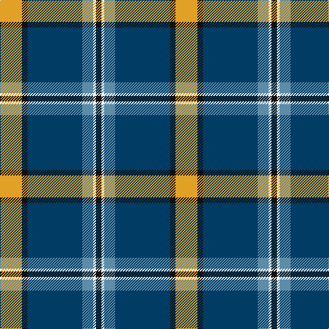

In pattern [KWBBKY](/stripes/kwbbky/).

This was sourced from register-of-tartans.  It is a [6 stripe tartan](/stripes/stripes6/).

Original link https://www.tartanregister.gov.uk/tartanDetails.aspx?ref=11124

## Register references

External register numbers recorded for this tartan.

- Scottish Register of Tartans: [11124](https://www.tartanregister.gov.uk/tartanDetails.aspx?ref=11124)

## Thread count
Y/32 K8 DB80 B16 W4 K/8

## Palette
Each colour and its ΔE from the base-6 reference it is a variant of.

| Colour | Shade | Base | ΔE (OKLab) |
|---|---|---|---|
| B | <code style="background-color:#5C8CA8;">#5C8CA8</code> `#5C8CA8` | B <code style="background-color:#2A418A;">#2A418A</code> | 0.23 |
| DB | <code style="background-color:#003C64;">#003C64</code> `#003C64` | B <code style="background-color:#2A418A;">#2A418A</code> | 0.08 |
| K | <code style="background-color:#101010;">#101010</code> `#101010` | K <code style="background-color:#000000;">#000000</code> | 0.17 |
| W | <code style="background-color:#FFFFFF;">#FFFFFF</code> `#FFFFFF` | W <code style="background-color:#F7F7F7;">#F7F7F7</code> | 0.02 |
| Y | <code style="background-color:#E0A126;">#E0A126</code> `#E0A126` | Y <code style="background-color:#F2BF00;">#F2BF00</code> | 0.08 |

# Sample pattern

## Nearest tartans

The nearest existing variants by ΔTartan distance.

1. [Solberg-Bell](/setts/s6/ly8k2dt20t4w1k2~x4/) — ΔT 0.51
1. [Nynashamn Whisky Society (Corporate)](/setts/s6/ly21g26db62w2dg2w2/) — ΔT 0.72
1. [Vance (Family Association)](/setts/s6/r4db24w2g13db2k3~x4/) — ΔT 0.93
1. [MacFadzean](/setts/s6/db48w2k20g22r3g4~x2/) — ΔT 1.08
1. [Centennial-King George Lodge No.171](/setts/s5/r2w7b30dg36ly2~x2/) — ΔT 1.08
1. [Centennial-King George Lodge No.171](/setts/s5/r2w7db30g36ly2~x2/) — ΔT 1.08
1. [Highlands of Durham (Corporate)](/setts/s6/r6dt4w2g27dt37ly2~x2/) — ΔT 1.14
1. [Sandelin (Personal)](/setts/s8/w10db2w1db35g10lo3g10r4~x2/) — ΔT 1.17
1. [Ferguson of Athol](/setts/s7/db24k8g8r2g8k1w2~x2/) — ΔT 1.17
1. [MX-5 Owners' Club](/setts/s7/r6db27t2g2t2g30w4~x2/) — ΔT 1.18

## Neighbour map

Every grey dot is one of 14299 variants placed by the first two principal components of the ΔTartan feature space (44% of its variance). Red is this tartan; blue dots are its nearest — click one to open its page.

<svg viewBox="0 0 640 380" role="img" style="max-width:100%;height:auto;border:1px solid #e0e0e0;border-radius:4px;display:block" xmlns="http://www.w3.org/2000/svg"><image href="/nn/cloud.v1.png" width="640" height="380"/><a href="/setts/s6/ly8k2dt20t4w1k2~x4/"><circle cx="267.0" cy="141.0" r="4" fill="#3465a4"><title>Solberg-Bell</title></circle></a><a href="/setts/s6/ly21g26db62w2dg2w2/"><circle cx="301.2" cy="128.1" r="4" fill="#3465a4"><title>Nynashamn Whisky Society (Corporate)</title></circle></a><a href="/setts/s6/r4db24w2g13db2k3~x4/"><circle cx="277.3" cy="178.6" r="4" fill="#3465a4"><title>Vance (Family Association)</title></circle></a><a href="/setts/s6/db48w2k20g22r3g4~x2/"><circle cx="259.6" cy="154.7" r="4" fill="#3465a4"><title>MacFadzean</title></circle></a><a href="/setts/s5/r2w7b30dg36ly2~x2/"><circle cx="255.8" cy="173.5" r="4" fill="#3465a4"><title>Centennial-King George Lodge No.171</title></circle></a><a href="/setts/s5/r2w7db30g36ly2~x2/"><circle cx="252.6" cy="171.4" r="4" fill="#3465a4"><title>Centennial-King George Lodge No.171</title></circle></a><a href="/setts/s6/r6dt4w2g27dt37ly2~x2/"><circle cx="301.7" cy="159.2" r="4" fill="#3465a4"><title>Highlands of Durham (Corporate)</title></circle></a><a href="/setts/s8/w10db2w1db35g10lo3g10r4~x2/"><circle cx="273.8" cy="112.5" r="4" fill="#3465a4"><title>Sandelin (Personal)</title></circle></a><a href="/setts/s7/db24k8g8r2g8k1w2~x2/"><circle cx="234.9" cy="146.5" r="4" fill="#3465a4"><title>Ferguson of Athol</title></circle></a><a href="/setts/s7/r6db27t2g2t2g30w4~x2/"><circle cx="242.9" cy="158.5" r="4" fill="#3465a4"><title>MX-5 Owners' Club</title></circle></a><circle cx="281.0" cy="148.0" r="5" fill="#c00000"/></svg>

ID: /setts/s6/lo8k2dt20t4w1k2~x4/
