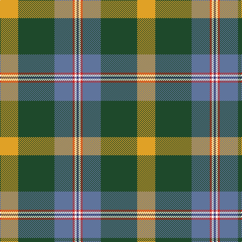

In pattern [BWRBGY](/stripes/bwrbgy/).

This was sourced from register-of-tartans.  It is a [6 stripe tartan](/stripes/stripes6/).

Original link https://www.tartanregister.gov.uk/tartanDetails.aspx?ref=10286

## Register references

External register numbers recorded for this tartan.

- Scottish Register of Tartans: [10286](https://www.tartanregister.gov.uk/tartanDetails.aspx?ref=10286)

## Thread count
Y/36 DG72 B36 R4 W4 DB/4

## Palette
Each colour and its ΔE from the base-6 reference it is a variant of.

| Colour | Shade | Base | ΔE (OKLab) |
|---|---|---|---|
| B | <code style="background-color:#5F749C;">#5F749C</code> `#5F749C` | B <code style="background-color:#2A418A;">#2A418A</code> | 0.17 |
| DB | <code style="background-color:#373875;">#373875</code> `#373875` | B <code style="background-color:#2A418A;">#2A418A</code> | 0.04 |
| DG | <code style="background-color:#1E492B;">#1E492B</code> `#1E492B` | G <code style="background-color:#006100;">#006100</code> | 0.10 |
| R | <code style="background-color:#CA2625;">#CA2625</code> `#CA2625` | R <code style="background-color:#CC0000;">#CC0000</code> | 0.02 |
| W | <code style="background-color:#F9F5EF;">#F9F5EF</code> `#F9F5EF` | W <code style="background-color:#F7F7F7;">#F7F7F7</code> | 0.01 |
| Y | <code style="background-color:#E0A126;">#E0A126</code> `#E0A126` | Y <code style="background-color:#F2BF00;">#F2BF00</code> | 0.08 |

# Sample pattern

## Nearest tartans

The nearest existing variants by ΔTartan distance.

1. [Stirling University (Corporate)](/setts/s8/g22r3w1g2r3t16k3ly2~x4/) — ΔT 1.02
1. [Stirling, University of Corporate Univ Tartan Tartan Number: 2297. Earliest known date: 1994 This is the accepted University design. See products available Copyright © Blair Urquhart, Comrie, 2015](/setts/s8/g22r3k1g2r3t16k3ly2~x4/) — ΔT 1.03
1. [State Seal of New Mexico (Fashion)](/setts/s8/lb5o49lb3dg24r5lo4dy30lb4~x2/) — ΔT 1.16
1. [Red Rum](/setts/s7/k2o30g4w2g14m13ly2~x2/) — ΔT 1.19
1. [State Seal of West Virginia (Fash)](/setts/s8/o49lo3b13dy8k23b10o14r4~x2/) — ΔT 1.23
1. [Hamilton of Brandon (Fashion)](/setts/s6/lo16k7w1g7k1ly3~x4/) — ΔT 1.24
1. [Caskie](/setts/s7/w3k1t25r7g12k1ly3~x2/) — ΔT 1.25
1. [Royal British Legion, The](/setts/s7/r6b2g20k3db8g2b4~x2/) — ΔT 1.25
1. [(4) Traill](/setts/s7/r8ly2o7ly2n24k2g1~x2/) — ΔT 1.28
1. [Glencross, Tynron (Name)](/setts/s6/r3y13db13ly2dg34w3~x2/) — ΔT 1.28

## Neighbour map

Every grey dot is one of 14299 variants placed by the first two principal components of the ΔTartan feature space (44% of its variance). Red is this tartan; blue dots are its nearest — click one to open its page.

<svg viewBox="0 0 640 380" role="img" style="max-width:100%;height:auto;border:1px solid #e0e0e0;border-radius:4px;display:block" xmlns="http://www.w3.org/2000/svg"><image href="/nn/cloud.v1.png" width="640" height="380"/><a href="/setts/s8/g22r3w1g2r3t16k3ly2~x4/"><circle cx="250.5" cy="124.0" r="4" fill="#3465a4"><title>Stirling University (Corporate)</title></circle></a><a href="/setts/s8/g22r3k1g2r3t16k3ly2~x4/"><circle cx="250.4" cy="124.7" r="4" fill="#3465a4"><title>Stirling, University of Corporate Univ Tartan Tartan Number: 2297. Earliest known date: 1994 This is the accepted University design. See products available Copyright © Blair Urquhart, Comrie, 2015</title></circle></a><a href="/setts/s8/lb5o49lb3dg24r5lo4dy30lb4~x2/"><circle cx="197.1" cy="135.7" r="4" fill="#3465a4"><title>State Seal of New Mexico (Fashion)</title></circle></a><a href="/setts/s7/k2o30g4w2g14m13ly2~x2/"><circle cx="244.4" cy="155.1" r="4" fill="#3465a4"><title>Red Rum</title></circle></a><a href="/setts/s8/o49lo3b13dy8k23b10o14r4~x2/"><circle cx="243.7" cy="147.7" r="4" fill="#3465a4"><title>State Seal of West Virginia (Fash)</title></circle></a><a href="/setts/s6/lo16k7w1g7k1ly3~x4/"><circle cx="216.0" cy="162.8" r="4" fill="#3465a4"><title>Hamilton of Brandon (Fashion)</title></circle></a><a href="/setts/s7/w3k1t25r7g12k1ly3~x2/"><circle cx="242.0" cy="119.1" r="4" fill="#3465a4"><title>Caskie</title></circle></a><a href="/setts/s7/r6b2g20k3db8g2b4~x2/"><circle cx="168.6" cy="164.2" r="4" fill="#3465a4"><title>Royal British Legion, The</title></circle></a><a href="/setts/s7/r8ly2o7ly2n24k2g1~x2/"><circle cx="276.4" cy="118.6" r="4" fill="#3465a4"><title>(4) Traill</title></circle></a><a href="/setts/s6/r3y13db13ly2dg34w3~x2/"><circle cx="259.6" cy="164.7" r="4" fill="#3465a4"><title>Glencross, Tynron (Name)</title></circle></a><circle cx="231.6" cy="147.6" r="5" fill="#c00000"/></svg>

ID: /setts/s6/lo9dg18t9r1w1db1~x4/
