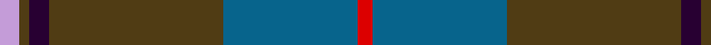

**Bands:** [RBGBGW](/stripes/rbgbgw/) · **Stripes:** [R N DY DP DY LP](/stripes/stripes6/) R N DY DP DY LP

This was sourced from register-of-tartans.  It is a [6 band tartan](/bands/bands6/).

Original link https://www.tartanregister.gov.uk/tartanDetails.aspx?ref=906

## Register references

External register numbers recorded for this tartan.

- Scottish Register of Tartans: [906](https://www.tartanregister.gov.uk/tartanDetails.aspx?ref=906)
- Scottish Tartans World Register: 2765

## Thread count
LP/8 T4 DP8 T70 B54 R/6

## Palette
Each colour and its ΔE from the base-6 reference it is a variant of.

| Colour | Shade | Base | ΔE (OKLab) |
|---|---|---|---|
| B | <code style="background-color:#07648C;">#07648C</code> `#07648C` | B <code style="background-color:#2A418A;">#2A418A</code> | 0.10 |
| DP | <code style="background-color:#280032;">#280032</code> `#280032` | B <code style="background-color:#2A418A;">#2A418A</code> | 0.22 |
| LP | <code style="background-color:#C49CD8;">#C49CD8</code> `#C49CD8` | W <code style="background-color:#F7F7F7;">#F7F7F7</code> | 0.25 |
| R | <code style="background-color:#DC0000;">#DC0000</code> `#DC0000` | R <code style="background-color:#CC0000;">#CC0000</code> | 0.03 |
| T | <code style="background-color:#503C14;">#503C14</code> `#503C14` | G <code style="background-color:#006100;">#006100</code> | 0.14 |

# Sample pattern

## Nearest tartans

The nearest existing variants by ΔTartan distance.

1. [Bressuire (District)](/setts/s7/r1g4lo1g3r4n15w1~x4/) — ΔT 0.96
1. [Royal Deeside (District)](/setts/s6/r4y2db4y35t27r3~x2/) — ΔT 1.03
1. [Hardie (Name)](/setts/s6/m4dg9w2dg24dt37r3~x2/) — ΔT 1.10
1. [Kilkenny, County (District)](/setts/s7/dr4dg27o2db25lo5dg3o3~x2/) — ΔT 1.16
1. [Scotch Mist](/setts/s8/n4o4n4k4n18k3do38w3~x2/) — ΔT 1.16
1. [Hebridean Granite Fashion Tartan Tartan Number: 6821. Earliest known date: 2005 For a new House of Edgar collection. Intended to emulate the gray morning suit perhaps. See products available Copyright © Blair Urquhart, Comrie, 2015](/setts/s8/o3lr4o4do4o18do3n36w3~x2/) — ΔT 1.18
1. [Graeme Heckenberg Hunting](/setts/s7/db3g13lr1o3lr1db10lo1~x2/) — ΔT 1.20
1. [Lawrie](/setts/s7/dp6y2dp1g25db16k2db4~x2/) — ΔT 1.20
1. [Lawrie Clan Tartan Tartan Number: 3202. Earliest known date: 2000 One of a set of three similar designs for Laurie, Lawrie and Lowry, designed by Peter MacDonald for Iain Laurie. See products available Copyright © Blair Urquhart, Comrie, 2015](/setts/s7/dp6o2dp1g25db16k2db4~x2/) — ΔT 1.21
1. [Laurie](/setts/s7/dp6r2dp1dg25db16k2db4~x2/) — ΔT 1.21

## Neighbour map

Every grey dot is one of 14313 variants placed by the first two principal components of the ΔTartan feature space (44% of its variance). Red is this tartan; blue dots are its nearest — click one to open its page.

<svg viewBox="0 0 640 380" role="img" style="max-width:100%;height:auto;border:1px solid #e0e0e0;border-radius:4px;display:block" xmlns="http://www.w3.org/2000/svg"><image href="/nn/cloud.v1.png" width="640" height="380"/><a href="/setts/s7/r1g4lo1g3r4n15w1~x4/"><circle cx="332.9" cy="183.3" r="4" fill="#3465a4"><title>Bressuire (District)</title></circle></a><a href="/setts/s6/r4y2db4y35t27r3~x2/"><circle cx="342.1" cy="186.8" r="4" fill="#3465a4"><title>Royal Deeside (District)</title></circle></a><a href="/setts/s6/m4dg9w2dg24dt37r3~x2/"><circle cx="333.8" cy="200.8" r="4" fill="#3465a4"><title>Hardie (Name)</title></circle></a><a href="/setts/s7/dr4dg27o2db25lo5dg3o3~x2/"><circle cx="282.7" cy="194.9" r="4" fill="#3465a4"><title>Kilkenny, County (District)</title></circle></a><a href="/setts/s8/n4o4n4k4n18k3do38w3~x2/"><circle cx="330.1" cy="186.0" r="4" fill="#3465a4"><title>Scotch Mist</title></circle></a><a href="/setts/s8/o3lr4o4do4o18do3n36w3~x2/"><circle cx="303.2" cy="173.3" r="4" fill="#3465a4"><title>Hebridean Granite Fashion Tartan Tartan Number: 6821. Earliest known date: 2005 For a new House of Edgar collection. Intended to emulate the gray morning suit perhaps. See products available Copyright © Blair Urquhart, Comrie, 2015</title></circle></a><a href="/setts/s7/db3g13lr1o3lr1db10lo1~x2/"><circle cx="261.8" cy="190.8" r="4" fill="#3465a4"><title>Graeme Heckenberg Hunting</title></circle></a><a href="/setts/s7/dp6y2dp1g25db16k2db4~x2/"><circle cx="311.0" cy="171.5" r="4" fill="#3465a4"><title>Lawrie</title></circle></a><a href="/setts/s7/dp6o2dp1g25db16k2db4~x2/"><circle cx="304.7" cy="169.8" r="4" fill="#3465a4"><title>Lawrie Clan Tartan Tartan Number: 3202. Earliest known date: 2000 One of a set of three similar designs for Laurie, Lawrie and Lowry, designed by Peter MacDonald for Iain Laurie. See products available Copyright © Blair Urquhart, Comrie, 2015</title></circle></a><a href="/setts/s7/dp6r2dp1dg25db16k2db4~x2/"><circle cx="324.4" cy="178.1" r="4" fill="#3465a4"><title>Laurie</title></circle></a><circle cx="338.0" cy="188.3" r="5" fill="#c00000"/></svg>

ID: /setts/s6/lp4dy2dp4dy35n27r3~x2/
