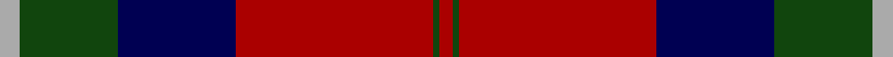

In pattern [RGRBGY](/stripes/rgrbgy/).

This was sourced from weddslist.  It is a [6 stripe tartan](/stripes/stripes6/).

Original link http://www.weddslist.com/cgi-bin/tartans/pg.pl?source=tinsel

## Attestations

This cloth appears in 2 source records; the oldest owns this page.

- undated — Ruthven (weddslist, [record](http://www.weddslist.com/cgi-bin/tartans/pg.pl?source=tinsel))
- undated — Ruthven (weddslist, [record](http://www.weddslist.com/cgi-bin/tartans/pg.pl?source=x))

## Thread count
N/6 DG30 DB36 DR60 DG2 DR/4

## Palette
Each colour and the base-6 reference it is a variant of.

| Colour | Shade | Base |
|---|---|---|
| DB | <code style="background-color:#000052;">#000052</code> `oklch(19.8% 0.137 264.1)` <small>#000052</small> | B <code style="background-color:#2A418A;">#2A418A</code> |
| DG | <code style="background-color:#11450D;">#11450D</code> `oklch(34.4% 0.101 142.1)` <small>#11450D</small> | G <code style="background-color:#006100;">#006100</code> |
| DR | <code style="background-color:#AA0000;">#AA0000</code> `oklch(46.3% 0.190 29.2)` <small>#AA0000</small> | R <code style="background-color:#CC0000;">#CC0000</code> |
| N | <code style="background-color:#AAAAAA;">#AAAAAA</code> `oklch(73.8% 0.000 89.9)` <small>#AAAAAA</small> | Y <code style="background-color:#F2BF00;">#F2BF00</code> |

# Sample pattern

## Nearest tartans

The nearest existing variants by ΔTartan distance.

1. [Ruthven](/setts/s6/lb3dg15db18r30db1r2~x2/) — ΔT 0.72
1. [Fraser](/setts/s6/r2db12r2dg12r24w1~x2/) — ΔT 1.01
1. [Carson Red (Personal)](/setts/s8/n19r2n3r2n3k43r22g3~x2/) — ΔT 1.10
1. [Ruthven](/setts/s6/w3g15db18r30g1r2~x2/) — ΔT 1.11
1. [Hunter of Bute (Clan ?)](/setts/s9/r8dg8k1dg3k1dg1k10r20lb3~x2/) — ΔT 1.20
1. [Nibley (Personal)](/setts/s6/w3dg18db22r19dg1r2~x2/) — ΔT 1.25
1. [Abernethy (Colerain USA) (Personal)](/setts/s7/lo1db14r28g14r1g14lo1~x2/) — ΔT 1.27
1. [Fraser (1745)](/setts/s6/r2db12r2g12r24w1~x2/) — ΔT 1.28
1. [Finlaggan](/setts/s6/dg7w1dg18db6r18dg2~x2/) — ΔT 1.28
1. [MacQuarrie LO](/setts/s7/r6dg16r4db12r16b1r2~x2/) — ΔT 1.30

## Neighbour map

Every grey dot is one of 14299 variants placed by the first two principal components of the ΔTartan feature space (44% of its variance). Red is this tartan; blue dots are its nearest — click one to open its page.

<svg viewBox="0 0 640 380" role="img" style="max-width:100%;height:auto;border:1px solid #e0e0e0;border-radius:4px;display:block" xmlns="http://www.w3.org/2000/svg"><image href="/nn/cloud.v1.png" width="640" height="380"/><a href="/setts/s6/lb3dg15db18r30db1r2~x2/"><circle cx="283.1" cy="150.4" r="4" fill="#3465a4"><title>Ruthven</title></circle></a><a href="/setts/s6/r2db12r2dg12r24w1~x2/"><circle cx="322.0" cy="161.5" r="4" fill="#3465a4"><title>Fraser</title></circle></a><a href="/setts/s8/n19r2n3r2n3k43r22g3~x2/"><circle cx="284.9" cy="147.7" r="4" fill="#3465a4"><title>Carson Red (Personal)</title></circle></a><a href="/setts/s6/w3g15db18r30g1r2~x2/"><circle cx="299.4" cy="156.4" r="4" fill="#3465a4"><title>Ruthven</title></circle></a><a href="/setts/s9/r8dg8k1dg3k1dg1k10r20lb3~x2/"><circle cx="311.6" cy="160.3" r="4" fill="#3465a4"><title>Hunter of Bute (Clan ?)</title></circle></a><a href="/setts/s6/w3dg18db22r19dg1r2~x2/"><circle cx="224.6" cy="179.7" r="4" fill="#3465a4"><title>Nibley (Personal)</title></circle></a><a href="/setts/s7/lo1db14r28g14r1g14lo1~x2/"><circle cx="278.9" cy="161.8" r="4" fill="#3465a4"><title>Abernethy (Colerain USA) (Personal)</title></circle></a><a href="/setts/s6/r2db12r2g12r24w1~x2/"><circle cx="333.4" cy="163.2" r="4" fill="#3465a4"><title>Fraser (1745)</title></circle></a><a href="/setts/s6/dg7w1dg18db6r18dg2~x2/"><circle cx="317.6" cy="197.1" r="4" fill="#3465a4"><title>Finlaggan</title></circle></a><a href="/setts/s7/r6dg16r4db12r16b1r2~x2/"><circle cx="289.7" cy="200.6" r="4" fill="#3465a4"><title>MacQuarrie LO</title></circle></a><circle cx="301.0" cy="162.9" r="5" fill="#c00000"/></svg>

ID: /setts/s6/lr3dg15db18r30dg1r2~x2/
