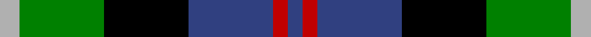

In pattern [BRBKGY](/stripes/brbkgy/).

This was sourced from weddslist.  It is a [6 stripe tartan](/stripes/stripes6/).

Original link http://www.weddslist.com/cgi-bin/tartans/pg.pl?source=sts

## Thread count
N/8 G34 K34 B34 R6 B/6

## Palette
Each colour and the base-6 reference it is a variant of.

| Colour | Shade | Base |
|---|---|---|
| B | <code style="background-color:#304080;">#304080</code> `oklch(39.4% 0.109 270.2)` <small>#304080</small> | B <code style="background-color:#2A418A;">#2A418A</code> |
| G | <code style="background-color:#008000;">#008000</code> `oklch(52.0% 0.177 142.5)` <small>#008000</small> | G <code style="background-color:#006100;">#006100</code> |
| K | <code style="background-color:#000000;">#000000</code> `oklch(0.0% 0.000 0.0)` <small>#000000</small> | K <code style="background-color:#000000;">#000000</code> |
| N | <code style="background-color:#B0B0B0;">#B0B0B0</code> `oklch(75.7% 0.000 89.9)` <small>#B0B0B0</small> | Y <code style="background-color:#F2BF00;">#F2BF00</code> |
| R | <code style="background-color:#C00000;">#C00000</code> `oklch(50.7% 0.208 29.2)` <small>#C00000</small> | R <code style="background-color:#CC0000;">#CC0000</code> |

# Sample pattern

## Nearest tartans

The nearest existing variants by ΔTartan distance.

1. [Wellington](/setts/s6/db1r1db6k6g6w1~x2/) — ΔT 0.23
1. [Birse](/setts/s6/k4g16k14ly3db16r4~x2/) — ΔT 0.47
1. [Hogarth, of Firhill](/setts/s7/b2g6ly1k6db6k1db1~x2/) — ΔT 0.47
1. [Dyce](/setts/s6/k2ly1g6k6db6w1~x4/) — ΔT 0.55
1. [MacNeil 6](/setts/s6/w3db14k12g12k2ly3~x2/) — ΔT 0.57
1. [Leslie, hunting](/setts/s6/r2db8k8w1g8k1~x2/) — ΔT 0.61
1. [Cooke](/setts/s7/k6b2db12g8r5k2g3~x4/) — ΔT 0.64
1. [Casely](/setts/s6/r4g11k11g2db11y3~x4/) — ΔT 0.67
1. [Davidson](/setts/s5/r1db6k3g6w1~x4/) — ΔT 0.71
1. [Wellington, or Waterloo](/setts/s6/t3g8k9db7r2db2~x2/) — ΔT 0.71

## Neighbour map

Every grey dot is one of 14299 variants placed by the first two principal components of the ΔTartan feature space (44% of its variance). Red is this tartan; blue dots are its nearest — click one to open its page.

<svg viewBox="0 0 640 380" role="img" style="max-width:100%;height:auto;border:1px solid #e0e0e0;border-radius:4px;display:block" xmlns="http://www.w3.org/2000/svg"><image href="/nn/cloud.v1.png" width="640" height="380"/><a href="/setts/s6/db1r1db6k6g6w1~x2/"><circle cx="101.9" cy="217.1" r="4" fill="#3465a4"><title>Wellington</title></circle></a><a href="/setts/s6/k4g16k14ly3db16r4~x2/"><circle cx="77.6" cy="229.3" r="4" fill="#3465a4"><title>Birse</title></circle></a><a href="/setts/s7/b2g6ly1k6db6k1db1~x2/"><circle cx="83.2" cy="209.8" r="4" fill="#3465a4"><title>Hogarth, of Firhill</title></circle></a><a href="/setts/s6/k2ly1g6k6db6w1~x4/"><circle cx="100.9" cy="223.2" r="4" fill="#3465a4"><title>Dyce</title></circle></a><a href="/setts/s6/w3db14k12g12k2ly3~x2/"><circle cx="78.0" cy="212.1" r="4" fill="#3465a4"><title>MacNeil 6</title></circle></a><a href="/setts/s6/r2db8k8w1g8k1~x2/"><circle cx="107.6" cy="206.5" r="4" fill="#3465a4"><title>Leslie, hunting</title></circle></a><a href="/setts/s7/k6b2db12g8r5k2g3~x4/"><circle cx="81.8" cy="219.3" r="4" fill="#3465a4"><title>Cooke</title></circle></a><a href="/setts/s6/r4g11k11g2db11y3~x4/"><circle cx="73.5" cy="236.1" r="4" fill="#3465a4"><title>Casely</title></circle></a><a href="/setts/s5/r1db6k3g6w1~x4/"><circle cx="111.2" cy="229.6" r="4" fill="#3465a4"><title>Davidson</title></circle></a><a href="/setts/s6/t3g8k9db7r2db2~x2/"><circle cx="57.1" cy="245.0" r="4" fill="#3465a4"><title>Wellington, or Waterloo</title></circle></a><circle cx="93.4" cy="223.9" r="5" fill="#c00000"/></svg>

ID: /setts/s6/lr4g17k17db17r3db3~x2/
