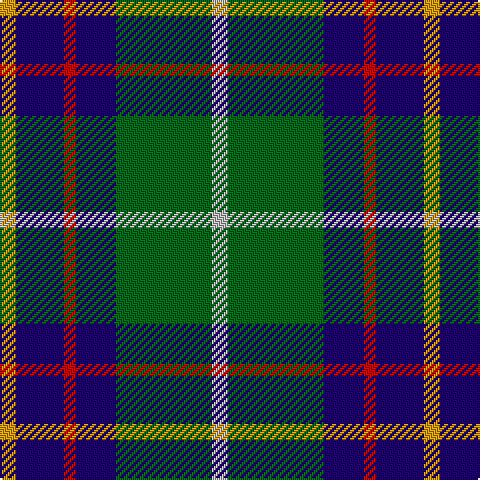

This page is one **sett** — a single exact thread-count. It belongs to the [tartan](/tartans/lr4g24db10r3db12lo4/)
(the same proportion at any scale), whose colour order is pattern [YBRBGY](/stripes/ybrbgy/).

Sourced from tartans-authority.  It is a [6 stripe tartan](/stripes/stripes6/).

Original link http://www.tartansauthority.com/tartan-ferret/display/1798/

2 attestations — the source records this cloth was collapsed from (oldest owns this page)

<ul>
<li>pre 2002 — Inglis (Name) (tartans-authority, <a href="http://www.tartansauthority.com/tartan-ferret/display/1798/">record</a>)</li>
<li>undated — Inglis (register-of-tartans, <a href="https://www.tartanregister.gov.uk/tartanDetails.aspx?ref=1825">record</a>)</li>
</ul>

## Register references

External register numbers recorded for this tartan.

- Scottish Register of Tartans: [1825](https://www.tartanregister.gov.uk/tartanDetails.aspx?ref=1825)
- Scottish Tartans Authority (ITI): 1798
- Scottish Tartans World Register: 1798

## Thread count
DY/8 DB24 R6 DB20 G48 N/8

## Palette

Palette: <strong>Tartan Register</strong> <small style="color:#888">(3 of 5 colours)</small>
<table><thead><tr><th>Colour</th><th>Threads</th><th>Shade</th><th>Base</th><th>OKLCh</th></tr></thead><tbody><tr><td>DY/</td><td style="text-align:right;font-variant-numeric:tabular-nums">8</td><td><code style="background-color:#D09800;">#D09800</code> <small style="color:#888">#D09800</small></td><td>Y <code style="background-color:#F2BF00;">#F2BF00</code></td><td><small style="color:#888">oklch(71.4% 0.147 82.1)</small></td></tr><tr><td>DB</td><td style="text-align:right;font-variant-numeric:tabular-nums">24</td><td><code style="background-color:#1C0070;">#1C0070</code> <small style="color:#888">#1C0070</small></td><td>B <code style="background-color:#2A418A;">#2A418A</code></td><td><small style="color:#888">oklch(26.3% 0.162 277.1)</small></td></tr><tr><td>R</td><td style="text-align:right;font-variant-numeric:tabular-nums">6</td><td><code style="background-color:#C80000;">#C80000</code> <small style="color:#888">#C80000</small></td><td>R <code style="background-color:#CC0000;">#CC0000</code></td><td><small style="color:#888">oklch(52.3% 0.215 29.2)</small></td></tr><tr><td>DB</td><td style="text-align:right;font-variant-numeric:tabular-nums">20</td><td><code style="background-color:#1C0070;">#1C0070</code> <small style="color:#888">#1C0070</small></td><td>B <code style="background-color:#2A418A;">#2A418A</code></td><td><small style="color:#888">oklch(26.3% 0.162 277.1)</small></td></tr><tr><td>G</td><td style="text-align:right;font-variant-numeric:tabular-nums">48</td><td><code style="background-color:#006818;">#006818</code> <small style="color:#888">#006818</small></td><td>G <code style="background-color:#006100;">#006100</code></td><td><small style="color:#888">oklch(45.0% 0.142 145.0)</small></td></tr><tr><td>N/</td><td style="text-align:right;font-variant-numeric:tabular-nums">8</td><td><code style="background-color:#B8B8B8;">#B8B8B8</code> <small style="color:#888">#B8B8B8</small></td><td>Y <code style="background-color:#F2BF00;">#F2BF00</code></td><td><small style="color:#888">oklch(78.3% 0.000 89.9)</small></td></tr></tbody></table>

# Sample pattern

## Nearest tartans

The nearest existing variants by ΔTartan distance, with this tartan at the top so the swatches line up against it.

ΔTartan

Tartan

Sett

—

<a href="/ttd/edit/#slug=lr4g24db10r3db12lo4~x2">Inglis (Name)</a> <a class="nn-out" href="/setts/s6/lr4g24db10r3db12lo4~x2/" title="open its dictionary page">↗</a>

0.72

<a href="/ttd/edit/#slug=w4g28db18r4db18ly3~x2">MacIntyre, Inglis</a> <a class="nn-out" href="/setts/s6/w4g28db18r4db18ly3~x2/" title="open its dictionary page">↗</a>

0.76

<a href="/ttd/edit/#slug=k2ly1g10db10w1~x6">Turnbull Hunting (1983) #2</a> <a class="nn-out" href="/setts/s5/k2ly1g10db10w1~x6/" title="open its dictionary page">↗</a>

0.77

<a href="/ttd/edit/#slug=db31b4db5k19g20ly4~x2">Midlothian</a> <a class="nn-out" href="/setts/s6/db31b4db5k19g20ly4~x2/" title="open its dictionary page">↗</a>

0.77

<a href="/ttd/edit/#slug=k7lb3g18db18w2~x2">Bhatti (Name)</a> <a class="nn-out" href="/setts/s5/k7lb3g18db18w2~x2/" title="open its dictionary page">↗</a>

0.79

<a href="/ttd/edit/#slug=k7m3g29db29w3~x2">Highlander, Highland Laddie Kilts</a> <a class="nn-out" href="/setts/s5/k7m3g29db29w3~x2/" title="open its dictionary page">↗</a>

0.80

<a href="/ttd/edit/#slug=r2ly1g10db10w1~x6">Turnbull Hunting (Name)</a> <a class="nn-out" href="/setts/s5/r2ly1g10db10w1~x6/" title="open its dictionary page">↗</a>

0.84

<a href="/ttd/edit/#slug=db20k6lo4db3g20w2~x2">DeLoughery (Personal)</a> <a class="nn-out" href="/setts/s6/db20k6lo4db3g20w2~x2/" title="open its dictionary page">↗</a>

0.89

<a href="/setts/s8/dp19w2g12t3k4~x2/">Wilson's No.111</a>

0.89

<a href="/ttd/edit/#slug=k1dbi1g8db8w1~x4">Douglas, Green (Wilsons)</a> <a class="nn-out" href="/setts/s5/k1dbi1g8db8w1~x4/" title="open its dictionary page">↗</a>

0.92

<a href="/ttd/edit/#slug=db18r3k9r3g23ly3~x2">Royal College of Physicians (Corp)</a> <a class="nn-out" href="/setts/s6/db18r3k9r3g23ly3~x2/" title="open its dictionary page">↗</a>

## Neighbour map

Every grey dot is one of 14359 variants placed by the first two principal components of the ΔTartan feature space (44% of its variance). Red is this tartan; blue dots are its nearest — click one to open its page.

<svg viewBox="0 0 640 380" role="img" style="max-width:100%;height:auto;border:1px solid #e0e0e0;border-radius:4px;display:block" xmlns="http://www.w3.org/2000/svg"><image href="/nn/cloud.v1.png" width="640" height="380"/><a href="/setts/s6/w4g28db18r4db18ly3~x2/"><circle cx="223.6" cy="207.3" r="4" fill="#3465a4"><title>MacIntyre, Inglis</title></circle></a><a href="/setts/s5/k2ly1g10db10w1~x6/"><circle cx="215.3" cy="205.6" r="4" fill="#3465a4"><title>Turnbull Hunting (1983) #2</title></circle></a><a href="/setts/s6/db31b4db5k19g20ly4~x2/"><circle cx="158.8" cy="210.1" r="4" fill="#3465a4"><title>Midlothian</title></circle></a><a href="/setts/s5/k7lb3g18db18w2~x2/"><circle cx="167.8" cy="221.7" r="4" fill="#3465a4"><title>Bhatti (Name)</title></circle></a><a href="/setts/s5/k7m3g29db29w3~x2/"><circle cx="198.1" cy="205.9" r="4" fill="#3465a4"><title>Highlander, Highland Laddie Kilts</title></circle></a><a href="/setts/s5/r2ly1g10db10w1~x6/"><circle cx="220.5" cy="203.5" r="4" fill="#3465a4"><title>Turnbull Hunting (Name)</title></circle></a><a href="/setts/s6/db20k6lo4db3g20w2~x2/"><circle cx="206.6" cy="204.1" r="4" fill="#3465a4"><title>DeLoughery (Personal)</title></circle></a><a href="/setts/s8/dp19w2g12t3k4~x2/"><circle cx="183.0" cy="184.4" r="4" fill="#3465a4"><title>Wilson's No.111</title></circle></a><a href="/setts/s5/k1dbi1g8db8w1~x4/"><circle cx="219.1" cy="218.2" r="4" fill="#3465a4"><title>Douglas, Green (Wilsons)</title></circle></a><a href="/setts/s6/db18r3k9r3g23ly3~x2/"><circle cx="168.5" cy="212.0" r="4" fill="#3465a4"><title>Royal College of Physicians (Corp)</title></circle></a><circle cx="183.1" cy="210.0" r="5" fill="#c00000"/></svg>

ID: /setts/s6/lr4g24db10r3db12lo4~x2/
