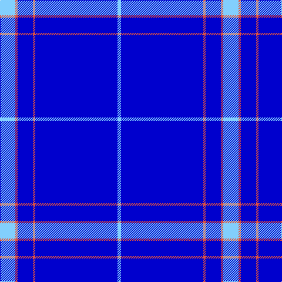

In pattern [WBRBRW](/stripes/wbrbrw/).

This was sourced from register-of-tartans.  It is a [6 stripe tartan](/stripes/stripes6/).

Original link https://www.tartanregister.gov.uk/tartanDetails.aspx?ref=10620

## Register references

External register numbers recorded for this tartan.

- Scottish Register of Tartans: [10620](https://www.tartanregister.gov.uk/tartanDetails.aspx?ref=10620)

## Thread count
LB/26 O4 B26 O4 B140 LB/6

## Palette
Each colour and the base-6 reference it is a variant of.

| Colour | Shade | Base |
|---|---|---|
| B | <code style="background-color:#0000CD;">#0000CD</code> `oklch(38.3% 0.266 264.1)` <small>#0000CD</small> | B <code style="background-color:#2A418A;">#2A418A</code> |
| LB | <code style="background-color:#82CFFD;">#82CFFD</code> `oklch(82.2% 0.100 236.0)` <small>#82CFFD</small> | W <code style="background-color:#F7F7F7;">#F7F7F7</code> |
| O | <code style="background-color:#E1523D;">#E1523D</code> `oklch(62.8% 0.182 31.0)` <small>#E1523D</small> | R <code style="background-color:#CC0000;">#CC0000</code> |

# Sample pattern

## Nearest tartans

The nearest existing variants by ΔTartan distance, with this tartan at the top so the swatches line up against it.

ΔTartan

Tartan

Sett

—

<a href="/ttd/edit/#slug=lt13r2db13r2db70lt3~x2">Agua</a> <a class="nn-out" href="/setts/s6/lt13r2db13r2db70lt3~x2/" title="open its dictionary page">↗</a>

1.53

<a href="/ttd/edit/#slug=k1db18lt5db1lt3db18k1~x4">Blueheart</a> <a class="nn-out" href="/setts/s7/k1db18lt5db1lt3db18k1~x4/" title="open its dictionary page">↗</a>

1.66

<a href="/ttd/edit/#slug=b61ly3db2w2b20w2b4ly4~x2">Royal Warrant Holders</a> <a class="nn-out" href="/setts/s8/b61ly3db2w2b20w2b4ly4~x2/" title="open its dictionary page">↗</a>

2.34

<a href="/ttd/edit/#slug=db61r6w2r8lo2db3lo2db15~x2">Duke of York (Royal)</a> <a class="nn-out" href="/setts/s8/db61r6w2r8lo2db3lo2db15~x2/" title="open its dictionary page">↗</a>

2.51

<a href="/ttd/edit/#slug=db35w4db10m3r3m3~x4">Steffen, Markus (Personal)</a> <a class="nn-out" href="/setts/s6/db35w4db10m3r3m3~x4/" title="open its dictionary page">↗</a>

2.59

<a href="/ttd/edit/#slug=db100y10k5y10r8">Waugh</a> <a class="nn-out" href="/setts/s5/db100y10k5y10r8/" title="open its dictionary page">↗</a>

2.62

<a href="/ttd/edit/#slug=b10db6b3db62w4db5~x2">Auchairne</a> <a class="nn-out" href="/setts/s6/b10db6b3db62w4db5~x2/" title="open its dictionary page">↗</a>

2.70

<a href="/ttd/edit/#slug=db66w2db10w2db10w2db12r3t24~x2">RAAF</a> <a class="nn-out" href="/setts/s9/db66w2db10w2db10w2db12r3t24~x2/" title="open its dictionary page">↗</a>

2.71

<a href="/ttd/edit/#slug=r5w4k4db80w4~x2">Volunteer Lifesaving Corps (Corp.)</a> <a class="nn-out" href="/setts/s5/r5w4k4db80w4~x2/" title="open its dictionary page">↗</a>

2.76

<a href="/ttd/edit/#slug=db80r1db2r1db6r10db1r7~x2">Mack of Stoneywood Dress (Personal)</a> <a class="nn-out" href="/setts/s8/db80r1db2r1db6r10db1r7~x2/" title="open its dictionary page">↗</a>

2.80

<a href="/ttd/edit/#slug=db32r3db4k1ly3">MacLaine of Lochbuie Hunting</a> <a class="nn-out" href="/setts/s5/db32r3db4k1ly3/" title="open its dictionary page">↗</a>

## Neighbour map

Every grey dot is one of 14299 variants placed by the first two principal components of the ΔTartan feature space (44% of its variance). Red is this tartan; blue dots are its nearest — click one to open its page.

<svg viewBox="0 0 640 380" role="img" style="max-width:100%;height:auto;border:1px solid #e0e0e0;border-radius:4px;display:block" xmlns="http://www.w3.org/2000/svg"><image href="/nn/cloud.v1.png" width="640" height="380"/><a href="/setts/s7/k1db18lt5db1lt3db18k1~x4/"><circle cx="483.8" cy="193.8" r="4" fill="#3465a4"><title>Blueheart</title></circle></a><a href="/setts/s8/b61ly3db2w2b20w2b4ly4~x2/"><circle cx="592.0" cy="137.4" r="4" fill="#3465a4"><title>Royal Warrant Holders</title></circle></a><a href="/setts/s8/db61r6w2r8lo2db3lo2db15~x2/"><circle cx="551.2" cy="141.5" r="4" fill="#3465a4"><title>Duke of York (Royal)</title></circle></a><a href="/setts/s6/db35w4db10m3r3m3~x4/"><circle cx="466.8" cy="192.8" r="4" fill="#3465a4"><title>Steffen, Markus (Personal)</title></circle></a><a href="/setts/s5/db100y10k5y10r8/"><circle cx="501.3" cy="184.5" r="4" fill="#3465a4"><title>Waugh</title></circle></a><a href="/setts/s6/b10db6b3db62w4db5~x2/"><circle cx="553.1" cy="185.2" r="4" fill="#3465a4"><title>Auchairne</title></circle></a><a href="/setts/s9/db66w2db10w2db10w2db12r3t24~x2/"><circle cx="494.9" cy="133.7" r="4" fill="#3465a4"><title>RAAF</title></circle></a><a href="/setts/s5/r5w4k4db80w4~x2/"><circle cx="562.0" cy="162.9" r="4" fill="#3465a4"><title>Volunteer Lifesaving Corps (Corp.)</title></circle></a><a href="/setts/s8/db80r1db2r1db6r10db1r7~x2/"><circle cx="626.0" cy="138.9" r="4" fill="#3465a4"><title>Mack of Stoneywood Dress (Personal)</title></circle></a><a href="/setts/s5/db32r3db4k1ly3/"><circle cx="575.7" cy="165.6" r="4" fill="#3465a4"><title>MacLaine of Lochbuie Hunting</title></circle></a><circle cx="564.0" cy="165.0" r="5" fill="#c00000"/></svg>

ID: /setts/s6/lt13r2db13r2db70lt3~x2/
