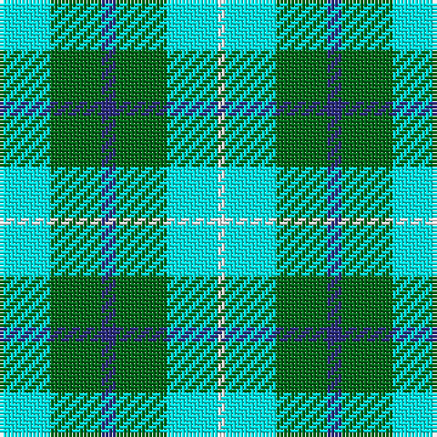

This page is one **sett** — a single exact thread-count. It belongs to the [tartan](/tartans/lt7g7db2g7lt7w1/)
(the same proportion at any scale), whose colour order is pattern [WGBGWW](/stripes/wgbgww/).

Sourced from register-of-tartans.  It is a [6 stripe tartan](/stripes/stripes6/).

Original link https://www.tartanregister.gov.uk/tartanDetails.aspx?ref=3195

## Register references

External register numbers recorded for this tartan.

- Scottish Register of Tartans: [3195](https://www.tartanregister.gov.uk/tartanDetails.aspx?ref=3195)
- Scottish Tartans Authority (ITI): 5549

## Thread count
LB/14 Ga14 DBa4 Ga14 LB14 Wa/2

## Palette

Palette: <strong>Tartan Register</strong> <small style="color:#888">(5 of 6 colours)</small>
<table><thead><tr><th>Colour</th><th>Threads</th><th>Shade</th><th>Base</th><th>OKLCh</th></tr></thead><tbody><tr><td>LB/</td><td style="text-align:right;font-variant-numeric:tabular-nums">14</td><td><code style="background-color:#00FCFC;">#00FCFC</code> <small style="color:#888">#00FCFC</small></td><td>W <code style="background-color:#F7F7F7;">#F7F7F7</code></td><td><small style="color:#888">oklch(89.7% 0.153 194.8)</small></td></tr><tr><td>Ga</td><td style="text-align:right;font-variant-numeric:tabular-nums">14</td><td><code style="background-color:#006818;">#006818</code> <small style="color:#888">#006818</small></td><td>G <code style="background-color:#006100;">#006100</code></td><td><small style="color:#888">oklch(45.0% 0.142 145.0)</small></td></tr><tr><td>DBa</td><td style="text-align:right;font-variant-numeric:tabular-nums">4</td><td><code style="background-color:#2C2C80;">#2C2C80</code> <small style="color:#888">#2C2C80</small></td><td>B <code style="background-color:#2A418A;">#2A418A</code></td><td><small style="color:#888">oklch(35.0% 0.138 276.6)</small></td></tr><tr><td>Ga</td><td style="text-align:right;font-variant-numeric:tabular-nums">14</td><td><code style="background-color:#006818;">#006818</code> <small style="color:#888">#006818</small></td><td>G <code style="background-color:#006100;">#006100</code></td><td><small style="color:#888">oklch(45.0% 0.142 145.0)</small></td></tr><tr><td>LB</td><td style="text-align:right;font-variant-numeric:tabular-nums">14</td><td><code style="background-color:#00FCFC;">#00FCFC</code> <small style="color:#888">#00FCFC</small></td><td>W <code style="background-color:#F7F7F7;">#F7F7F7</code></td><td><small style="color:#888">oklch(89.7% 0.153 194.8)</small></td></tr><tr><td>Wa/</td><td style="text-align:right;font-variant-numeric:tabular-nums">2</td><td><code style="background-color:#FCFCFC;">#FCFCFC</code> <small style="color:#888">#FCFCFC</small></td><td>W <code style="background-color:#F7F7F7;">#F7F7F7</code></td><td><small style="color:#888">oklch(99.1% 0.000 89.9)</small></td></tr></tbody></table>

# Sample pattern

## Nearest tartans

The nearest existing variants by ΔTartan distance, with this tartan at the top so the swatches line up against it.

ΔTartan

Tartan

Sett

—

<a href="/ttd/edit/#slug=lt7g7db2g7lt7w1~x2">Norwich No.078</a> <a class="nn-out" href="/setts/s6/lt7g7db2g7lt7w1~x2/" title="open its dictionary page">↗</a>

1.92

<a href="/ttd/edit/#slug=p6lg15g15w2~x2">Thistle and Kudzu Scottish Society</a> <a class="nn-out" href="/setts/s4/p6lg15g15w2~x2/" title="open its dictionary page">↗</a>

2.02

<a href="/ttd/edit/#slug=t60g9r7ly12g33ly33t26">Supporter.com</a> <a class="nn-out" href="/setts/s7/t60g9r7ly12g33ly33t26/" title="open its dictionary page">↗</a>

2.03

<a href="/ttd/edit/#slug=p6lg15g15k2~x2">Thistle and Kudzu Scottish Socie Corporate Tartan Tartan Number: 10655. Earliest known date: 01/09/2010 The Thistle and Kudzu Scottish Society of Athens is an informal group that organizes and supports Scottish activities in Athens, Georgia, USA. Activities include Royal Scottish Country Dance lessons and demonstrations, annual Robert Burns Dinners, a Scottish Festival, and the Thistle &amp; Kudzu Pipes and Drums band and piping lessons. In 2010 a tartan design contest was organized to create a unique tartan that represented the Thistle and Kudzu Scottish Society. Members used an online tartan design programme (http://www.houseoftartan.co.uk/interactive/weaver/index.html) to create and submit various tartan designs that were then voted on by the Scottish dance class. The design that received the most votes was selected as the official tartan of the group. The overall design was submitted by Stephanie Bohan and the thread count established for weaving by Dorothy Harnish. Colours: dark green represents the kudzu vine which grows abundantly throughout Georgia and is well known in that state; light green, purple and white represent the thistle plant and flower in bloom. See products available Copyright © Blair Urquhart, Comrie, 2015</a> <a class="nn-out" href="/setts/s4/p6lg15g15k2~x2/" title="open its dictionary page">↗</a>

2.10

<a href="/ttd/edit/#slug=b2g13b11y4w9b2~x2">Loch Leven</a> <a class="nn-out" href="/setts/s6/b2g13b11y4w9b2~x2/" title="open its dictionary page">↗</a>

2.12

<a href="/ttd/edit/#slug=w12g12w1g12w12lo1~x4">Wallace Green Dress Fashion Tartan Tartan Number: 2212. Earliest known date: pre 2004 A dancers tartan based on the Wallace See products available Copyright © Blair Urquhart, Comrie, 2015</a> <a class="nn-out" href="/setts/s6/w12g12w1g12w12lo1~x4/" title="open its dictionary page">↗</a>

2.23

<a href="/ttd/edit/#slug=k9w38k22g31k5g31ly5">Lawsons' Whisky</a> <a class="nn-out" href="/setts/s7/k9w38k22g31k5g31ly5/" title="open its dictionary page">↗</a>

2.31

<a href="/ttd/edit/#slug=w3dt10dt12gi11db3gi11g4gi2~x2">Queen of the South</a> <a class="nn-out" href="/setts/s8/w3dt10dt12gi11db3gi11g4gi2~x2/" title="open its dictionary page">↗</a>

2.31

<a href="/ttd/edit/#slug=g23dy5db13g5db5w3db5g5dy9g9~x2">MacScott Family (America) (Personal)</a> <a class="nn-out" href="/setts/s10/g23dy5db13g5db5w3db5g5dy9g9~x2/" title="open its dictionary page">↗</a>

2.37

<a href="/ttd/edit/#slug=g8r1g4dy2w4t3w1t3w4~x8">Gaelic College of St.Anns</a> <a class="nn-out" href="/setts/s9/g8r1g4dy2w4t3w1t3w4~x8/" title="open its dictionary page">↗</a>

2.50

<a href="/ttd/edit/#slug=k3w25g16w3n25w3~x2">Birnham, Blue (Dance)</a> <a class="nn-out" href="/setts/s6/k3w25g16w3n25w3~x2/" title="open its dictionary page">↗</a>

## Neighbour map

Every grey dot is one of 14359 variants placed by the first two principal components of the ΔTartan feature space (44% of its variance). Red is this tartan; blue dots are its nearest — click one to open its page.

<svg viewBox="0 0 640 380" role="img" style="max-width:100%;height:auto;border:1px solid #e0e0e0;border-radius:4px;display:block" xmlns="http://www.w3.org/2000/svg"><image href="/nn/cloud.v1.png" width="640" height="380"/><a href="/setts/s4/p6lg15g15w2~x2/"><circle cx="162.2" cy="246.5" r="4" fill="#3465a4"><title>Thistle and Kudzu Scottish Society</title></circle></a><a href="/setts/s7/t60g9r7ly12g33ly33t26/"><circle cx="208.1" cy="217.5" r="4" fill="#3465a4"><title>Supporter.com</title></circle></a><a href="/setts/s4/p6lg15g15k2~x2/"><circle cx="157.5" cy="246.6" r="4" fill="#3465a4"><title>Thistle and Kudzu Scottish Socie Corporate Tartan Tartan Number: 10655. Earliest known date: 01/09/2010 The Thistle and Kudzu Scottish Society of Athens is an informal group that organizes and supports Scottish activities in Athens, Georgia, USA. Activities include Royal Scottish Country Dance lessons and demonstrations, annual Robert Burns Dinners, a Scottish Festival, and the Thistle &amp; Kudzu Pipes and Drums band and piping lessons. In 2010 a tartan design contest was organized to create a unique tartan that represented the Thistle and Kudzu Scottish Society. Members used an online tartan design programme (http://www.houseoftartan.co.uk/interactive/weaver/index.html) to create and submit various tartan designs that were then voted on by the Scottish dance class. The design that received the most votes was selected as the official tartan of the group. The overall design was submitted by Stephanie Bohan and the thread count established for weaving by Dorothy Harnish. Colours: dark green represents the kudzu vine which grows abundantly throughout Georgia and is well known in that state; light green, purple and white represent the thistle plant and flower in bloom. See products available Copyright © Blair Urquhart, Comrie, 2015</title></circle></a><a href="/setts/s6/b2g13b11y4w9b2~x2/"><circle cx="131.2" cy="234.4" r="4" fill="#3465a4"><title>Loch Leven</title></circle></a><a href="/setts/s6/w12g12w1g12w12lo1~x4/"><circle cx="272.4" cy="224.4" r="4" fill="#3465a4"><title>Wallace Green Dress Fashion Tartan Tartan Number: 2212. Earliest known date: pre 2004 A dancers tartan based on the Wallace See products available Copyright © Blair Urquhart, Comrie, 2015</title></circle></a><a href="/setts/s7/k9w38k22g31k5g31ly5/"><circle cx="151.0" cy="213.1" r="4" fill="#3465a4"><title>Lawsons' Whisky</title></circle></a><a href="/setts/s8/w3dt10dt12gi11db3gi11g4gi2~x2/"><circle cx="141.6" cy="226.2" r="4" fill="#3465a4"><title>Queen of the South</title></circle></a><a href="/setts/s10/g23dy5db13g5db5w3db5g5dy9g9~x2/"><circle cx="209.8" cy="212.9" r="4" fill="#3465a4"><title>MacScott Family (America) (Personal)</title></circle></a><a href="/setts/s9/g8r1g4dy2w4t3w1t3w4~x8/"><circle cx="114.7" cy="188.9" r="4" fill="#3465a4"><title>Gaelic College of St.Anns</title></circle></a><a href="/setts/s6/k3w25g16w3n25w3~x2/"><circle cx="179.9" cy="200.4" r="4" fill="#3465a4"><title>Birnham, Blue (Dance)</title></circle></a><circle cx="170.2" cy="248.0" r="5" fill="#c00000"/></svg>

ID: /setts/s6/lt7g7db2g7lt7w1~x2/
