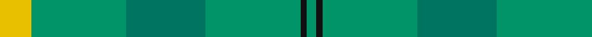
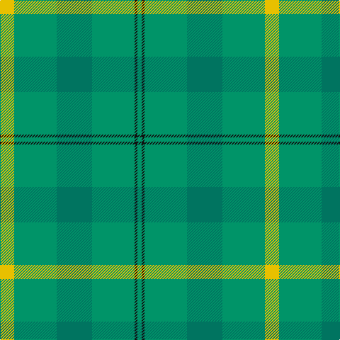

In pattern [GKGGGY](/stripes/gkgggy/).

This was sourced from tartans-authority.  It is a [6 stripe tartan](/stripes/stripes6/).

Original link http://www.tartansauthority.com/tartan-ferret/display/7643/

## Attestations

This cloth appears in 2 source records; the oldest owns this page.

- pre 2008 — Gordon Cumming (Artefact) (tartans-authority, [record](http://www.tartansauthority.com/tartan-ferret/display/7643/))
- undated — Gordon Cumming (register-of-tartans, [record](https://www.tartanregister.gov.uk/tartanDetails.aspx?ref=5657))

## Register references

External register numbers recorded for this tartan.

- Scottish Register of Tartans: [5657](https://www.tartanregister.gov.uk/tartanDetails.aspx?ref=5657)
- Scottish Tartans Authority (ITI): 7643

## Thread count
Y/20 B60 G50 B60 K4 B/6

## Palette
Each colour and its ΔE from the base-6 reference it is a variant of.

| Colour | Shade | Base | ΔE (OKLab) |
|---|---|---|---|
| B | <code style="background-color:#009468;">#009468</code> `#009468` | G <code style="background-color:#006100;">#006100</code> | 0.17 |
| G | <code style="background-color:#007460;">#007460</code> `#007460` | G <code style="background-color:#006100;">#006100</code> | 0.11 |
| K | <code style="background-color:#101010;">#101010</code> `#101010` | K <code style="background-color:#000000;">#000000</code> | 0.17 |
| Y | <code style="background-color:#E8C000;">#E8C000</code> `#E8C000` | Y <code style="background-color:#F2BF00;">#F2BF00</code> | 0.02 |

# Sample pattern

## Nearest tartans

The nearest existing variants by ΔTartan distance.

1. [Irving of Bonshaw](/setts/s5/g27g14dt2g2ly2~x4/) — ΔT 1.45
1. [Castle Bay (Fashion)](/setts/s5/g40w2y5g5y15~x2/) — ΔT 1.53
1. [Palm Beach Gardens Police](/setts/s6/g32t6g12t28r2db1~x2/) — ΔT 1.67
1. [Irvine of Drum (Clan)](/setts/s5/g49t21k3t3w3~x2/) — ΔT 1.85
1. [O'Brien (Scotch Corner)](/setts/s9/y36g19y4g31b2r3b2r3g12~x2/) — ΔT 1.87
1. [Taylor](/setts/s8/g8k2g13lr4g12n22g5lo3~x2/) — ΔT 1.88
1. [Glenlivet](/setts/s8/g18r6g75db6g13o35g12db6/) — ΔT 1.94
1. [Ledford (Name)](/setts/s3/g9o4ly1~x16/) — ΔT 1.98
1. [Campbell Simpson (Dalgliesh)](/setts/s6/g22k3g3g16g6k4~x2/) — ΔT 1.99
1. [Kildare](/setts/s8/g8dr2g13r4g12t22g5y3~x2/) — ΔT 2.10

## Neighbour map

Every grey dot is one of 14299 variants placed by the first two principal components of the ΔTartan feature space (44% of its variance). Red is this tartan; blue dots are its nearest — click one to open its page.

<svg viewBox="0 0 640 380" role="img" style="max-width:100%;height:auto;border:1px solid #e0e0e0;border-radius:4px;display:block" xmlns="http://www.w3.org/2000/svg"><image href="/nn/cloud.v1.png" width="640" height="380"/><a href="/setts/s5/g27g14dt2g2ly2~x4/"><circle cx="424.7" cy="250.5" r="4" fill="#3465a4"><title>Irving of Bonshaw</title></circle></a><a href="/setts/s5/g40w2y5g5y15~x2/"><circle cx="463.6" cy="238.2" r="4" fill="#3465a4"><title>Castle Bay (Fashion)</title></circle></a><a href="/setts/s6/g32t6g12t28r2db1~x2/"><circle cx="456.0" cy="226.0" r="4" fill="#3465a4"><title>Palm Beach Gardens Police</title></circle></a><a href="/setts/s5/g49t21k3t3w3~x2/"><circle cx="452.0" cy="226.8" r="4" fill="#3465a4"><title>Irvine of Drum (Clan)</title></circle></a><a href="/setts/s9/y36g19y4g31b2r3b2r3g12~x2/"><circle cx="410.7" cy="213.0" r="4" fill="#3465a4"><title>O'Brien (Scotch Corner)</title></circle></a><a href="/setts/s8/g8k2g13lr4g12n22g5lo3~x2/"><circle cx="336.1" cy="237.2" r="4" fill="#3465a4"><title>Taylor</title></circle></a><a href="/setts/s8/g18r6g75db6g13o35g12db6/"><circle cx="472.6" cy="228.6" r="4" fill="#3465a4"><title>Glenlivet</title></circle></a><a href="/setts/s3/g9o4ly1~x16/"><circle cx="455.4" cy="325.0" r="4" fill="#3465a4"><title>Ledford (Name)</title></circle></a><a href="/setts/s6/g22k3g3g16g6k4~x2/"><circle cx="373.9" cy="285.5" r="4" fill="#3465a4"><title>Campbell Simpson (Dalgliesh)</title></circle></a><a href="/setts/s8/g8dr2g13r4g12t22g5y3~x2/"><circle cx="349.6" cy="238.7" r="4" fill="#3465a4"><title>Kildare</title></circle></a><circle cx="418.4" cy="261.6" r="5" fill="#c00000"/></svg>

ID: /setts/s6/ly10g30g25g30k2g3~x2/
