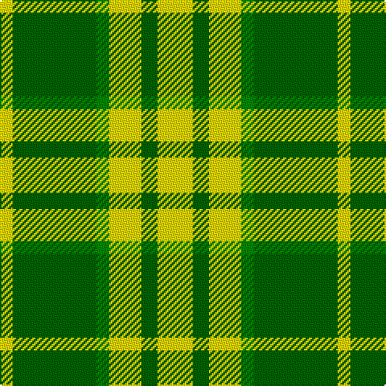

This page is one **sett** — a single exact thread-count. It belongs to the [tartan](/tartans/y11g5y10ga4g26y4/)
(the same proportion at any scale), whose colour order is pattern [YGGYGY](/stripes/yggygy/).

Sourced from register-of-tartans.  It is a [6 stripe tartan](/stripes/stripes6/).

Original link https://www.tartanregister.gov.uk/tartanDetails.aspx?ref=10517

## Register references

External register numbers recorded for this tartan.

- Scottish Register of Tartans: [10517](https://www.tartanregister.gov.uk/tartanDetails.aspx?ref=10517)

## Thread count
Y/22 G10 Y20 Ga8 G52 Y/8

## Palette
Each colour and the base-6 reference it is a variant of.

| Colour | Shade | Base |
|---|---|---|
| G | <code style="background-color:#006400;">#006400</code> `oklch(43.6% 0.148 142.5)` <small>#006400</small> | G <code style="background-color:#006100;">#006100</code> |
| Ga | <code style="background-color:#008B00;">#008B00</code> `oklch(55.2% 0.188 142.5)` <small>#008B00</small> | G <code style="background-color:#006100;">#006100</code> |
| Y | <code style="background-color:#FFE700;">#FFE700</code> `oklch(91.9% 0.192 101.8)` <small>#FFE700</small> | Y <code style="background-color:#F2BF00;">#F2BF00</code> |

# Sample pattern

## Nearest tartans

The nearest existing variants by ΔTartan distance, with this tartan at the top so the swatches line up against it.

ΔTartan

Tartan

Sett

—

<a href="/ttd/edit/#slug=ly11g5ly10g4g26ly4~x2">North Dakota State University Bison</a> <a class="nn-out" href="/setts/s6/ly11g5ly10g4g26ly4~x2/" title="open its dictionary page">↗</a>

1.93

<a href="/ttd/edit/#slug=g9ly20g40w5~x2">O'Neill Irish Family Tartan Tartan Number: 2464. Earliest known date: 1985 O'Neill is an Irish family tartan. The dark yellow stripe is mustard or dark saffron. See products available Copyright © Blair Urquhart, Comrie, 2015</a> <a class="nn-out" href="/setts/s4/g9ly20g40w5~x2/" title="open its dictionary page">↗</a>

1.98

<a href="/ttd/edit/#slug=lo5g7k1t1~x4">Wilson's, No 195</a> <a class="nn-out" href="/setts/s4/lo5g7k1t1~x4/" title="open its dictionary page">↗</a>

1.99

<a href="/ttd/edit/#slug=w1ly8g3ly1db3ly1~x4">Fraser, Yellow</a> <a class="nn-out" href="/setts/s6/w1ly8g3ly1db3ly1~x4/" title="open its dictionary page">↗</a>

2.05

<a href="/ttd/edit/#slug=w1ly8dg3ly1db3ly1~x4">Fraser Yellow #2</a> <a class="nn-out" href="/setts/s6/w1ly8dg3ly1db3ly1~x4/" title="open its dictionary page">↗</a>

2.09

<a href="/ttd/edit/#slug=dg4w35g31w4~x2">Lewis, Green (Dance)</a> <a class="nn-out" href="/setts/s4/dg4w35g31w4~x2/" title="open its dictionary page">↗</a>

2.10

<a href="/ttd/edit/#slug=g4ly20k3ly2k3ly20g24k3g2k3g24ly4">Meredith of Wales</a> <a class="nn-out" href="/setts/s12/g4ly20k3ly2k3ly20g24k3g2k3g24ly4/" title="open its dictionary page">↗</a>

2.10

<a href="/ttd/edit/#slug=g4ly20ly3ly2ly3ly20g24ly3g2ly3g24ly4">Meredith (Welsh Name)</a> <a class="nn-out" href="/setts/s12/g4ly20ly3ly2ly3ly20g24ly3g2ly3g24ly4/" title="open its dictionary page">↗</a>

2.18

<a href="/ttd/edit/#slug=do4g25lo10g3lo18r4~x2">Unidentfied (Ligioner Highland Games</a> <a class="nn-out" href="/setts/s6/do4g25lo10g3lo18r4~x2/" title="open its dictionary page">↗</a>

2.20

<a href="/ttd/edit/#slug=dg8lo1dg8lo12r1lo1~x4">Forget Family (Yonne)</a> <a class="nn-out" href="/setts/s6/dg8lo1dg8lo12r1lo1~x4/" title="open its dictionary page">↗</a>

2.22

<a href="/ttd/edit/#slug=w2g13lo13w2~x6">Dunoon</a> <a class="nn-out" href="/setts/s4/w2g13lo13w2~x6/" title="open its dictionary page">↗</a>

## Neighbour map

Every grey dot is one of 14299 variants placed by the first two principal components of the ΔTartan feature space (44% of its variance). Red is this tartan; blue dots are its nearest — click one to open its page.

<svg viewBox="0 0 640 380" role="img" style="max-width:100%;height:auto;border:1px solid #e0e0e0;border-radius:4px;display:block" xmlns="http://www.w3.org/2000/svg"><image href="/nn/cloud.v1.png" width="640" height="380"/><a href="/setts/s4/g9ly20g40w5~x2/"><circle cx="362.8" cy="260.4" r="4" fill="#3465a4"><title>O'Neill Irish Family Tartan Tartan Number: 2464. Earliest known date: 1985 O'Neill is an Irish family tartan. The dark yellow stripe is mustard or dark saffron. See products available Copyright © Blair Urquhart, Comrie, 2015</title></circle></a><a href="/setts/s4/lo5g7k1t1~x4/"><circle cx="236.9" cy="234.8" r="4" fill="#3465a4"><title>Wilson's, No 195</title></circle></a><a href="/setts/s6/w1ly8g3ly1db3ly1~x4/"><circle cx="279.4" cy="193.8" r="4" fill="#3465a4"><title>Fraser, Yellow</title></circle></a><a href="/setts/s6/w1ly8dg3ly1db3ly1~x4/"><circle cx="272.3" cy="191.6" r="4" fill="#3465a4"><title>Fraser Yellow #2</title></circle></a><a href="/setts/s4/dg4w35g31w4~x2/"><circle cx="281.9" cy="230.7" r="4" fill="#3465a4"><title>Lewis, Green (Dance)</title></circle></a><a href="/setts/s12/g4ly20k3ly2k3ly20g24k3g2k3g24ly4/"><circle cx="265.5" cy="167.9" r="4" fill="#3465a4"><title>Meredith of Wales</title></circle></a><a href="/setts/s12/g4ly20ly3ly2ly3ly20g24ly3g2ly3g24ly4/"><circle cx="283.2" cy="173.6" r="4" fill="#3465a4"><title>Meredith (Welsh Name)</title></circle></a><a href="/setts/s6/do4g25lo10g3lo18r4~x2/"><circle cx="222.4" cy="205.2" r="4" fill="#3465a4"><title>Unidentfied (Ligioner Highland Games</title></circle></a><a href="/setts/s6/dg8lo1dg8lo12r1lo1~x4/"><circle cx="321.5" cy="211.4" r="4" fill="#3465a4"><title>Forget Family (Yonne)</title></circle></a><a href="/setts/s4/w2g13lo13w2~x6/"><circle cx="250.7" cy="254.7" r="4" fill="#3465a4"><title>Dunoon</title></circle></a><circle cx="255.5" cy="231.8" r="5" fill="#c00000"/></svg>

ID: /setts/s6/ly11g5ly10g4g26ly4~x2/
