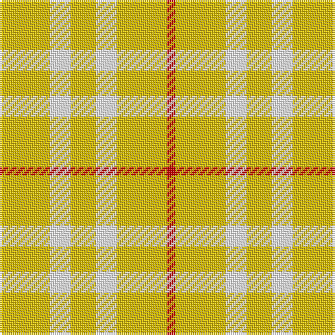

**Bands:** [RYWYWY](/stripes/rywywy/) · **Stripes:** [R LY W LY W LY](/stripes/stripes6/) R LY W LY W LY

This was sourced from register-of-tartans.  It is a [6 band tartan](/bands/bands6/).

Original link https://www.tartanregister.gov.uk/tartanDetails.aspx?ref=5359

## Register references

External register numbers recorded for this tartan.

- Scottish Register of Tartans: [5359](https://www.tartanregister.gov.uk/tartanDetails.aspx?ref=5359)
- Scottish Tartans Authority (ITI): 3912

## Thread count
Y/24 W10 Y12 W10 Y24 R/4

## Palette
Each colour and its ΔE from the base-6 reference it is a variant of.

| Colour | Shade | Base | ΔE (OKLab) |
|---|---|---|---|
| R | <code style="background-color:#C80000;">#C80000</code> `#C80000` | R <code style="background-color:#CC0000;">#CC0000</code> | 0.01 |
| W | <code style="background-color:#FCFCFC;">#FCFCFC</code> `#FCFCFC` | W <code style="background-color:#F7F7F7;">#F7F7F7</code> | 0.01 |
| Y | <code style="background-color:#E8C000;">#E8C000</code> `#E8C000` | Y <code style="background-color:#F2BF00;">#F2BF00</code> | 0.02 |

# Sample pattern

## Nearest tartans

The nearest existing variants by ΔTartan distance.

1. [One Account (Corporate)](/setts/s4/ly6w5ly12r2~x2/) — ΔT 0.97
1. [Virgin One](/setts/s6/lo11r2lo11w6lo7w6~x2/) — ΔT 1.39
1. [Virgin One (Corporate)](/setts/s4/lo7w6lo11r2~x2/) — ΔT 1.61
1. [Glufree](/setts/s8/ly8r2ly8g1r6ly3g4ly2~x4/) — ΔT 1.71
1. [Fallow Deer, The](/setts/s6/o3w17o11w2o11w2~x4/) — ΔT 2.70
1. [Burt's Highlanders (Fashion)](/setts/s5/lo40g13lo6db13lo22~x2/) — ΔT 2.83
1. [Ailsa, Gold (Dance)](/setts/s6/ly8w3ly28w32dp3w4~x2/) — ΔT 2.99
1. [O'Neill](/setts/s4/g9lo20g40w5~x2/) — ΔT 3.16
1. [Weaving for Life](/setts/s8/lr24n2lr6m3lr6w6lr6w6~x2/) — ΔT 3.17
1. [Wolfe (Name)](/setts/s7/g4o4g13o13g4o36lo4~x2/) — ΔT 3.18

## Neighbour map

Every grey dot is one of 14299 variants placed by the first two principal components of the ΔTartan feature space (44% of its variance). Red is this tartan; blue dots are its nearest — click one to open its page.

<svg viewBox="0 0 640 380" role="img" style="max-width:100%;height:auto;border:1px solid #e0e0e0;border-radius:4px;display:block" xmlns="http://www.w3.org/2000/svg"><image href="/nn/cloud.v1.png" width="640" height="380"/><a href="/setts/s4/ly6w5ly12r2~x2/"><circle cx="418.4" cy="281.7" r="4" fill="#3465a4"><title>One Account (Corporate)</title></circle></a><a href="/setts/s6/lo11r2lo11w6lo7w6~x2/"><circle cx="376.2" cy="295.1" r="4" fill="#3465a4"><title>Virgin One</title></circle></a><a href="/setts/s4/lo7w6lo11r2~x2/"><circle cx="400.6" cy="305.1" r="4" fill="#3465a4"><title>Virgin One (Corporate)</title></circle></a><a href="/setts/s8/ly8r2ly8g1r6ly3g4ly2~x4/"><circle cx="347.9" cy="239.8" r="4" fill="#3465a4"><title>Glufree</title></circle></a><a href="/setts/s6/o3w17o11w2o11w2~x4/"><circle cx="343.9" cy="239.8" r="4" fill="#3465a4"><title>Fallow Deer, The</title></circle></a><a href="/setts/s5/lo40g13lo6db13lo22~x2/"><circle cx="374.5" cy="244.7" r="4" fill="#3465a4"><title>Burt's Highlanders (Fashion)</title></circle></a><a href="/setts/s6/ly8w3ly28w32dp3w4~x2/"><circle cx="384.8" cy="225.5" r="4" fill="#3465a4"><title>Ailsa, Gold (Dance)</title></circle></a><a href="/setts/s4/g9lo20g40w5~x2/"><circle cx="405.5" cy="281.2" r="4" fill="#3465a4"><title>O'Neill</title></circle></a><a href="/setts/s8/lr24n2lr6m3lr6w6lr6w6~x2/"><circle cx="450.2" cy="188.3" r="4" fill="#3465a4"><title>Weaving for Life</title></circle></a><a href="/setts/s7/g4o4g13o13g4o36lo4~x2/"><circle cx="448.2" cy="214.9" r="4" fill="#3465a4"><title>Wolfe (Name)</title></circle></a><circle cx="414.9" cy="276.4" r="5" fill="#c00000"/></svg>

ID: /setts/s6/ly12w5ly6w5ly12r2~x2/
