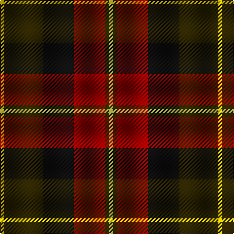

This page is one **sett** — a single exact thread-count. It belongs to the [tartan](/tartans/ly1dy10k8r8dy1lyi1/)
(the same proportion at any scale), whose colour order is pattern [YGKRGY](/stripes/ygkrgy/).

Sourced from register-of-tartans.  It is a [6 stripe tartan](/stripes/stripes6/).

Original link https://www.tartanregister.gov.uk/tartanDetails.aspx?ref=5312

## Register references

External register numbers recorded for this tartan.

- Scottish Register of Tartans: [5312](https://www.tartanregister.gov.uk/tartanDetails.aspx?ref=5312)
- Scottish Tartans World Register: 3057

## Thread count
Y/4 K40 Ka32 DR32 K4 LT/4

## Palette

Palette: <strong>Tartan Register</strong> <small style="color:#888">(3 of 5 colours)</small>
<table><thead><tr><th>Colour</th><th>Threads</th><th>Shade</th><th>Base</th><th>OKLCh</th></tr></thead><tbody><tr><td>Y/</td><td style="text-align:right;font-variant-numeric:tabular-nums">4</td><td><code style="background-color:#E8C000;">#E8C000</code> <small style="color:#888">#E8C000</small></td><td>Y <code style="background-color:#F2BF00;">#F2BF00</code></td><td><small style="color:#888">oklch(81.9% 0.168 93.7)</small></td></tr><tr><td>K</td><td style="text-align:right;font-variant-numeric:tabular-nums">40</td><td><code style="background-color:#2A2303;">#2A2303</code> <small style="color:#888">#2A2303</small></td><td>G <code style="background-color:#006100;">#006100</code></td><td><small style="color:#888">oklch(25.7% 0.049 96.8)</small></td></tr><tr><td>Ka</td><td style="text-align:right;font-variant-numeric:tabular-nums">32</td><td><code style="background-color:#101010;">#101010</code> <small style="color:#888">#101010</small></td><td>K <code style="background-color:#000000;">#000000</code></td><td><small style="color:#888">oklch(17.3% 0.000 89.9)</small></td></tr><tr><td>DR</td><td style="text-align:right;font-variant-numeric:tabular-nums">32</td><td><code style="background-color:#960000;">#960000</code> <small style="color:#888">#960000</small></td><td>R <code style="background-color:#CC0000;">#CC0000</code></td><td><small style="color:#888">oklch(42.3% 0.173 29.2)</small></td></tr><tr><td>K</td><td style="text-align:right;font-variant-numeric:tabular-nums">4</td><td><code style="background-color:#2A2303;">#2A2303</code> <small style="color:#888">#2A2303</small></td><td>G <code style="background-color:#006100;">#006100</code></td><td><small style="color:#888">oklch(25.7% 0.049 96.8)</small></td></tr><tr><td>LT/</td><td style="text-align:right;font-variant-numeric:tabular-nums">4</td><td><code style="background-color:#96963C;">#96963C</code> <small style="color:#888">#96963C</small></td><td>Y <code style="background-color:#F2BF00;">#F2BF00</code></td><td><small style="color:#888">oklch(65.5% 0.112 109.1)</small></td></tr></tbody></table>

# Sample pattern

## Nearest tartans

The nearest existing variants by ΔTartan distance, with this tartan at the top so the swatches line up against it.

ΔTartan

Tartan

Sett

—

<a href="/ttd/edit/#slug=ly1dy10k8r8dy1lyi1~x4">Unidentified #66</a> <a class="nn-out" href="/setts/s6/ly1dy10k8r8dy1lyi1~x4/" title="open its dictionary page">↗</a>

0.94

<a href="/ttd/edit/#slug=dy6r3dy34k16ly3dt22r4~x2">Ballantrae (Macnaughtons)</a> <a class="nn-out" href="/setts/s7/dy6r3dy34k16ly3dt22r4~x2/" title="open its dictionary page">↗</a>

1.16

<a href="/ttd/edit/#slug=r1n12k6ly1do10r1~x4">Andover (Fashion)</a> <a class="nn-out" href="/setts/s6/r1n12k6ly1do10r1~x4/" title="open its dictionary page">↗</a>

1.21

<a href="/ttd/edit/#slug=g3r22t5g10k10g2~x2">Strathspey (Fashion)</a> <a class="nn-out" href="/setts/s6/g3r22t5g10k10g2~x2/" title="open its dictionary page">↗</a>

1.22

<a href="/setts/s5/db6w1dyi6dy12r2~x4/">Vass (Personal)</a>

1.26

<a href="/ttd/edit/#slug=g4r28db6g10k10g3~x2">Canadian Autumn</a> <a class="nn-out" href="/setts/s6/g4r28db6g10k10g3~x2/" title="open its dictionary page">↗</a>

1.27

<a href="/ttd/edit/#slug=lb3r30k18db6g30k2~x2">Bryant (Dalgleish) (Personal)</a> <a class="nn-out" href="/setts/s6/lb3r30k18db6g30k2~x2/" title="open its dictionary page">↗</a>

1.31

<a href="/ttd/edit/#slug=lo4k28r2do22t8do3~x2">Loch Long One Design</a> <a class="nn-out" href="/setts/s6/lo4k28r2do22t8do3~x2/" title="open its dictionary page">↗</a>

1.31

<a href="/ttd/edit/#slug=db8lo1g12r10y2r6y2r4~x4">Indiana &quot;Cardinal&quot; (District)</a> <a class="nn-out" href="/setts/s8/db8lo1g12r10y2r6y2r4~x4/" title="open its dictionary page">↗</a>

1.31

<a href="/ttd/edit/#slug=db4r11db1g8r2g4k1lo2~x4">Craik of Assington (Personal)</a> <a class="nn-out" href="/setts/s8/db4r11db1g8r2g4k1lo2~x4/" title="open its dictionary page">↗</a>

1.33

<a href="/ttd/edit/#slug=k6t1r18db6dg18k2~x2">Eachaidh (Personal)</a> <a class="nn-out" href="/setts/s6/k6t1r18db6dg18k2~x2/" title="open its dictionary page">↗</a>

## Neighbour map

Every grey dot is one of 14359 variants placed by the first two principal components of the ΔTartan feature space (44% of its variance). Red is this tartan; blue dots are its nearest — click one to open its page.

<svg viewBox="0 0 640 380" role="img" style="max-width:100%;height:auto;border:1px solid #e0e0e0;border-radius:4px;display:block" xmlns="http://www.w3.org/2000/svg"><image href="/nn/cloud.v1.png" width="640" height="380"/><a href="/setts/s7/dy6r3dy34k16ly3dt22r4~x2/"><circle cx="264.2" cy="205.1" r="4" fill="#3465a4"><title>Ballantrae (Macnaughtons)</title></circle></a><a href="/setts/s6/r1n12k6ly1do10r1~x4/"><circle cx="241.5" cy="208.7" r="4" fill="#3465a4"><title>Andover (Fashion)</title></circle></a><a href="/setts/s6/g3r22t5g10k10g2~x2/"><circle cx="251.6" cy="226.8" r="4" fill="#3465a4"><title>Strathspey (Fashion)</title></circle></a><a href="/setts/s5/db6w1dyi6dy12r2~x4/"><circle cx="252.8" cy="235.5" r="4" fill="#3465a4"><title>Vass (Personal)</title></circle></a><a href="/setts/s6/g4r28db6g10k10g3~x2/"><circle cx="267.5" cy="227.5" r="4" fill="#3465a4"><title>Canadian Autumn</title></circle></a><a href="/setts/s6/lb3r30k18db6g30k2~x2/"><circle cx="193.2" cy="191.4" r="4" fill="#3465a4"><title>Bryant (Dalgleish) (Personal)</title></circle></a><a href="/setts/s6/lo4k28r2do22t8do3~x2/"><circle cx="265.3" cy="202.3" r="4" fill="#3465a4"><title>Loch Long One Design</title></circle></a><a href="/setts/s8/db8lo1g12r10y2r6y2r4~x4/"><circle cx="236.4" cy="206.2" r="4" fill="#3465a4"><title>Indiana &quot;Cardinal&quot; (District)</title></circle></a><a href="/setts/s8/db4r11db1g8r2g4k1lo2~x4/"><circle cx="208.9" cy="187.7" r="4" fill="#3465a4"><title>Craik of Assington (Personal)</title></circle></a><a href="/setts/s6/k6t1r18db6dg18k2~x2/"><circle cx="237.2" cy="198.7" r="4" fill="#3465a4"><title>Eachaidh (Personal)</title></circle></a><circle cx="219.4" cy="215.4" r="5" fill="#c00000"/></svg>

ID: /setts/s6/ly1dy10k8r8dy1lyi1~x4/
