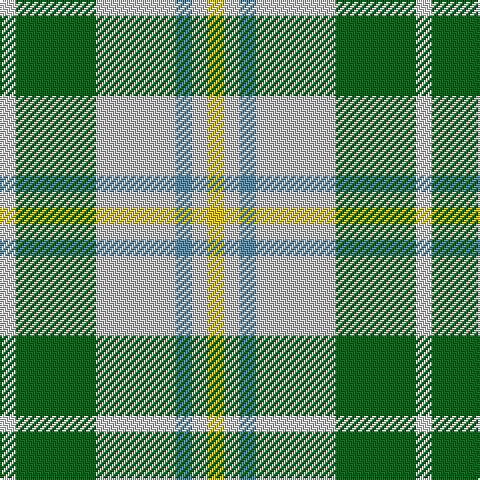

**Bands:** [WGWBWY](/stripes/wgwbwy/) · **Stripes:** [W G LB T LB LY](/stripes/stripes6/) W G LB T LB LY

This was sourced from tartans-authority.  It is a [6 band tartan](/bands/bands6/).

Original link http://www.tartansauthority.com/tartan-ferret/display/3839/

## Thread count
LN/8 G40 N40 B8 N8 Y/8

## Palette
Each colour and its ΔE from the base-6 reference it is a variant of.

| Colour | Shade | Base | ΔE (OKLab) |
|---|---|---|---|
| B | <code style="background-color:#5C8CA8;">#5C8CA8</code> `#5C8CA8` | B <code style="background-color:#2A418A;">#2A418A</code> | 0.23 |
| G | <code style="background-color:#006818;">#006818</code> `#006818` | G <code style="background-color:#006100;">#006100</code> | 0.02 |
| LN | <code style="background-color:#E0E0E0;">#E0E0E0</code> `#E0E0E0` | W <code style="background-color:#F7F7F7;">#F7F7F7</code> | 0.07 |
| N | <code style="background-color:#C0C0C0;">#C0C0C0</code> `#C0C0C0` | W <code style="background-color:#F7F7F7;">#F7F7F7</code> | 0.17 |
| Y | <code style="background-color:#E8C000;">#E8C000</code> `#E8C000` | Y <code style="background-color:#F2BF00;">#F2BF00</code> | 0.02 |

# Sample pattern

## Nearest tartans

The nearest existing variants by ΔTartan distance.

1. [MacGiboney Dress](/setts/s10/g5lb5t1lb1ly1lb1t1lb5g5w1~x8/) — ΔT 1.17
1. [MacGiboney Clan Tartan Tartan Number: 3839. Earliest known date: 1999 Designed by Greg McGibonney from Fremont, California. The sett shown here was submitted as a woven sample by Greg McGibboney. Colours here are from the woven sample. See products available Copyright © Blair Urquhart, Comrie, 2015](/setts/s10/g5lb5t1lb1ly1lb1t1lb5g5w1~x4/) — ΔT 1.17
1. [Manitoba Dress (Dance)](/setts/s8/g3r10lb2g3lb13g2lb2g3~x2/) — ΔT 1.45
1. [Deeside](/setts/s7/ly1g5g1y7p2y1w1~x4/) — ΔT 1.52
1. [Cotswolds Distillery](/setts/s9/dy4ly15lr17ly4n3ly3n3ly12k4~x2/) — ΔT 1.54
1. [Supporter.com](/setts/s7/t60g9r7ly12g33ly33t26/) — ΔT 1.55
1. [Birnham, Blue (Dance)](/setts/s6/k3w25g16w3n25w3~x2/) — ΔT 1.55
1. [Bannockbane Dark Green](/setts/s7/dg4g3dg24w15lo21g3lo4~x2/) — ΔT 1.57
1. [Beck-McSorley](/setts/s8/lp1dg1lp1dg7lb7lp1dg1r1~x6/) — ΔT 1.58
1. [Alvis of Lee (Personal)](/setts/s5/db9w4g36t36r4/) — ΔT 1.60

## Neighbour map

Every grey dot is one of 14313 variants placed by the first two principal components of the ΔTartan feature space (44% of its variance). Red is this tartan; blue dots are its nearest — click one to open its page.

<svg viewBox="0 0 640 380" role="img" style="max-width:100%;height:auto;border:1px solid #e0e0e0;border-radius:4px;display:block" xmlns="http://www.w3.org/2000/svg"><image href="/nn/cloud.v1.png" width="640" height="380"/><a href="/setts/s10/g5lb5t1lb1ly1lb1t1lb5g5w1~x8/"><circle cx="183.5" cy="199.9" r="4" fill="#3465a4"><title>MacGiboney Dress</title></circle></a><a href="/setts/s10/g5lb5t1lb1ly1lb1t1lb5g5w1~x4/"><circle cx="183.5" cy="199.9" r="4" fill="#3465a4"><title>MacGiboney Clan Tartan Tartan Number: 3839. Earliest known date: 1999 Designed by Greg McGibonney from Fremont, California. The sett shown here was submitted as a woven sample by Greg McGibboney. Colours here are from the woven sample. See products available Copyright © Blair Urquhart, Comrie, 2015</title></circle></a><a href="/setts/s8/g3r10lb2g3lb13g2lb2g3~x2/"><circle cx="173.9" cy="181.0" r="4" fill="#3465a4"><title>Manitoba Dress (Dance)</title></circle></a><a href="/setts/s7/ly1g5g1y7p2y1w1~x4/"><circle cx="190.2" cy="187.9" r="4" fill="#3465a4"><title>Deeside</title></circle></a><a href="/setts/s9/dy4ly15lr17ly4n3ly3n3ly12k4~x2/"><circle cx="202.9" cy="190.8" r="4" fill="#3465a4"><title>Cotswolds Distillery</title></circle></a><a href="/setts/s7/t60g9r7ly12g33ly33t26/"><circle cx="208.9" cy="216.7" r="4" fill="#3465a4"><title>Supporter.com</title></circle></a><a href="/setts/s6/k3w25g16w3n25w3~x2/"><circle cx="180.8" cy="199.5" r="4" fill="#3465a4"><title>Birnham, Blue (Dance)</title></circle></a><a href="/setts/s7/dg4g3dg24w15lo21g3lo4~x2/"><circle cx="144.9" cy="184.5" r="4" fill="#3465a4"><title>Bannockbane Dark Green</title></circle></a><a href="/setts/s8/lp1dg1lp1dg7lb7lp1dg1r1~x6/"><circle cx="224.5" cy="184.9" r="4" fill="#3465a4"><title>Beck-McSorley</title></circle></a><a href="/setts/s5/db9w4g36t36r4/"><circle cx="213.7" cy="215.9" r="4" fill="#3465a4"><title>Alvis of Lee (Personal)</title></circle></a><circle cx="171.4" cy="213.5" r="5" fill="#c00000"/></svg>

ID: /setts/s6/ly1lb1t1lb5g5w1~x8/
