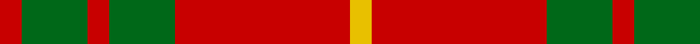
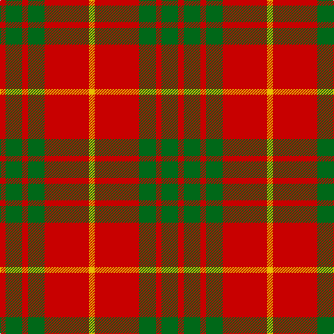

**Bands:** [RGRGRY](/stripes/rgrgry/) · **Stripes:** [R G R G R LY](/stripes/stripes6/) R G R G R LY

This was sourced from register-of-tartans.  It is a [6 band tartan](/bands/bands6/).

Original link https://www.tartanregister.gov.uk/tartanDetails.aspx?ref=488

## Register references

External register numbers recorded for this tartan.

- Scottish Register of Tartans: [488](https://www.tartanregister.gov.uk/tartanDetails.aspx?ref=488)
- Scottish Tartans Authority (ITI): 1538
- Scottish Tartans World Register: 1538

## Variants

Other setts woven to the same stripe pattern.

- [Cameron](/setts/s6/r2g6r2g6r16ly1~x2/)
- [Cameron (Clan)](/setts/s6/r2g6r2g6r16ly1~x4/)
- [Maguire, Black](/setts/s6/r29g2r2g2r6ly21~x4/)

## Thread count
R/8 G24 R8 G24 R64 Y/8

## Palette
Each colour and its ΔE from the base-6 reference it is a variant of.

| Colour | Shade | Base | ΔE (OKLab) |
|---|---|---|---|
| G | <code style="background-color:#006818;">#006818</code> `#006818` | G <code style="background-color:#006100;">#006100</code> | 0.02 |
| R | <code style="background-color:#C80000;">#C80000</code> `#C80000` | R <code style="background-color:#CC0000;">#CC0000</code> | 0.01 |
| Y | <code style="background-color:#E8C000;">#E8C000</code> `#E8C000` | Y <code style="background-color:#F2BF00;">#F2BF00</code> | 0.02 |

# Sample pattern

## Nearest tartans

The nearest existing variants by ΔTartan distance.

1. [MacDonald, Lord of The Isles (Artef)](/setts/s5/g16r5g2r18k2~x2/) — ΔT 0.83
1. [Makhtoum](/setts/s6/w11r40g13r5g12r5~x2/) — ΔT 0.90
1. [MacDonald Lord of the Isles #2](/setts/s5/dg16r5dg2r18k2~x2/) — ΔT 0.92
1. [Auld Lang Syne (red) Tartan Tartan Number: 2402. Earliest known date: Threadcount and colours aren't 100% original. Generated manually. See products available Copyright © Blair Urquhart, Comrie, 2015](/setts/s7/r4g14r5k6r24g2r4~x2/) — ΔT 0.98
1. [MacDonald of Sleat](/setts/s5/dg7r3dg1r9k1~x2/) — ΔT 1.01
1. [Bryce](/setts/s4/ly1r9g7r1~x4/) — ΔT 1.07
1. [Claus of the North Pole (Restricted)](/setts/s7/r21g3r21g16lo3w2lo3~x2/) — ΔT 1.11
1. [Cameron (Clan)](/setts/s6/r2g6r2g6r16ly1~x4/) — ΔT 1.11
1. [Cameron](/setts/s6/r2g6r2g6r16ly1~x2/) — ΔT 1.12
1. [Cameron Clan D](/setts/s6/ly1r15dg6r1dg6r1~x2/) — ΔT 1.13

## Neighbour map

Every grey dot is one of 14313 variants placed by the first two principal components of the ΔTartan feature space (44% of its variance). Red is this tartan; blue dots are its nearest — click one to open its page.

<svg viewBox="0 0 640 380" role="img" style="max-width:100%;height:auto;border:1px solid #e0e0e0;border-radius:4px;display:block" xmlns="http://www.w3.org/2000/svg"><image href="/nn/cloud.v1.png" width="640" height="380"/><a href="/setts/s5/g16r5g2r18k2~x2/"><circle cx="352.7" cy="240.4" r="4" fill="#3465a4"><title>MacDonald, Lord of The Isles (Artef)</title></circle></a><a href="/setts/s6/w11r40g13r5g12r5~x2/"><circle cx="329.1" cy="216.6" r="4" fill="#3465a4"><title>Makhtoum</title></circle></a><a href="/setts/s5/dg16r5dg2r18k2~x2/"><circle cx="343.4" cy="233.0" r="4" fill="#3465a4"><title>MacDonald Lord of the Isles #2</title></circle></a><a href="/setts/s7/r4g14r5k6r24g2r4~x2/"><circle cx="395.1" cy="206.0" r="4" fill="#3465a4"><title>Auld Lang Syne (red) Tartan Tartan Number: 2402. Earliest known date: Threadcount and colours aren't 100% original. Generated manually. See products available Copyright © Blair Urquhart, Comrie, 2015</title></circle></a><a href="/setts/s5/dg7r3dg1r9k1~x2/"><circle cx="354.9" cy="237.2" r="4" fill="#3465a4"><title>MacDonald of Sleat</title></circle></a><a href="/setts/s4/ly1r9g7r1~x4/"><circle cx="356.3" cy="246.0" r="4" fill="#3465a4"><title>Bryce</title></circle></a><a href="/setts/s7/r21g3r21g16lo3w2lo3~x2/"><circle cx="356.8" cy="192.2" r="4" fill="#3465a4"><title>Claus of the North Pole (Restricted)</title></circle></a><a href="/setts/s6/r2g6r2g6r16ly1~x4/"><circle cx="422.2" cy="202.4" r="4" fill="#3465a4"><title>Cameron (Clan)</title></circle></a><a href="/setts/s6/r2g6r2g6r16ly1~x2/"><circle cx="417.2" cy="201.0" r="4" fill="#3465a4"><title>Cameron</title></circle></a><a href="/setts/s6/ly1r15dg6r1dg6r1~x2/"><circle cx="394.8" cy="195.5" r="4" fill="#3465a4"><title>Cameron Clan D</title></circle></a><circle cx="371.1" cy="226.6" r="5" fill="#c00000"/></svg>

ID: /setts/s6/ly1r8g3r1g3r1~x8/
