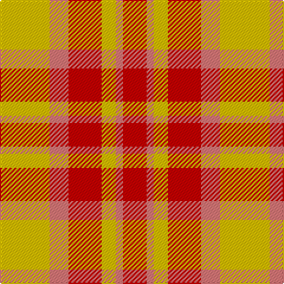

This page is one **sett** — a single exact thread-count. It belongs to the [tartan](/tartans/ly21ri8r14ly6ri3r10/)
(the same proportion at any scale), whose colour order is pattern [RRYRRY](/stripes/rryrry/).

Sourced from tartans-authority.  It is a [6 stripe tartan](/stripes/stripes6/).

Original link http://www.tartansauthority.com/tartan-ferret/display/2046/

## Register references

External register numbers recorded for this tartan.

- Scottish Tartans Authority (ITI): 2046

## Thread count
Y/42 LR16 R28 Y12 LR6 R/20

## Palette

Palette: <strong>Tartan Register</strong>
<table><thead><tr><th>Colour</th><th>Threads</th><th>Shade</th><th>Base</th><th>OKLCh</th></tr></thead><tbody><tr><td>Y/</td><td style="text-align:right;font-variant-numeric:tabular-nums">42</td><td><code style="background-color:#E8C000;">#E8C000</code> <small style="color:#888">#E8C000</small></td><td>Y <code style="background-color:#F2BF00;">#F2BF00</code></td><td><small style="color:#888">oklch(81.9% 0.168 93.7)</small></td></tr><tr><td>LR</td><td style="text-align:right;font-variant-numeric:tabular-nums">16</td><td><code style="background-color:#E87878;">#E87878</code> <small style="color:#888">#E87878</small></td><td>R <code style="background-color:#CC0000;">#CC0000</code></td><td><small style="color:#888">oklch(70.0% 0.139 21.2)</small></td></tr><tr><td>R</td><td style="text-align:right;font-variant-numeric:tabular-nums">28</td><td><code style="background-color:#C80000;">#C80000</code> <small style="color:#888">#C80000</small></td><td>R <code style="background-color:#CC0000;">#CC0000</code></td><td><small style="color:#888">oklch(52.3% 0.215 29.2)</small></td></tr><tr><td>Y</td><td style="text-align:right;font-variant-numeric:tabular-nums">12</td><td><code style="background-color:#E8C000;">#E8C000</code> <small style="color:#888">#E8C000</small></td><td>Y <code style="background-color:#F2BF00;">#F2BF00</code></td><td><small style="color:#888">oklch(81.9% 0.168 93.7)</small></td></tr><tr><td>LR</td><td style="text-align:right;font-variant-numeric:tabular-nums">6</td><td><code style="background-color:#E87878;">#E87878</code> <small style="color:#888">#E87878</small></td><td>R <code style="background-color:#CC0000;">#CC0000</code></td><td><small style="color:#888">oklch(70.0% 0.139 21.2)</small></td></tr><tr><td>R/</td><td style="text-align:right;font-variant-numeric:tabular-nums">20</td><td><code style="background-color:#C80000;">#C80000</code> <small style="color:#888">#C80000</small></td><td>R <code style="background-color:#CC0000;">#CC0000</code></td><td><small style="color:#888">oklch(52.3% 0.215 29.2)</small></td></tr></tbody></table>

# Sample pattern

## Nearest tartans

The nearest existing variants by ΔTartan distance, with this tartan at the top so the swatches line up against it.

ΔTartan

Tartan

Sett

—

<a href="/ttd/edit/#slug=ly21ri8r14ly6ri3r10~x2">Kozlosky (Personal)</a> <a class="nn-out" href="/setts/s6/ly21ri8r14ly6ri3r10~x2/" title="open its dictionary page">↗</a>

0.42

<a href="/ttd/edit/#slug=ly42r15ri28ly12r6ri20">Kozlosky, Kilt</a> <a class="nn-out" href="/setts/s6/ly42r15ri28ly12r6ri20/" title="open its dictionary page">↗</a>

1.09

<a href="/ttd/edit/#slug=o2ly10r15o10ly2~x4">Harmony, 9</a> <a class="nn-out" href="/setts/s5/o2ly10r15o10ly2~x4/" title="open its dictionary page">↗</a>

1.15

<a href="/setts/s10/ly21ri8r14ly6ri3r10~x2/">Kozlosky (Personal)</a>

1.51

<a href="/ttd/edit/#slug=dy2ly10r15dy10ly2~x4">Harmony 9</a> <a class="nn-out" href="/setts/s5/dy2ly10r15dy10ly2~x4/" title="open its dictionary page">↗</a>

1.83

<a href="/ttd/edit/#slug=r4lyi1r3ly1lyi8ly2~x4">Buchele Check (Fashion?)</a> <a class="nn-out" href="/setts/s6/r4lyi1r3ly1lyi8ly2~x4/" title="open its dictionary page">↗</a>

1.98

<a href="/ttd/edit/#slug=t6lo28o20t3~x2">Prince of Orange</a> <a class="nn-out" href="/setts/s4/t6lo28o20t3~x2/" title="open its dictionary page">↗</a>

2.01

<a href="/ttd/edit/#slug=w1r5o5ly1~x4">Manx, Mannin Plaid</a> <a class="nn-out" href="/setts/s4/w1r5o5ly1~x4/" title="open its dictionary page">↗</a>

2.04

<a href="/ttd/edit/#slug=r18ly3r18ly30k4~x2">Shire of Hornwood (USA)</a> <a class="nn-out" href="/setts/s5/r18ly3r18ly30k4~x2/" title="open its dictionary page">↗</a>

2.04

<a href="/ttd/edit/#slug=loi36do15loi9r31lo5do4r16~x2">Manhattan Ethnic</a> <a class="nn-out" href="/setts/s7/loi36do15loi9r31lo5do4r16~x2/" title="open its dictionary page">↗</a>

2.17

<a href="/ttd/edit/#slug=t6lo28dy20t3~x2">Prince of Orange Tartan Tartan Number: 389. Earliest known date: pre 2003 Sales help Princess Diana Memorial Trust See products available Copyright © Blair Urquhart, Comrie, 2015</a> <a class="nn-out" href="/setts/s4/t6lo28dy20t3~x2/" title="open its dictionary page">↗</a>

## Neighbour map

Every grey dot is one of 14359 variants placed by the first two principal components of the ΔTartan feature space (44% of its variance). Red is this tartan; blue dots are its nearest — click one to open its page.

<svg viewBox="0 0 640 380" role="img" style="max-width:100%;height:auto;border:1px solid #e0e0e0;border-radius:4px;display:block" xmlns="http://www.w3.org/2000/svg"><image href="/nn/cloud.v1.png" width="640" height="380"/><a href="/setts/s6/ly42r15ri28ly12r6ri20/"><circle cx="247.1" cy="242.8" r="4" fill="#3465a4"><title>Kozlosky, Kilt</title></circle></a><a href="/setts/s5/o2ly10r15o10ly2~x4/"><circle cx="232.7" cy="247.0" r="4" fill="#3465a4"><title>Harmony, 9</title></circle></a><a href="/setts/s10/ly21ri8r14ly6ri3r10~x2/"><circle cx="230.3" cy="226.6" r="4" fill="#3465a4"><title>Kozlosky (Personal)</title></circle></a><a href="/setts/s5/dy2ly10r15dy10ly2~x4/"><circle cx="210.7" cy="236.3" r="4" fill="#3465a4"><title>Harmony 9</title></circle></a><a href="/setts/s6/r4lyi1r3ly1lyi8ly2~x4/"><circle cx="259.3" cy="217.0" r="4" fill="#3465a4"><title>Buchele Check (Fashion?)</title></circle></a><a href="/setts/s4/t6lo28o20t3~x2/"><circle cx="328.9" cy="260.2" r="4" fill="#3465a4"><title>Prince of Orange</title></circle></a><a href="/setts/s4/w1r5o5ly1~x4/"><circle cx="241.6" cy="264.3" r="4" fill="#3465a4"><title>Manx, Mannin Plaid</title></circle></a><a href="/setts/s5/r18ly3r18ly30k4~x2/"><circle cx="282.7" cy="204.8" r="4" fill="#3465a4"><title>Shire of Hornwood (USA)</title></circle></a><a href="/setts/s7/loi36do15loi9r31lo5do4r16~x2/"><circle cx="244.3" cy="220.9" r="4" fill="#3465a4"><title>Manhattan Ethnic</title></circle></a><a href="/setts/s4/t6lo28dy20t3~x2/"><circle cx="321.9" cy="262.6" r="4" fill="#3465a4"><title>Prince of Orange Tartan Tartan Number: 389. Earliest known date: pre 2003 Sales help Princess Diana Memorial Trust See products available Copyright © Blair Urquhart, Comrie, 2015</title></circle></a><circle cx="248.7" cy="246.8" r="5" fill="#c00000"/></svg>

ID: /setts/s6/ly21ri8r14ly6ri3r10~x2/
