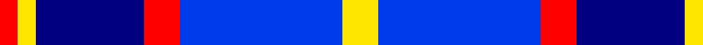
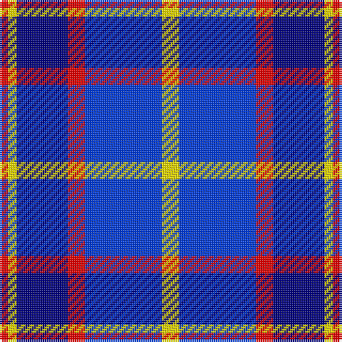

**Bands:** [RYBRBY](/stripes/rybrby/) · **Stripes:** [R LY DB R B LY](/stripes/stripes6/) R LY DB R B LY

This was sourced from register-of-tartans.  It is a [6 band tartan](/bands/bands6/).

Original link https://www.tartanregister.gov.uk/tartanDetails.aspx?ref=10307

## Register references

External register numbers recorded for this tartan.

- Scottish Register of Tartans: [10307](https://www.tartanregister.gov.uk/tartanDetails.aspx?ref=10307)

## Thread count
R/4 Y4 DB24 R8 B36 Y/8

## Palette
Each colour and its ΔE from the base-6 reference it is a variant of.

| Colour | Shade | Base | ΔE (OKLab) |
|---|---|---|---|
| B | <code style="background-color:#003BEB;">#003BEB</code> `#003BEB` | B <code style="background-color:#2A418A;">#2A418A</code> | 0.16 |
| DB | <code style="background-color:#000080;">#000080</code> `#000080` | B <code style="background-color:#2A418A;">#2A418A</code> | 0.14 |
| R | <code style="background-color:#FF0000;">#FF0000</code> `#FF0000` | R <code style="background-color:#CC0000;">#CC0000</code> | 0.11 |
| Y | <code style="background-color:#FFE600;">#FFE600</code> `#FFE600` | Y <code style="background-color:#F2BF00;">#F2BF00</code> | 0.10 |

# Sample pattern

## Nearest tartans

The nearest existing variants by ΔTartan distance.

1. [Strathclyde](/setts/s7/b4db2b15w10k15db2k4~x2/) — ΔT 1.20
1. [Thompson (Dance)](/setts/s6/b1lb6db1b3k3b1~x8/) — ΔT 1.29
1. [Lands of Liberty](/setts/s5/r10w5db30b20r3~x4/) — ΔT 1.35
1. [Bannockbane Blue #2](/setts/s8/db3db2db14db1lb10lb16db2lb3~x2/) — ΔT 1.39
1. [Immanuel Presbyterian Church (Milwaukee)](/setts/s8/k3r2k14lt2db6lt2db16lt3~x2/) — ΔT 1.39
1. [Strathclyde](/setts/s7/k2b16w2k16w15k2w2~x2/) — ΔT 1.45
1. [Bryson (1988)](/setts/s5/y16r8b57db56lb8/) — ΔT 1.53
1. [Halesowen #2](/setts/s8/w9db3ly3db24dt24ly2dt2ly2~x2/) — ΔT 1.54
1. [Lands of Liberty (Fashion)](/setts/s5/r15w10db48t32r6~x2/) — ΔT 1.54
1. [RSCDS Australia? (Corporate)](/setts/s5/r2db12k5t16w2~x4/) — ΔT 1.56

## Neighbour map

Every grey dot is one of 14313 variants placed by the first two principal components of the ΔTartan feature space (44% of its variance). Red is this tartan; blue dots are its nearest — click one to open its page.

<svg viewBox="0 0 640 380" role="img" style="max-width:100%;height:auto;border:1px solid #e0e0e0;border-radius:4px;display:block" xmlns="http://www.w3.org/2000/svg"><image href="/nn/cloud.v1.png" width="640" height="380"/><a href="/setts/s7/b4db2b15w10k15db2k4~x2/"><circle cx="129.4" cy="207.7" r="4" fill="#3465a4"><title>Strathclyde</title></circle></a><a href="/setts/s6/b1lb6db1b3k3b1~x8/"><circle cx="134.6" cy="214.7" r="4" fill="#3465a4"><title>Thompson (Dance)</title></circle></a><a href="/setts/s5/r10w5db30b20r3~x4/"><circle cx="210.6" cy="215.8" r="4" fill="#3465a4"><title>Lands of Liberty</title></circle></a><a href="/setts/s8/db3db2db14db1lb10lb16db2lb3~x2/"><circle cx="184.0" cy="159.7" r="4" fill="#3465a4"><title>Bannockbane Blue #2</title></circle></a><a href="/setts/s8/k3r2k14lt2db6lt2db16lt3~x2/"><circle cx="209.4" cy="199.0" r="4" fill="#3465a4"><title>Immanuel Presbyterian Church (Milwaukee)</title></circle></a><a href="/setts/s7/k2b16w2k16w15k2w2~x2/"><circle cx="129.0" cy="188.0" r="4" fill="#3465a4"><title>Strathclyde</title></circle></a><a href="/setts/s5/y16r8b57db56lb8/"><circle cx="177.0" cy="220.1" r="4" fill="#3465a4"><title>Bryson (1988)</title></circle></a><a href="/setts/s8/w9db3ly3db24dt24ly2dt2ly2~x2/"><circle cx="202.6" cy="167.4" r="4" fill="#3465a4"><title>Halesowen #2</title></circle></a><a href="/setts/s5/r15w10db48t32r6~x2/"><circle cx="186.1" cy="223.0" r="4" fill="#3465a4"><title>Lands of Liberty (Fashion)</title></circle></a><a href="/setts/s5/r2db12k5t16w2~x4/"><circle cx="182.2" cy="214.6" r="4" fill="#3465a4"><title>RSCDS Australia? (Corporate)</title></circle></a><circle cx="178.3" cy="194.7" r="5" fill="#c00000"/></svg>

ID: /setts/s6/ly2b9r2db6ly1r1~x4/
